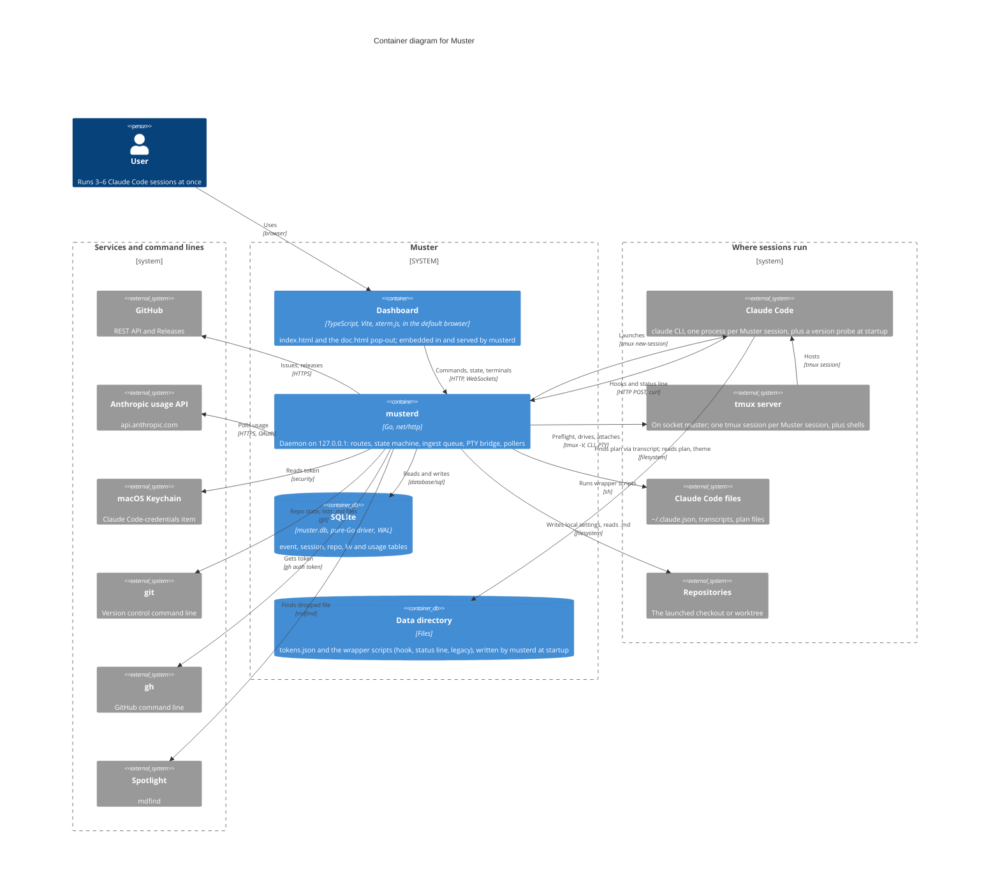

Read this to see what Muster deploys and how each piece talks to the outside. The boxes
inside the boundary are Muster's own; everything else is a system it touches, the same
set as the context diagram. Read it before the daemon-components diagram, which opens the
musterd box.

Muster is four things. musterd, one Go process bound to 127.0.0.1, which starts a tmux
server on the dedicated `muster` socket. The dashboard, compiled into the binary and served
to the default browser, which musterd opens at startup; it holds a cookie exchanged for the
UI token and speaks HTTP for commands, one WebSocket for the state stream and one per live
terminal. The SQLite file. And the data directory beside it, holding the tokens file and
the hook wrapper scripts.

Claude Code never addresses musterd itself. musterd launches it inside a new tmux session
with the Muster session id in the pane environment; on every hook and status-line refresh
Claude Code runs a wrapper script from the data directory, and that script posts the JSON
to the ingest endpoints with curl, the ingest token in the URL path. musterd scans Claude
Code's transcript only to locate the plan file, reads the plan and the global config, and
writes each launched directory's project-scoped local settings. The remaining wires are outbound
polls and command lines.

Assumptions: the browser is a plain tab, not an app window, because startup runs `open`
with the URL; Claude Code's files are drawn apart from the Claude Code process because
their wire is a file read, not an HTTP post; musterd's startup write of the data directory
is stated on that box rather than drawn, so no wire crosses another box.

