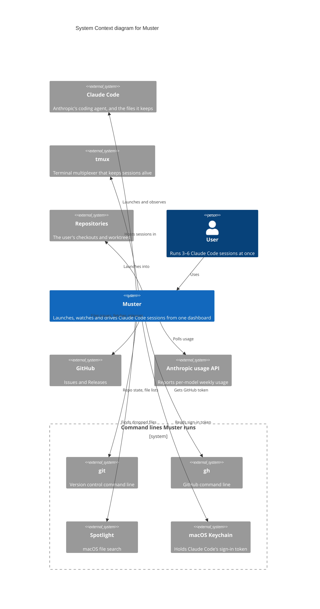

Read this for the shortest true answer to "what is Muster and what does it touch". One
person, one system, and every outside system Muster depends on, with no technology named;
the containers diagram opens the Muster box and puts a protocol on each wire.

The user works in Muster from a browser to launch Claude Code sessions, watch their state and
context, watch account usage, and type into them. Muster launches Claude Code and observes
it through the signals Claude Code sends back and the files it writes; it never reads the
terminal to learn state. Sessions live in tmux, which keeps them alive when the dashboard
or the daemon is gone. Muster launches into the user's repositories and writes its hook
settings there. GitHub receives the issues filed from the dashboard and serves the
releases Muster updates itself from. The Anthropic usage API answers the per-model usage
poll, with the Claude Code token Muster reads from the Keychain and never keeps. Three
local command lines do small jobs: git reads repo state and lists a checkout's files, gh
supplies the GitHub token, and Spotlight finds a dropped file.

Assumption: the outside systems match the containers diagram one for one, except that
Claude Code's own files, a separate box there, are part of the Claude Code system here.

