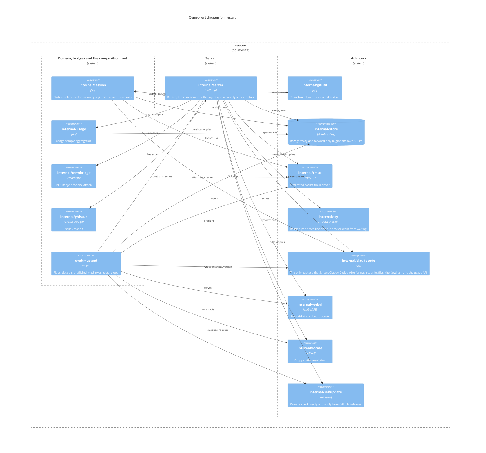

Components inside the `musterd` binary and their responsibilities. Every edge is a real import,
drawn from the import blocks, not from prose; the absent edges are the architecture.

`internal/store`, `internal/tmux`, `internal/tty` and `internal/claudecode` import nothing
internal — leaf adapters, which is what keeps Claude-Code-format knowledge inside one package
(kb:adr/nongoal-generic-agent-abstraction-layer). `internal/session` never imports
`internal/server`: it declares its own `PaneChecker`, `PaneSnapshotter` and `Killer` ports and
`*tmux.Client` satisfies them, injected by the composition root. Ingest is not a package of its
own: it is `internal/server/ingest.go`, one feature type among the server's twenty-odd.

This opens the musterd box of kb:diagram/containers. The outside systems stay on that diagram;
here an adapter's description names what it reaches, and only imports are wires. The loop worth
following is still `claude` posting its own hooks back to the ingest endpoint: the daemon writes
the wrapper scripts, tmux hosts the pane, and state arrives over HTTP rather than from the
terminal.

Not shown, because they are other containers: `tools/kb`, `tools/triage` and `tools/versions`,
the dev-tooling binaries built from `internal/kb` and `internal/triage` (`.goreleaser.yaml`
builds only `./cmd/musterd`). `internal/kb` imports `internal/claudecode` for version records;
nothing in the daemon imports either of them.

