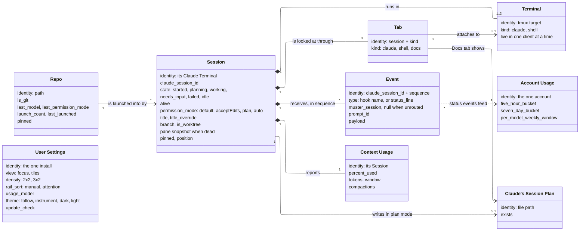

What Muster keeps track of and how the pieces relate, in the dashboard's words, as it exists
today; each box names its identity and its vocabularies.

A **Session** is one Claude Code run that Muster launched, identified by the Terminal it
runs in; its Claude session id is an attribute that `/clear` replaces. It is launched into a
**Repo**, a directory remembered by path with its last launch choices; branch and
worktree flag are recorded on the session at launch, and Muster never creates a worktree. Every session runs inside a **Terminal** kept
alive by tmux, and may have a second, shell one that outlives its end; only the Claude
terminal carries liveness and a snapshot when dead. Claude Code reports back as **Events**,
numbered per Claude session id; hook events drive state, the status-line event refreshes
readings and never touches state, and an event whose envelope names no session is kept
unrouted.
**Context Usage** is the session's reading of its context window. **Account Usage** is the
account's rate-limit readings, fed by status events from any session and Muster's poll.
**Claude's Session Plan** is the document Claude writes in plan mode, at most one per
session. The dashboard looks at a session through three **Tabs**; the Claude and
Shell tabs each attach to their own Terminal, and each Terminal is live in one client at a
time. **User Settings** are one set per install.

Rules the boxes cannot say: state comes only from events and launch actions, never
terminal text; a dead session keeps its last state; pinned sessions precede unpinned ones.
Tab stays because it is the word the user sees.

Not shown: the rail and tiles, which only draw the session list; the access tokens, on the
containers diagram; the transcript, which only locates the plan.
