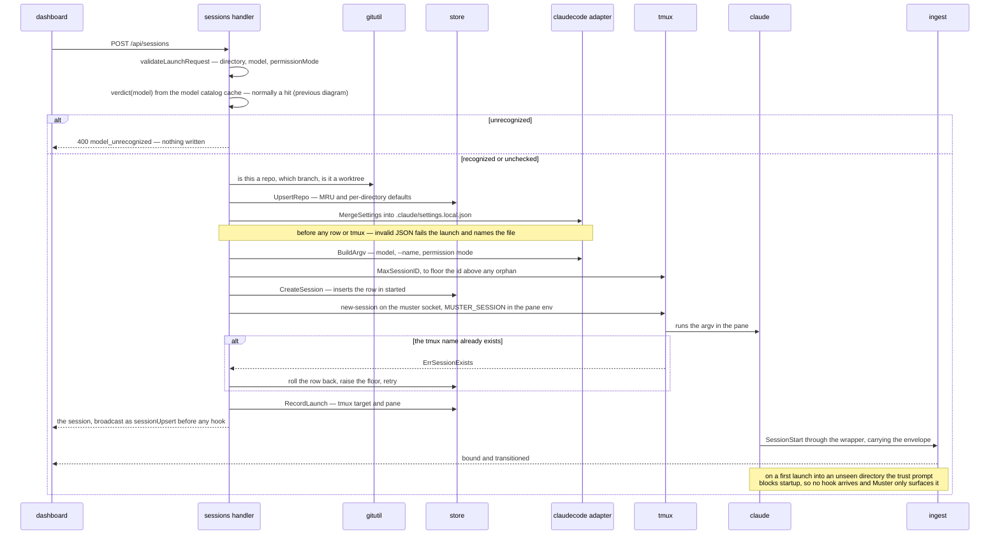

Moved out of `docs/features/launch/spec.md` (kb:spec/launch) once the resume-and-dangerously-allow
additions pushed that spec past its 800-word budget; the launch feature it depicts is unchanged.

The order matters at both ends: the settings file is written before any row exists or tmux is
touched, so a corrupt one fails with nothing to roll back.

