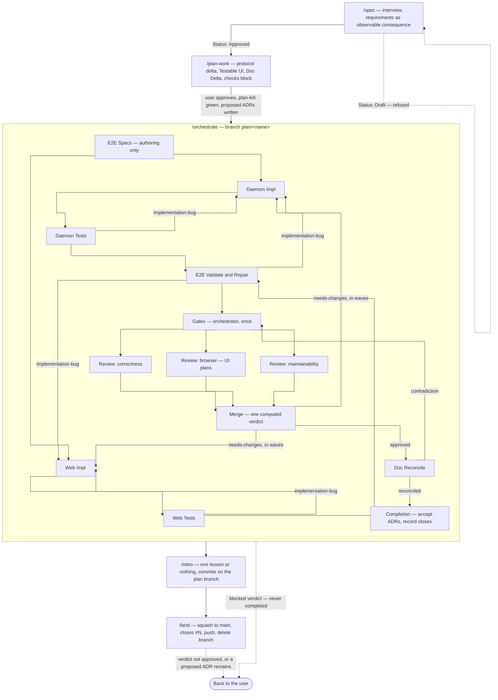

One feature, end to end. Each arrow into a skill is a gate that refuses rather than warns:
`/plan-work` refuses a spec whose `Status` is not `Approved`; `/orchestrate` refuses a `draft`
plan or any `plan-lint` FAIL and spawns nobody; `/land` refuses a review verdict that is not
`approved`, a dirty tree, or a `proposed` ADR still carrying this plan's name.

Inside `/orchestrate`, a full-stack plan runs both tracks; a `daemon` or `web` plan drops the
other track's two boxes, and an E2E Scope of `none` drops both E2E stages. E2E Specs authors
against a feature that does not exist yet, so it gates on collection, never on a pass. Each
tester starts as soon as its own track is green — the daemon tester never waits for the web
coder. The orchestrator runs the gates once and then spawns three Opus reviewers in parallel —
correctness against the plan, the browser matrix (UI plans only), a maintainability read with the
plan withheld — and merges their parts into one `review.md` whose verdict is computed, never
opined (kb:adr/process-review-split-three-reviewers-computed-verdict). Doc Reconcile
is reached only by an `approved` merged review, and only its `reconciled` verdict completes the
run (kb:adr/process-doc-reconcile-after-review). Retry budgets and the wave
ordering a `needs-changes` verdict follows are in the orchestrate skill's tables, not here.

`/retro` runs in the session that ran `/orchestrate`, while the stumbles are still in context,
and commits on the plan branch so its changes ride `/land`'s squash — which is why it comes
before the merge, not after.

Trivial fixes and doc work skip all of this; the pipeline is for anything with acceptance
criteria.
