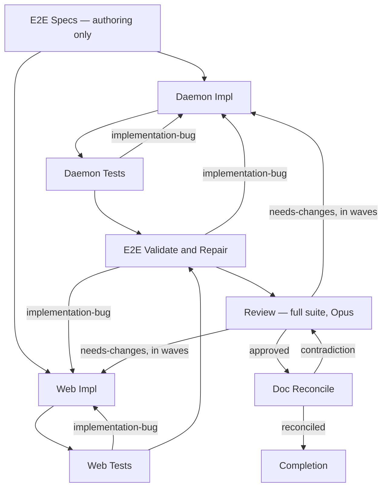

Stage order for a full-stack plan. A `daemon` or `web` plan drops the other track's two boxes; an
E2E Scope of `none` drops both E2E stages. Retry budgets and the wave ordering a `needs-changes`
verdict follows are in the orchestrate skill's tables, not here.

E2E Specs authors against a feature that does not exist yet, so it gates on collection, never on a
pass. Each tester starts as soon as its own track's implementation is green — the daemon tester
never waits for the web coder. Doc Reconcile is reached only by an `approved` review, and only its
`reconciled` verdict completes the run.
