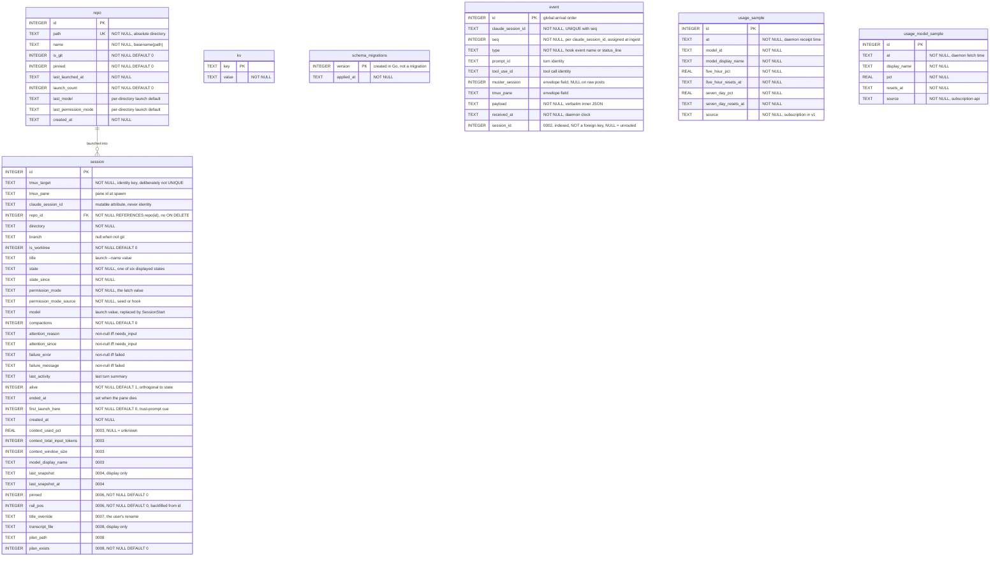

Final shape, with the additive `ALTER TABLE`s of 0003-0008 folded into `session`. Migrations are
forward-only and purely additive: no migration has ever changed or dropped a column, and the one
data statement is 0006's `rail_pos` backfill.

The schema has exactly **one** foreign key — `session.repo_id REFERENCES repo(id)`, with no
`ON DELETE` clause, so `NO ACTION`. It is genuinely enforced: `PRAGMA foreign_keys = ON` is set
at connection time. `event.session_id` is deliberately *not* a foreign key and carries no
relationship line here: it is NULL while an event is unrouted, and an envelope that names an
unknown Muster session is persisted unrouted rather than guessed at
(kb:adr/ingest-envelope-binds-never-cwd).

Two non-constraints are decisions. `session.tmux_target` is the identity key yet has no UNIQUE,
because tmux window ids restart with the tmux server, so a dead session's target can be re-minted
— uniqueness among *alive* sessions is the code's job
(kb:adr/lifecycle-session-identity-is-tmux-target). `event`'s uniqueness is
`(claude_session_id, seq)`, the per-session counter a single worker assigns at ingest
(kb:adr/ingest-seq-assigned-at-ingest).

All six tables a migration creates are declared `STRICT`, so SQLite enforces the column types
shown rather than applying its usual affinity rules. `schema_migrations` is the exception on both
counts: it is created in Go rather than in a `.sql` file, so it has no migration of its own and
is not `STRICT`. The only explicit index is `idx_event_session_id`.

