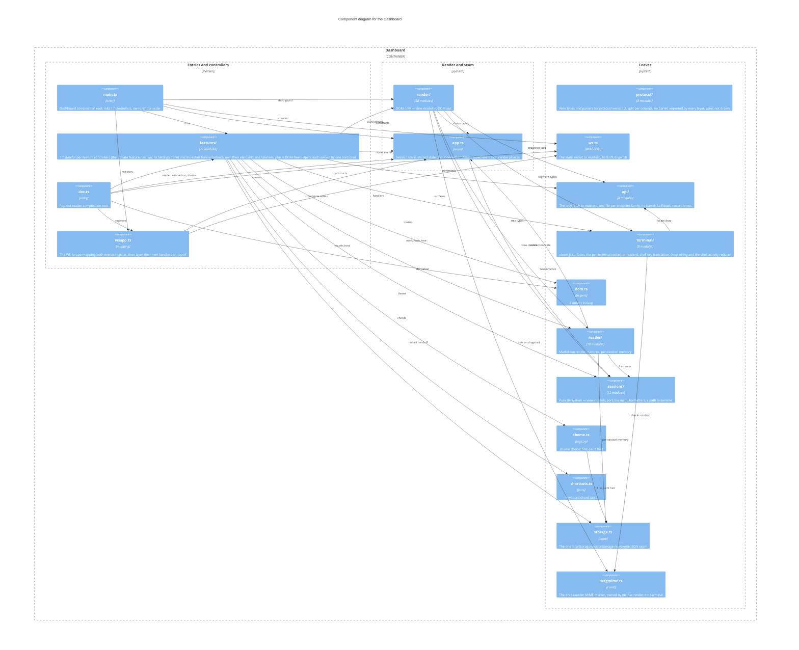

Drawn from the `import` statements at directory granularity: `features/`, `render/`,
`sessions/`, `terminal/`, `reader/`, `protocol/` and `api/` are one node each, the root
modules are their own. `protocol/` and `api/` are split per concept/endpoint family, with
no barrel (`docs/conventions.md`).

Two Vite entries (`web/vite.config.ts`), each a composition root that only wires
(kb:adr/process-composition-roots-registration-only): `main.ts` for the dashboard,
`doc.ts` for the pop-out reader, which is a second page rather than a route
(kb:adr/reader-popout-is-a-second-page). Both now register the same `wsapp.ts` mapping
(`coreWsHandlers`) instead of hand-copying it, and no feature imports another: the mutual
needs of actions, tiles, focus and surfaces are resolved through thunks in `main.ts`. The
graph is acyclic but no longer a single line down: `render/`, `terminal/`, `reader/` and
`api/` all sit below `features/`, and `render/`/`terminal/`/`features/` each reach `api/`
directly too. `app.ts` is the seam all of those reach for shared state (including
`ConnectionStatus`, moved here off `render/masthead.ts` to cut a cycle), and it depends on
nothing above `sessions/`/`protocol/`, so no loop closes back up.

This opens the Dashboard box of kb:diagram/containers; the daemon and `localStorage` stay on
that diagram and the module descriptions say which module reaches them. Three modules talk to
the daemon, matching kb:adr/connection-commands-http-ws-push-only: `api/` holds the only
`fetch`, `ws.ts` the server-to-client state socket, and `terminal/pane.ts` the one WebSocket
constructed outside `ws.ts`, per live terminal. `localStorage` is reached through one seam,
`storage.ts`'s `readJson`/`writeJson`, by the reader's per-session memory and the first-paint
theme hint, never session state; `sessionStorage` through the same seam, by the update
restart handoff only (kb:adr/update-restart-reloads-dashboard). `protocol/` is imported by every layer for wire types,
so those seven wires sit on its box rather than drawn. `dragmime.ts` is the other root-level
leaf: the drag-reorder MIME marker `render/dragreorder.ts` sets and `terminal/pane.ts`
checks, owned by neither.

