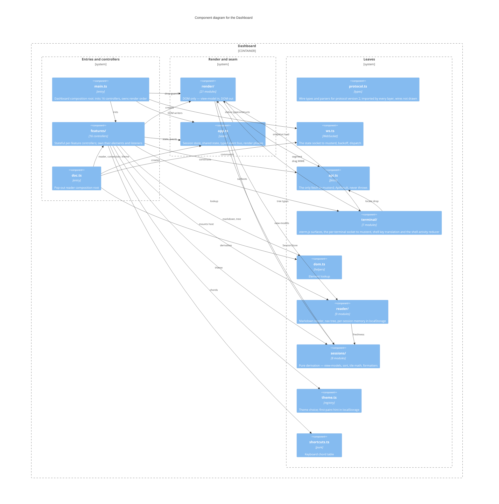

Drawn from the `import` statements at directory granularity: `features/`, `render/`,
`sessions/`, `terminal/` and `reader/` are one node each, the root modules are their own.

Two Vite entries (`web/vite.config.ts`), each a composition root that only wires
(kb:adr/process-composition-roots-registration-only): `main.ts` for the dashboard,
`doc.ts` for the pop-out reader, which is a second page rather than a route
(kb:adr/reader-popout-is-a-second-page). The graph is acyclic and strictly layered — entry →
`features/` → (`render/` | `terminal/` | `reader/`) → `sessions/` → `protocol.ts` — and no
feature imports another: the mutual needs of actions, tiles, focus and surfaces are resolved
through thunks in `main.ts`.

This opens the Dashboard box of kb:diagram/containers; the daemon and `localStorage` stay on
that diagram and the module descriptions say which module reaches them. Three modules talk to
the daemon, matching kb:adr/connection-commands-http-ws-push-only: `api.ts` holds the only
`fetch`, `ws.ts` the server-to-client state socket, and `terminal/pane.ts` the one WebSocket
constructed outside `ws.ts`, per live terminal. `localStorage` holds only the reader's per-session
memory and the first-paint theme hint, never session state. `protocol.ts` is imported by every
layer for wire types, so those seven wires are stated on its box rather than drawn.

