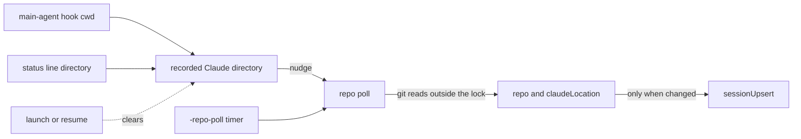

A card names the directory the session was launched in, and that stays true for the row's
lifetime: the shell, the docs reader, file drop and resume all use it
(kb:adr/lifecycle-card-shows-launch-directory-marks-claude-elsewhere). Claude's own working
directory moves mid-session (kb:fact/cwd-follows-claude-mid-session,
kb:fact/enter-worktree-moves-project-dir), so a second readout says where it is, and only
when that is a different checkout.

## Branch

The daemon re-reads a session's branch and worktree flag from its launch directory on a repo
poll: at start, every `-repo-poll` (default 5 s) and whenever Claude's reported directory
changes. `-repo-poll 0` disables the timer, leaving the start read and the nudge. A checkout
made by Claude, the shell pane or anything outside Muster therefore shows within one tick
(kb:adr/lifecycle-branch-refreshed-by-repo-poll). Only alive sessions whose launch directory
still exists are read. A dead card keeps its last-known `repo`; a directory that is gone keeps
both `repo` and `claudeLocation`. A reading in flight when the session died is dropped whole, even if a
resume lands before it does, and the next tick reads afresh. Git runs outside the session
manager's lock; an unchanged reading broadcasts nothing, and a changed one is a single
`sessionUpsert`.

## Where Claude is

Claude's directory is recorded from every main-agent hook's `cwd` and from the status line's
working directory. Subagent-marked events, `SubagentStart`, `SubagentStop` and absent or
empty values change nothing, and `CwdChanged` stays unregistered
(kb:adr/lifecycle-claude-location-from-main-agent-cwd, kb:fact/cwd-changed-hook). Hooks
arrive unordered (kb:fact/hook-delivery-best-effort), so a straggler can briefly revert it.

The poll derives `claudeLocation` from it: non-null only while the recorded directory is a
different checkout from the launch directory. Inside a git checkout the top levels decide, so
a worktree under the launch path still counts as elsewhere; outside one, the paths decide.
Both sides are symlink-resolved. It is display-only, never read by the state machine, and
null on a dead session. Launch and resume clear it, because Claude restarts in the launch
directory.

## Model name

A bind (`SessionStart`) naming a different model than the session holds sets its display name
to the id until the status line confirms a name, so it is never blank or stale. A bind naming
the held id changes nothing, so a confirmed name survives
(kb:adr/lifecycle-bind-model-display-name-is-id, kb:fact/sessionstart-model-optional-string,
kb:fact/status-model-is-object, kb:fact/model-switch-hooks).

The rail, Focus header and tiles render these fields (kb:spec/rail, kb:spec/focus,
kb:spec/tiles). Their shapes are in `kb:anchor/ws.session`.

