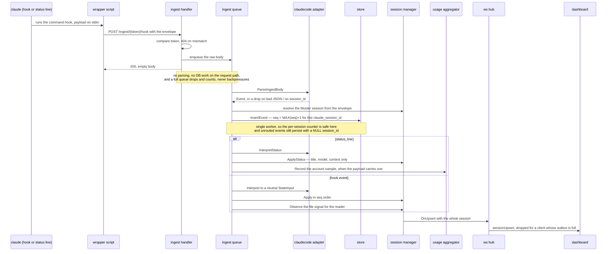

Ingest is how Claude Code's hooks and status line reach the daemon. Two endpoints,
`POST /ingest/{token}/hook` and `POST /ingest/{token}/status` (`kb:anchor/ingest`), receive
the JSON the wrapper scripts post; everything Claude-Code-shaped is parsed inside
`internal/claudecode` and leaves it as neutral Muster types.

## Signals and their sources

| Signal | Source |
|---|---|
| Session lifecycle | `SessionStart`, `Stop`, `StopFailure`, `SessionEnd`, `Notification` (`permission_prompt`, `idle_prompt`), `PermissionRequest`, `PreCompact`; tool hooks as turn activity (kb:fact/hook-payload-fields) |
| Permission mode | `permission_mode` from the hook events that carry it, latched forward (kb:fact/permission-mode-presence-split); absent from the status line (kb:fact/status-line-keys) |
| Failed and its reason | `StopFailure` with its typed `error` (kb:fact/stopfailure-error-taxonomy) |
| Context, model, title, account usage | the status-line payload, posted by the status-line script |
| Terminal content | never ingest; the PTY bridge (kb:spec/surfaces) |

## Transport

Every hook and the status line is a `type:"command"` wrapper script that posts its stdin
and exits 0 silently when the session is unmanaged or the daemon is unreachable
(kb:adr/ingest-all-hooks-command-wrappers, kb:adr/ingest-sessionstart-command-wrapper,
kb:fact/sessionstart-not-over-http). Muster writes no `type:"http"` entries and no
`allowedHttpHookUrls`. The wrappers live in the data directory and are rewritten at every
daemon start; the settings entries reference their paths as single-quoted shell words
(kb:adr/ingest-shell-quote-at-write-boundary, kb:fact/hook-commands-are-shell-lines) in the
directory's project-scoped `.claude/settings.local.json` (kb:fact/local-settings-honoured).
Entries are permanent once written (kb:adr/ingest-hook-entries-permanent). Hook timeouts
are short, never five seconds. A separate ingest token sits in the URL path; a bad token is a
404 (kb:adr/ingest-separate-token-in-url-path).

The handler returns `200` with an empty body at once and enqueues the raw body; a single
worker parses it, assigns a monotonic per-session `seq`, appends it to the `event` table and
feeds the state machine in that order (kb:adr/ingest-seq-assigned-at-ingest). Malformed JSON
and bodies without a `session_id` are dropped with a log line and still answered `200`.
Delivery is best-effort and unordered (kb:fact/hook-delivery-best-effort); nothing is
replayed. Payload bodies are never logged.

## One post, end to end

Two things the shape guards: the handler does no database work before acknowledging, and a
single worker does everything after, so `seq` order and apply order are the same thing by
construction.

## The envelope

The daemon spawns every pane with `MUSTER_SESSION` in its environment, and command hooks
inherit it (kb:fact/command-hooks-inherit-pane-env), so every post is enveloped as
`{musterSession, tmuxPane, payload}` (`kb:anchor/ingest.envelope`). The envelope routes the
event; a stale or unknown value is persisted unrouted, never guessed from `cwd`
(kb:adr/ingest-envelope-binds-never-cwd). An enveloped `SessionStart` binds the Claude
`session_id` to the Muster session; any enveloped non-status event with a different
`session_id` is a `/clear`-style rebind, and one on a never-bound session binds it without a
transition (kb:adr/ingest-envelope-authoritative-binding). Rebinding is monotonic: an event
for a `session_id` the session has already left applies without rebinding backwards
(kb:adr/ingest-monotonic-rebind). Raw posts route by `session_id` through the existing
mapping and never bind. Status posts never bind or rebind.

## Does not

Ingest does not parse terminal output, does not retry, does not answer `PermissionRequest`
and does not interpret payloads outside the adapter package.
