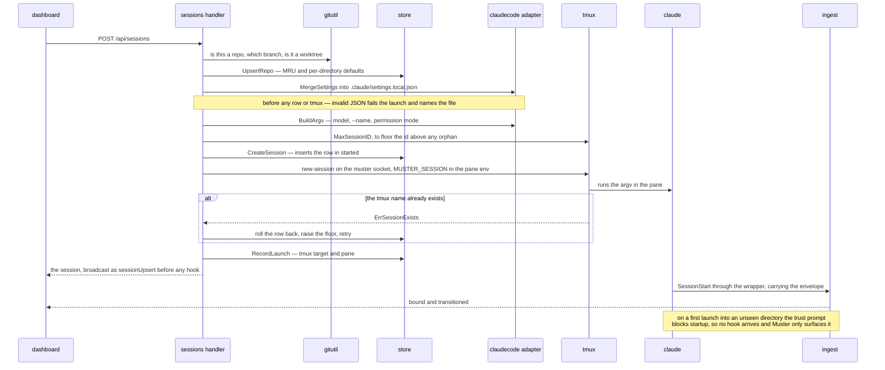

Sessions are launched from the dashboard and nowhere else: macOS gives no access to another
process's PTY, so Muster manages only what it started. The dialog opens from the rail's New
session button, the Tiles toolbar button or the launch chord (kb:spec/shortcuts).

## The picker

A Finder-style picker: a Recent sidebar beside a clickable breadcrumb over one child
listing served by `kb:anchor/browse.get`, rooted at the `-browse-root` directory
(kb:adr/launch-picker-recent-sidebar-plus-browse-list, kb:adr/launch-browse-via-daemon-not-native-chooser).
The listed directory is the selection; descending into a child changes it, the parent chord
goes up, and the footer always states where the launch will happen. Git checkouts are
marked. Recents come from `kb:anchor/repos.list`, ordered pinned then most recently
launched; clicking one navigates there and restores that directory's last model and
permission mode. Directory memory is hybrid: every launch remembers its directory as a repo
row, with promotion reserved for rows that carry per-repo config, which nothing writes yet
(kb:adr/launch-hybrid-mru-directory-memory). No worktree is created; one the picker is
pointed at is recognised so the session shows repo and branch truthfully.

## The form

Title is optional and maps to `--name` (kb:fact/name-flag-reaches-title); blank lets Claude
Code auto-generate one. Model is a segmented control of presets plus a free-text override,
passed to `--model` verbatim (kb:adr/launch-model-presets-passed-verbatim,
kb:fact/fable-model-alias). Start in offers Claude Code's four tabbed modes under its own
labels, where manual is the wire's `default` (kb:adr/launch-permission-modes-offered-four-tabbed,
kb:fact/permission-mode-flag-on-wire); bypass and don't-ask are not offered
(kb:adr/launch-bypass-and-dontask-unoffered). The chosen mode seeds the permission-mode
latch, which the first hook carrying the field corrects; a mode the model cannot run is
corrected the same way (kb:adr/launch-form-seeds-model-and-permission-mode,
kb:fact/permission-mode-auto-model-gated). Model and Start in default to the directory's
last-used values.

## What launch does

`kb:anchor/sessions.create` upserts the repo row, ensures the directory's project-scoped
`.claude/settings.local.json` carries Muster's hook and status-line entries
(kb:adr/launch-settings-local-json-not-settings-json, kb:fact/local-settings-honoured),
creates the tmux session on the muster socket with the Muster session id in the pane
environment, spawns `claude` with the assembled argv, and inserts the session row in
`started`, broadcast immediately so the card appears before any hook arrives. A settings
file that exists but is not valid JSON fails the launch and names the file. Muster never
touches the user-level settings or `CLAUDE_CONFIG_DIR`
(kb:adr/launch-project-scoped-settings-not-config-dir, kb:fact/config-dir-breaks-oauth).
A launch from Tiles promotes the new session into the grid
(kb:adr/tiles-launched-session-promoted-into-grid).

## One launch, end to end

The order matters at both ends: the settings file is written before any row exists or tmux is
touched, so a corrupt one fails with nothing to roll back; and the card is broadcast from the
inserted row, before any hook has arrived.

## The trust prompt

On the first launch into a directory Claude Code has not seen, its workspace-trust prompt
blocks startup: no hooks fire and no status line renders. Muster surfaces it and never
answers it (kb:adr/launch-trust-prompt-never-auto-answered, kb:fact/trust-prompt-preselects-exit).
Detection is by absence and by Muster's own records: a session whose directory had no repo
row says "first launch here — likely waiting on Claude Code's trust prompt" from the moment
it appears, and any other session with no `SessionStart` after a short wait says "no signal
yet" (docs/design/ux-flows.md "First-launch trust prompt"). Neither reads the pane.
