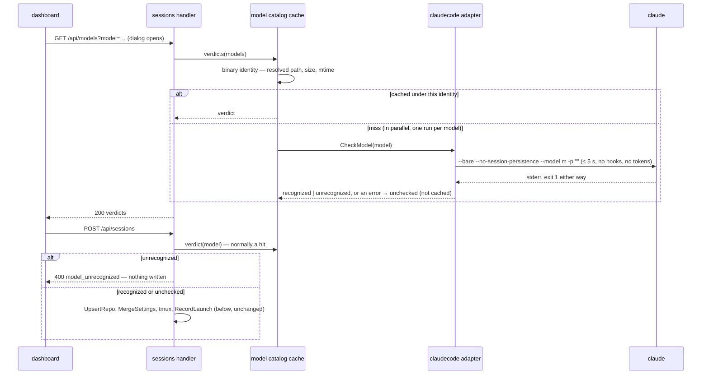

Sessions are launched from the dashboard and nowhere else: macOS gives no access to another
process's PTY, so Muster manages only what it started. The dialog opens from the masthead's
New session button or the launch chord (kb:spec/shortcuts,
kb:adr/launch-new-session-button-in-masthead). Its head carries New (this spec) and Resume
(`kb:spec/past-sessions`) tabs.

## The picker

A Finder-style picker: a Recent sidebar beside a clickable breadcrumb over one child
listing served by `kb:anchor/browse.get`, rooted at the `-browse-root` directory
(kb:adr/launch-picker-recent-sidebar-plus-browse-list, kb:adr/launch-browse-via-daemon-not-native-chooser).
The listed directory is the selection; descending into a child changes it, the parent chord
goes up, and the footer always states where the launch will happen. Git checkouts are
marked. Recents come from `kb:anchor/repos.list`, ordered pinned then most recently
launched; clicking one navigates there, restoring its last model and mode. Directory memory is
hybrid: every launch remembers its directory as a repo row, with promotion reserved for rows
that carry per-repo config, which nothing writes yet (kb:adr/launch-hybrid-mru-directory-memory).
No worktree is created; a picked one is recognised, so the session shows repo and branch
truthfully.

## The form

Title is optional and maps to `--name` (kb:fact/name-flag-reaches-title); blank lets Claude
Code auto-generate one. Model is a segmented control of presets plus a free-text override,
passed to `--model` verbatim (kb:fact/fable-model-alias). Start in offers five modes: Claude
Code's four tabbed modes under its own labels
(kb:adr/launch-start-in-explicit-flag-auto-fallback, kb:fact/permission-mode-flag-on-wire), plus
bypass — a fifth danger segment sending `bypassPermissions`, showing a warning line, and turning
Launch into danger `Launch without checks` (kb:adr/launch-bypass-offered-with-danger-guardrails);
don't-ask stays unoffered (kb:adr/launch-bypass-and-dontask-unoffered). Every mode is sent as an explicit
flag (kb:fact/permission-mode-no-flag-follows-configured-default).
The chosen mode seeds the permission-mode latch, which the first hook carrying the field corrects;
a mode the model cannot run is corrected the same way
(kb:adr/launch-form-seeds-model-and-permission-mode, kb:fact/permission-mode-auto-model-gated).
Model and Start in default to the directory's last-used values; a value
picked before they arrive is kept. A remembered bypass is never restored — the dialog checks
auto instead (kb:adr/launch-bypass-never-restored-as-default). Group, under Title, offers groups, No
group and New group… with a name field, defaulting to the focused session's group
(kb:adr/launch-group-row-moves-between-tabs, kb:adr/launch-new-group-created-with-the-row-or-not-at-all).

## What launch does

Opening the dialog asks the daemon (`kb:anchor/models.check`) whether Claude Code recognises
each preset, and any restored non-preset model. An unrecognised, unselected preset is disabled;
a selected unrecognised model stays selected, marked invalid under the Model row
(`#model-error`), and blocks Launch until another is picked. Verdicts are cached against the resolved `claude` binary's path, size and
modification time, so an update re-checks; concurrent requests for one model share one run.
Launch reads the same cache and refuses an unrecognised model with `model_unrecognized`; a
check that cannot run yields `unchecked`, lets the launch proceed, and is not cached
(kb:adr/launch-model-check-cached-per-binary-identity,
kb:adr/launch-unrecognized-model-marked-blocks-launch). A refusal shows only in `#model-error`,
never also in `#launch-error`; editing the text or picking another model clears it. Focus moves
to the invalid control regardless of where it was — `#model-error` has no live-region role; a
cancelled-and-reopened dialog's refusal is ignored, focus included. A dialog-open
verdict only moves focus when Launch itself held it and is now disabled
(kb:adr/launch-model-refusal-shown-in-field-error-only).

`kb:anchor/sessions.create` upserts the repo row, ensures the directory's project-scoped
`.claude/settings.local.json` carries Muster's hook and status-line entries
(kb:adr/launch-settings-local-json-not-settings-json, kb:fact/local-settings-honoured),
creates the tmux session on the muster socket with the Muster session id in the pane
environment, spawns `claude` with the assembled argv, and inserts the session row in
`started`, broadcast immediately so the card appears before any hook arrives. A settings
file that exists but is not valid JSON fails the launch with a fixed-phrase `message`; the
daemon log, never the response body, names the file and the raw error
(kb:anchor/transport). Muster never touches the user-level settings or `CLAUDE_CONFIG_DIR`
(kb:adr/launch-project-scoped-settings-not-config-dir, kb:fact/config-dir-breaks-oauth).
A Tiles launch promotes the new session into the grid
(kb:adr/tiles-launched-session-promoted-into-grid). A launch opens the launched session: Focus
focuses it, both views put keyboard focus in its terminal
(kb:adr/launch-opens-launched-session).

## The model check

The dialog checks first, so Launch itself pays no subprocess on the common path.

```mermaid
sequenceDiagram
    participant UI as dashboard
    participant S as sessions handler
    participant K as model catalog cache
    participant A as claudecode adapter
    participant CC as claude

    UI->>S: GET /api/models?model=… (dialog opens)
    S->>K: verdicts(models)
    K->>K: binary identity — resolved path, size, mtime
    alt cached under this identity
        K-->>S: verdict
    else miss (in parallel, one run per model)
        K->>A: CheckModel(model)
        A->>CC: --bare --no-session-persistence --model m -p "" (≤ 5 s, no hooks, no tokens)
        CC-->>A: stderr, exit 1 either way
        A-->>K: recognized | unrecognized, or an error → unchecked (not cached)
    end
    S-->>UI: 200 verdicts
    UI->>S: POST /api/sessions
    S->>K: verdict(model) — normally a hit
    alt unrecognized
        S-->>UI: 400 model_unrecognized — nothing written
    else recognized or unchecked
        S->>S: UpsertRepo, MergeSettings, tmux, RecordLaunch (below, unchanged)
    end
```

## One launch, end to end

`kb:diagram/one-launch-end-to-end` — the settings file is written before any row or tmux touch,
so a corrupt one fails with nothing to roll back.

## The trust prompt

On the first launch into a directory Claude Code has not seen, its workspace-trust prompt
blocks startup: no hooks fire and no status line renders. Muster surfaces it and never
answers it (kb:adr/launch-trust-prompt-never-auto-answered, kb:fact/trust-prompt-preselects-exit).
Detection is by absence and by Muster's own records: a session whose directory had no repo
row says "first launch here — likely waiting on Claude Code's trust prompt" from the moment
it appears, and any other session with no `SessionStart` after a short wait says "no signal
yet" (docs/design/ux-flows.md "First-launch trust prompt"). Neither reads the pane. A bypass
launch that has not bound is likely waiting on Claude Code's own bypass warning ("No, exit"
preselected), surfaced and never answered the same way
(kb:adr/launch-bypass-warning-surfaced-never-answered, kb:fact/bypass-acceptance-blocks-startup).
