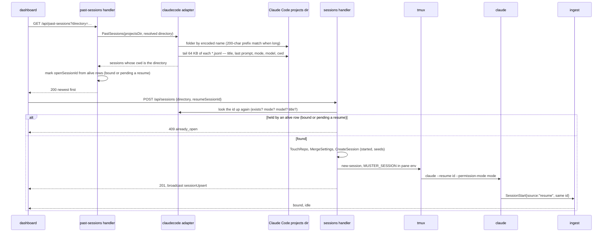

The launch dialog's head carries New and Resume tabs (`kb:spec/launch`); the Resume tab lists a
directory's own Claude Code sessions and resumes one Muster never started (issue #62). It carries
the New tab's Group row under the list, and the resumed session joins the chosen group
(kb:adr/launch-group-row-moves-between-tabs).

## The list

`kb:anchor/pastsessions.list` reads the picker's listed directory's transcript folder — found by
Claude Code's own folder-name encoding, matched by a 200-character prefix when the encoded name
runs long — and returns every session whose transcript records that directory as `cwd`
(kb:adr/launch-resume-listed-from-transcripts-by-cwd, kb:fact/transcript-dir-encoding). Title,
last prompt, permission mode and model come from each transcript's last ~64 KB
(kb:fact/transcript-session-lines): title is the last custom-title, else the last ai-title, else
none. Rows sort newest `lastActiveAt` (the transcript file's own mtime) first, capped at 200 with
`truncated` and a "Showing the newest 200" line. A directory Claude Code never ran in, or an
unreadable projects directory, reads as an empty list, never an error; the daemon only ever reads
there, never writes. The filter box matches title and last prompt case-insensitively; a selection
the filter hides is dropped.

## The running-session guard

Each row carries `openSessionId`: the alive Muster session already holding this Claude session id
— bound to it, or itself spawned to resume it and not yet bound
(kb:adr/launch-resume-pending-hold-persisted). Such a row is disabled and its last-prompt line
reads "open in Muster"; the default selection is the first row that isn't
(kb:adr/launch-resume-running-guard-muster-only). The hold is stored with the row, so it survives a
daemon restart until the row binds or ends. A session running outside Muster — a plain terminal, another tool — cannot be
detected and stays enabled (kb:fact/no-running-session-signal); Claude Code, not Muster, owns two
processes sharing one conversation.

## Resume in the original mode

Resuming a row always creates a new Muster session, never reuses a dead one that shares the id
(kb:adr/launch-resume-one-alive-row-per-claude-session), running `claude --resume <id>
--permission-mode <mode>` with no `--model` and no `--name`. `<mode>` is the transcript's last
recorded permission mode, verbatim — including one the launch form never offers, such as
`dontAsk` — or `default` when none was recorded (kb:adr/launch-resume-in-original-mode-else-default,
kb:adr/launch-resume-passes-any-recorded-mode, kb:fact/resume-restores-model-and-mode-except-plan).
The row is seeded from the listing: `title`, and, when the transcript recorded a model,
`model.displayName` equal to that model id until the status line confirms the real name, as any
launch does — never null (kb:adr/launch-resume-display-name-falls-back-to-id); with no model
recorded, `model` is null, which `kb:spec/focus`'s mainhead renders as `unknown`. The row stays
`started` until the enveloped `SessionStart{source:"resume"}` binds it into `idle`. A resume of an
id already held — bound, or itself mid-resume — is refused `409 already_open`, naming that session;
a transcript deleted since the list was read is `404 unknown_claude_session`, caught here even
though the list already showed it.

## End to end

