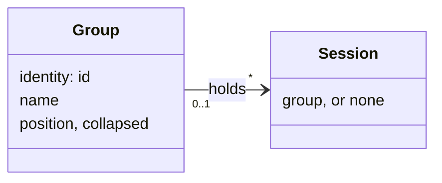
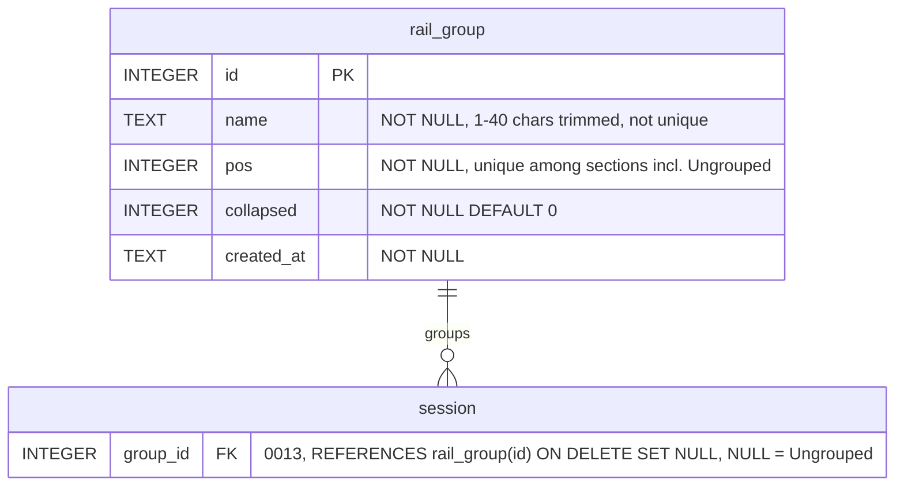

# Plan: Rail groups

**Created**: 2026-10-05
**Status**: completed
**Work Type**: full-stack
**E2E Scope**: new-specs
**Fixture plan**: groups.spec.ts daemon (every test asserts section order, counts or the Ungrouped header's presence, and one restarts the daemon); groups-select.spec.ts daemon (bulk Remove must leave "No sessions yet", a daemon-global state); groups-launch.spec.ts daemon (the launch default reads the sole focused session; the filter flip asserts the `n of m` count)
**Features**: rail, actions, launch, focus, shortcuts, tiles, lifecycle, connection, past-sessions, rename, update, surfaces, groups, knowledge
*Amended 2026-10-05 during `/orchestrate` (user decision, `decisions/features-header-widened/decision.md`)*: `update` and `surfaces` added because the snapshot's two new keys force fixture repairs in `web/src/features/updaterestart.test.ts` and `web/e2e/shell.spec.ts`; no behaviour of either feature changes.
*Amended 2026-10-05 after doc-reconcile returned `blocked` (user decision, `decisions/groups-feature-split/decision.md`)*: `groups` added as a new feature split out of `rail` — `docs/features/groups/spec.md` owns sections, the header summary and popover, select mode and the filter, with the groups globs moved from the rail spec — because the rail spec could not hold the delta within its 800-word budget; `knowledge` added because the plan's doc upkeep edits `tools/kb/anchors.tsv` (nine registry rows, no code or spec text).
**Description**: Named, collapsible session groups in the rail — daemon-owned rows and membership, a select mode with bulk Stop/Remove, a Group row in the launch dialog and a group control in the Focus header. Closes #74 and #27.

## Overview

The spec (`plans/groups/spec.md`, Approved 2026-10-05) settled what the developer sees. This plan
settles how the two tracks build it without reading each other's code: a `rail_group` table and a
`group_id` column on the session row; one whole-list `groups` WS message (the prefs pattern) for
the groups themselves, with membership riding the ordinary `sessionUpsert` as a new `groupId`
field; six small group endpoints plus two batch endpoints for Stop and Remove; and the launch
request growing `groupId` / `newGroup`. The rail's pin invariant becomes per-section. Nothing here
is derived from hooks, so there is no hook-loss story — only ordinary persisted state.

On the web side the rail renders sections instead of one flat list: a sticky header per group and,
once any group exists, an Ungrouped section of the same shape. Everything the developer does to a
group goes through one new menu builder (the codebase has none today), the existing confirm
dialogs generalised to batches, and a new delete-group dialog. Select mode, the filter and the
pending "name your new group" editor are per-window client state. The Tiles grid and strip keep
rendering the flat order and are untouched.

The developer runs ~10 live sessions in attention sort, so the primary design holds: sections keep
their place in both sort modes, cards sort inside them, and a state change in a collapsed group
changes a summary dot and moves nothing.

## Requirements

Spec requirements 1–20 are carried verbatim as REQ-1…REQ-20 (the numbering matches `spec.md`).
Planning adds REQ-21…REQ-27 for the mechanics the spec leaves open.

### Must Have
- [ ] REQ-1: a group is made from the rail ⋯ menu, ⌥⌘G, the selection bar's Move to, the launch dialog or the Focus header; the rail path shows a section with its name in an edit field — Enter with a non-empty name keeps it, Escape or an empty name discards it. Names are trimmed, 1–40 characters, not unique.
- [ ] REQ-2: double-clicking a header's name, or ⋯ → Rename, edits it in place; the new name shows at once in the header, popover, launch dialog and Focus header.
- [ ] REQ-3: clicking a header, its caret, or ⋯ → Collapse/Expand toggles the section; collapsed, only the header shows; collapsed state survives reload and restart.
- [ ] REQ-4: a group may be empty; an empty section shows a drop line and still offers Rename and Delete.
- [ ] REQ-5: ⋯ → Delete group… asks what happens to its sessions (Ungrouped by default, another group, or stop and remove), states how many are affected, and does exactly that.
- [ ] REQ-6: ⋯ → Ungroup dissolves the group with no dialog; its sessions stay in their relative order in Ungrouped.
- [ ] REQ-7: ⋯ → Stop all… confirms, then stops every live member; they stay in the group as ended, resumable cards.
- [ ] REQ-8: a section is dragged by its header above or below another section; the order survives reload.
- [ ] REQ-9: a card dropped on a header or among a section's cards joins that section; a drop into Ungrouped leaves its group; drop position still decides pin, per section.
- [ ] REQ-10: the Focus header shows the focused session's group as a control between the name and the repo readout offering the groups, New group… and No group; it hides before the title shortens; the title keeps its floor; repo / branch never truncate.
  *Amended 2026-10-05 during `/orchestrate` (user decision, `decisions/focus-header-floor-rule/decision.md`, kb:adr/focus-repo-block-keeps-floor-beside-group-control)*: "repo / branch never truncate" is replaced by the existing floor rule — the repo block keeps its 8-character folder floor and never hides. Validate attempt 1 measured on the base commit 41a4469 that a folder over 8 characters beside a long title already truncates at 900, 724, 600 and 500 px with no control in the tree; the accepted give-way order (kb:adr/focus-model-never-truncates-name-blocks-give-way) shortens the title before the repo block drops below its floor, so the control is one more item that takes free space from the folder text above its floor (measured at 1140 px: 81 of 81 px without the control, 55 of 81 with it). The control's hide-before-the-title-shortens step and the 6rem title floor stand.
  *Amended 2026-10-05 (review cycle 1, browser Major 1; consensus debate `decisions/control-hide-rule/decision.md`, kb:adr/focus-group-control-stays-while-title-shortens)*: "it hides before the title shortens" is replaced by "it hides below a 640 px content box of the header (strictly under: `@container (width < 640px)`); above that the title may shorten beside it, never below its 6rem floor". The title gives way first and the control is the first item removed whole, the locked design's order.
- [ ] REQ-11: the launch dialog has a Group row under Title on both tabs — groups, No group, New group… with a name field — defaulting to the focused session's group; Launch creates group and session together; a refused launch creates neither; a launched session lands at the end of its section.
- [ ] REQ-12: Select in the rail head turns on a checkbox per card and per header; a card click toggles instead of focusing; the bar at the rail's foot shows the count and offers Move to, Ungroup, Stop…, Remove…, All, Done; Escape, Done and switching to Tiles leave the mode with nothing selected.
- [ ] REQ-13: Move to lists the groups, New group… and Ungrouped; Stop… and Remove… confirm with the count and, for Remove, how many are live and will be stopped first.
- [ ] REQ-14: Select → All → Remove… removes every session (#27).
- [ ] REQ-15: with no groups the rail is today's plus the Select button and the ⋯ menu; the first group brings the Ungrouped header and the filter; deleting the last group removes them.
- [ ] REQ-16: every header shows the member count and, per state present, a dot in that state's colour with its number, in attention order; ended members count with a neutral dot; hovering a header (~⅓ s) shows a popover listing each state and its sessions; a state change in a collapsed group moves nothing.
- [ ] REQ-17: the filter row offers All · Groups · Ungrouped; the count reads `n of m` while something is hidden; the filter resets to All on reload.
- [ ] REQ-18: sections keep their place in both sort modes; inside a section the existing manual or attention rules apply, with a pinned block per section.
- [ ] REQ-19: ⌥⌘1–9 count the cards as displayed, skipping collapsed and filtered-out cards; ⌥⌘0 ignores groups and expands the section it lands in.
- [ ] REQ-20: groups, membership, section order and collapsed state survive reload and daemon restart; a session removed any other way simply leaves its group.
- [ ] REQ-21 (planning): the daemon holds groups as rows and broadcasts the whole list on every change; membership is a per-session field; the client never computes a group from anything but the wire.
- [ ] REQ-22 (planning): bulk Stop and Remove are daemon batches that report what they did; the dashboard never loops single-session calls.
- [ ] REQ-23 (planning): the pinned-before-unpinned invariant holds within each section; `railPos` stays unique across all sessions.
- [ ] REQ-24 (planning): while select mode is on, cards are not draggable; moves go through the bar.
- [ ] REQ-25 (planning): section headers drag in both sort modes; cards still drag in manual only.

### Should Have
- [ ] REQ-26 (planning): a `groupId` that names no known group (a message lost or out of order) renders the card in Ungrouped until the next `groups` message, never an error.
- [ ] REQ-27 (planning): a partial batch (some sessions skipped or failed) is reported in the action-error line with a fixed phrase; a complete one shows nothing.

### Nice to Have
- None.

## Protocol Contract

Delta against `docs/protocol.md` (merged there on approval; `docs/features/<f>/contract.md`
regenerates). Everything is additive: no existing field changes shape, so no protocol version bump
(kb:adr/connection-protocol-bumps-only-on-shape-change). New error code: `unknown_group` (404).

### The Group object

```jsonc
{ "id": 3,                 // integer ≥ 1, daemon-assigned (SQLite rowid), opaque; may be reused after a delete
  "name": "PR reviews",    // string, 1–40 characters after trimming; a label, not an identity — duplicates allowed
  "pos": 0,                // integer ≥ 0 — the section's place among every section, Ungrouped included; unique; the client sorts by it
  "collapsed": false }     // boolean — shared across windows, persisted
```

### WS daemon→UI `groups`

```jsonc
{ "type": "groups",
  "groups": [ /* Group objects — order unspecified; the client sorts by pos */ ],
  "ungrouped": { "pos": 2, "collapsed": false } }   // the Ungrouped section's place and collapsed state; always present
```

Broadcast whole on every change to any group or to the Ungrouped layout (create, rename, collapse,
reorder, collapse-all, delete) — the `prefs` full-object pattern, loss-tolerant by construction.
Membership never travels here: a session's `groupId` arrives on its own `sessionUpsert`. Within one
request the daemon sends the `groups` message **before** the session upserts that join a new group
and **after** the upserts that leave a deleted one, so a client that applies messages in order never
sees a `groupId` naming an unknown group; a client must still tolerate one (REQ-26).

### WS `snapshot` gains two keys

```jsonc
{ "type": "snapshot",
  /* … every existing key unchanged … */
  "groups": [ /* Group objects */ ],                 // [] when none; always present
  "ungrouped": { "pos": 0, "collapsed": false } }    // always present
```

`GET /api/state` carries the same two keys.

### WS daemon→UI: the Session object (`kb:anchor/ws.session`) gains `groupId`

```jsonc
{ /* … every existing field unchanged … */
  "groupId": null }   // integer | null, required key — the group this session belongs to; null = the Ungrouped section.
                      //   Display-only: never read by the state machine or the status path. Untouched by /clear, resume,
                      //   reconcile, rename and pin. Changed only by the group endpoints below, by PUT /api/sessions/order
                      //   with groupId, by a launch naming a group, and to null when its group is deleted or ungrouped.
```

The `railPos` invariant sentence changes: *every pinned session's `railPos` is below every unpinned
one's **within the same section** (same `groupId`); `railPos` is unique across all sessions.*
`PUT /api/sessions/{id}/pin`'s "bottom of the pinned block" / "top of the unpinned block" read
within the session's own section. New sessions still get `max(railPos)+1`, which is the end of
their section.

### HTTP: `POST /api/groups`

**Auth**: UI cookie (401 `unauthorized`).
**Request:**
```jsonc
{ "name": "PR reviews",      // required; 1–40 characters after trimming
  "sessionIds": [4, 9] }     // optional; session ids to move into the new group, no duplicates, each must exist
```
**Response 201:** the Group object. The group's `pos` is Ungrouped's current `pos` and Ungrouped
moves one place down, so a new group always appears immediately above Ungrouped; every section is
renumbered 0..n. Each listed session takes `groupId` = the new id and `railPos = max+1` in listed
order (the end of the new section, pin flag kept), then the per-section invariant is re-enforced.
Broadcast: one `groups`, then one `sessionUpsert` per changed session.
**Errors:**
- 400 `invalid_request` — body not JSON, `name` missing or outside 1–40 after trimming (`{"error": {"code": "invalid_request", "message": "name must be 1-40 characters after trimming"}}`), `sessionIds` not an integer array or with a duplicate.
- 404 `unknown_session` — a listed id does not exist; nothing is created: `{"error": {"code": "unknown_session", "message": "unknown session"}}`.

### HTTP: `PUT /api/groups/{id}`

**Auth**: UI cookie. `{id}` is a group id, or `0` for the Ungrouped section.
**Request** (at least one field):
```jsonc
{ "name": "PR reviews",   // optional; 1–40 after trimming; refused for id 0
  "collapsed": true }      // optional boolean
```
→ `204`, no body. Already in the requested state → `204` and no broadcast; otherwise one `groups`.
**Errors:**
- 400 `invalid_request` — body not JSON, no known field, `name` outside its bounds or `collapsed` not a boolean, or `name` given for id 0: `{"error": {"code": "invalid_request", "message": "the Ungrouped section cannot be renamed"}}`.
- 404 `unknown_group` — `{"error": {"code": "unknown_group", "message": "unknown group"}}`.

### HTTP: `PUT /api/groups/order`

**Auth**: UI cookie.
**Request:**
```jsonc
{ "order": [3, 0, 1] }   // every group id exactly once plus 0 (Ungrouped) exactly once
```
→ `204`. `pos` = index in `order`. Unchanged → no broadcast; else one `groups`. Route note: the
literal `order` segment wins over `{id}`, as `sessions/order` already does.
**Errors:** 400 `invalid_request` — not an integer array, a missing or duplicate id, an unknown id, or 0 absent: `{"error": {"code": "invalid_request", "message": "order must list every group id and 0 exactly once"}}`. Nothing changes on a 400.

### HTTP: `PUT /api/groups/collapsed`

**Auth**: UI cookie.
**Request:** `{ "collapsed": true }` (required boolean). → `204`. Sets every group's and Ungrouped's
`collapsed` in one write; one `groups` broadcast, none when nothing changed (Collapse all / Expand
all). **Errors:** 400 `invalid_request` — `{"error": {"code": "invalid_request", "message": "collapsed is required and must be a boolean"}}`.

### HTTP: `DELETE /api/groups/{id}`

**Auth**: UI cookie. `{id}` ≥ 1 (Ungrouped cannot be deleted).
**Request** (body optional; absent = `ungroup`):
```jsonc
{ "sessions": "ungroup",   // "ungroup" | "move" | "remove" — what happens to the members
  "to": 5 }                // required iff sessions is "move": the target group id, ≠ {id}
```
**Response 200:**
```jsonc
{ "deleted": true,                                   // false only when a "remove" left a failed member behind
  "sessions": { "done": [4, 9], "skipped": [], "failed": [] } }   // member ids, by outcome
```
`ungroup`: every member's `groupId` becomes null (relative order kept — `railPos` untouched, then the
per-section invariant re-enforced for pinned members), the group row is deleted. `move`: members
take `groupId: to` at the end of that section (as `PUT /api/sessions/group`), then the row is
deleted. `remove`: each member is removed as `DELETE /api/sessions/{id}` does — End first when
alive, shell killed, `sessionRemoved` broadcast — under its own per-session lock
(kb:adr/actions-serialized-per-session); a member gone before its turn is `skipped`; a genuine kill
failure is `failed` and that session stays in the group; the row is deleted iff no member remains
(`deleted`). Broadcast order: member upserts / `sessionRemoved`s first, then `groups` (only when
`deleted`). A filter the client held on that group is the client's business.
**Errors:**
- 400 `invalid_request` — `{id}` is 0 (`{"error": {"code": "invalid_request", "message": "the Ungrouped section cannot be deleted"}}`), `sessions` outside its enum, `to` missing with `move`, or `to` = `{id}`.
- 404 `unknown_group` — `{id}` or `to` names no group; the message says which: `{"error": {"code": "unknown_group", "message": "unknown target group"}}`.

### HTTP: `PUT /api/sessions/group`

**Auth**: UI cookie.
**Request:**
```jsonc
{ "ids": [4, 9],       // session ids, no duplicates, each must exist, may be empty
  "groupId": 3 }       // integer | null — null moves them to Ungrouped
```
→ `204`. Each listed session whose `groupId` differs takes the new value and `railPos = max+1` in
listed order (the end of the target section, pin flag kept); the per-section invariant is then
re-enforced; every session whose `groupId`, `pinned` or `railPos` changed is broadcast as a
`sessionUpsert` — none when nothing changed. Route note: literal `group` beats `{id}`.
**Errors:** 400 `invalid_request` (body not JSON, `ids` not an integer array, duplicate or unknown id, `groupId` key missing): `{"error": {"code": "invalid_request", "message": "ids must be known session ids without duplicates"}}`; 404 `unknown_group`. Nothing changes on an error.

### HTTP: `PUT /api/sessions/order` gains `groupId`

```jsonc
{ "ids": [4, 9, 2], "pinnedCount": 1,
  "groupId": 3 }       // optional, integer | null: when present every listed id also joins that section before the order is applied
```
Semantics otherwise unchanged. With `groupId` present the listed ids are expected to be exactly one
section's cards (plus the dragged one); the daemon does not check that — it applies membership, then
the pinned prefix, then the per-section rebuild, and broadcasts every session whose `groupId`,
`pinned` or `railPos` changed. Absent → membership untouched (the pre-groups behaviour). New error:
404 `unknown_group`.

### HTTP: `POST /api/sessions/end` and `POST /api/sessions/remove`

**Auth**: UI cookie. The batch forms of `kb:anchor/sessions.end` and `kb:anchor/sessions.remove`.
**Request:** `{ "ids": [4, 9] }` — non-empty integer array, no duplicates.
**Response 200:**
```jsonc
{ "done": [4], "skipped": [9], "failed": [] }
```
Each id is processed in listed order under its per-session lock exactly as the single endpoint
does (End: final snapshot, kill, `alive:false` upsert; Remove: End first when alive, idempotent kill
otherwise, row deleted, shell killed, `sessionRemoved`). `skipped`: unknown at its turn, or (End
only) not alive. `failed`: a genuine kill failure (the single endpoint's `500 end_failed`); for Remove
the row is kept. Sessions outside `ids` are never touched. The response is `200` whatever the mix;
the dashboard reports a non-empty `skipped`/`failed` (REQ-27). Route note: literal `end` /
`remove` segments beat `{id}`.
**Errors:** 400 `invalid_request` — body not JSON, `ids` missing, empty, not an integer array, or a duplicate: `{"error": {"code": "invalid_request", "message": "ids must be a non-empty list of session ids without duplicates"}}`.

### HTTP: `POST /api/sessions` (`kb:anchor/sessions.create`) gains `groupId` / `newGroup`

```jsonc
{ /* … existing fields, either request form … */
  "groupId": 3,              // optional, integer | null — the group the new session joins; absent or null = No group
  "newGroup": "Hotfix" }     // optional, 1–40 after trimming — create this group and put the session in it; exclusive with groupId
```
Valid on both the launch form and the `resumeSessionId` form. Checked after every existing
`invalid_request` rule and the model pre-check, before any side effect: both keys present → 400
`invalid_request` (`{"error": {"code": "invalid_request", "message": "groupId and newGroup cannot be combined"}}`); `newGroup` outside its bounds → 400 `invalid_request`
(the `name` message above); unknown `groupId` → 404 `unknown_group`. With `newGroup` the group row is
inserted immediately before the session row (same point in the launch as `CreateSession`) and
deleted again by the launch rollback when the spawn or record step fails — the response is both or
neither, and no `groups` broadcast precedes a successful session upsert's. The new session's
`groupId` is on the `201` Session object.

## Schema Changes

Migration `internal/store/migrations/0013_groups.sql` (forward-only, additive — kb:adr/lifecycle-migrations-add-tables-when-written):

```sql
-- Plan groups (2026-10-05): named rail sections (kb:spec/rail). A group is a label with a place
-- and a collapsed flag; membership is the session's own column. Display-only — never read by the
-- state machine. The table is rail_group because group is a SQL keyword.
CREATE TABLE rail_group (
  id         INTEGER PRIMARY KEY,
  name       TEXT    NOT NULL,
  pos        INTEGER NOT NULL,
  collapsed  INTEGER NOT NULL DEFAULT 0,
  created_at TEXT    NOT NULL
) STRICT;
ALTER TABLE session ADD COLUMN group_id INTEGER REFERENCES rail_group(id) ON DELETE SET NULL;
```

The Ungrouped section's `pos` and `collapsed` live in `kv` under the key `rail_ungrouped` as
`{"pos": <int>, "collapsed": <bool>}`; an absent key reads as last place, expanded. This is the
schema's second foreign key (`ON DELETE SET NULL` is a guard — the daemon moves members before it
deletes a group). `kb:diagram/store-schema`'s "exactly one foreign key" and "six STRICT tables"
sentences change (Diagrams, below). Don't test what SQLite guarantees (the FK, NOT NULL).

## Diagrams

Two record deltas, prose-sized — no new diagram (spec). Each fence shows only what changes; the
orchestrator folds it into the record at Completion.

`delta of kb:diagram/domain-model` — a **Group** box: "A **Group** is a named, ordered, collapsible
section of the rail the developer made; a Session belongs to at most one, and the Ungrouped section
holds the rest." Add `group` to the Session box's attributes and the relation below; the "rules the
boxes cannot say" line gains "pinned sessions precede unpinned ones *within a section*".



`delta of kb:diagram/store-schema` — the `rail_group` table and `session.group_id`; the prose becomes
"after migrations 0001-0013", "two foreign keys — `session.repo_id` (no ON DELETE) and
`session.group_id` (ON DELETE SET NULL)", "seven STRICT tables", and `kv` also holds the Ungrouped
section's layout under `rail_ungrouped`.



## UI Specifications

Design authority: `docs/design/mockups/groups/a-sections-select-mode.html` (default URL, the locked
variant), `a-round3.html` (launch Group row, Focus header at four widths, no-groups rail) and
`shared.css` for every token used. Design system §3 (state colour is meaning), §5 (Rail card, Focus
mainhead, Buttons, Modal, Form fields, Segmented control), §6 (honesty). No new colour literal: every
dot, border and ground is an existing token (`--amber`, `--rose`, `--violet`, `--teal`, `--fg-muted`,
`--idle`, `--line-control` for ended, `--bg-raised`, `--bg-hover`, `--edge`, `--line`, `--well`,
`--danger`); `make contrast` stays green.

### Views

- **Rail head** — row 1 is today's (sort select, count, density). Row 2: the filter segmented
  control (All · Groups · Ungrouped, only while a group exists), a spacer, the `Select` toggle, the
  rail `⋯` button. With no groups row 2 holds Select and ⋯ only.
- **Rail ⋯ menu** — `New group…` (with a `⌥⌘G` hint), a separator, `Collapse all groups`,
  `Expand all groups`. The two collapse items are disabled while no group exists.
- **Sections** — `#sessions` holds one section per group in `pos` order plus the Ungrouped section
  at its `pos`. A section is a sticky header (`.ghead`: caret button, select-mode checkbox, name,
  summary, `⋯`) over a body (`.gbody`) of cards rendered exactly as today. With zero groups no
  header is rendered and the cards read as today's flat rail. A collapsed section renders its header
  only. An empty group's body shows the line `empty — drop sessions here`; an empty Ungrouped shows
  `no ungrouped sessions`.
- **Header summary** — `.gsum`: the member count, then one `.st` item per state present, in this
  order: needs input, failed, started, planning, working, idle, ended — a 7px dot in the state's
  token (ended: `--line-control`) followed by the number. Each item carries `data-state` and a
  `title` of the form `2 needs input`.
- **Popover** — after ~350 ms hovering a header (and on the header's caret taking keyboard focus) a
  `role="tooltip"` panel below the header names the group and `n sessions`, then one row per state
  present (dot, state word, count) followed by that state's session titles; an empty group says
  `empty`. Pointer-events none; removed on leave, blur or pointerdown.
- **Header ⋯ menu** — `Rename`, `Collapse`/`Expand`, separator, `Select all (n)`, `New group…`,
  separator, `Stop all…`, `Ungroup`, `Delete group…` (danger). The Ungrouped header's menu omits
  Rename, Ungroup and Delete group…. `Select all (n)` is disabled when n is 0; `Stop all…` when no
  member is alive.
- **Rename** — the name span becomes a text input (`Group name`) prefilled, selected and focused;
  Enter or blur commits a non-empty trimmed value, Escape or an empty value restores the old name.
- **New group (rail)** — a pending section appears above the first section (above the loose cards
  when there are no groups) with an empty name input focused; Enter with a non-empty name POSTs and
  the pending section is replaced by the real one on the `groups` message; Escape, blur or an empty
  name removes it. The Ungrouped header and filter appear only once the group exists.
- **Delete group dialog** — a new `<dialog id="delete-group-dialog" class="modal confirm">`: title
  `Delete group “<name>”?`; body `The group goes away. Choose what happens to its <n> sessions.`
  (`1 session` singular) over three radios — `Move them to Ungrouped` (checked), `Move them to
  another group` with a `Target group` select (absent when no other group exists), `Stop and remove
  them`; each radio has a muted hint line beneath it; an empty group's body is the single line
  `The group is empty; nothing else changes.`; footer `Cancel` and a danger `Delete group`.
- **Select mode** — `Select` pressed: every card gains a leading checkbox (`Select <title>`), every
  header a checkbox (`Select all in <name>`), cards lose `draggable`, the pin control hides, and the
  selection bar appears at the rail's foot: `n selected` (or `Select sessions` at 0), `Move to`,
  `Ungroup`, `Stop…`, `Remove…`, a spacer, `All`, `Done`. Move to / Stop… / Remove… are disabled at
  0; Ungroup when nothing selected is grouped; Stop… when nothing selected is alive. A selected card
  carries `.selected` (neutral `--fg` stripe, `--bg-hover` ground). Escape (with no dialog open),
  Done, and a `prefs.view` change to `tiles` clear the selection and leave the mode.
- **Move to menu** — header `Move to`, every group (a tick on the group every selected session
  shares), `New group…`, separator, `Ungrouped`. `New group…` from a selection opens a small modal
  (`New group from n sessions`, a `Group name` input, `Cancel` / `Create`) — the one place a group is
  named in a dialog rather than inline, because the sessions already exist.
- **Bulk confirm dialogs** — the existing `#end-dialog` / `#remove-dialog` with batch copy: Stop —
  title `Stop <n> sessions?`, body `Each is stopped the way Stop does: it stays in the rail as ended
  and can be resumed.` plus ` The group stays.` from a header's Stop all…, confirm `Stop <n>`; Remove
  — title `Remove <n> sessions?`, body `<k> of them are alive and will be stopped first. A removed
  session cannot be resumed.` (the first sentence only when k > 0), confirm `Remove <n>`. Singular
  forms at n = 1. The single-session dialogs are unchanged.
- **Focus mainhead** — a `<button class="ingroup">` after the name and bypass chip, before `.meta`:
  text `<group name>` or `no group` plus an `aria-hidden` `▾`, `title="Group — click to move"`;
  mono `--fs-2xs`, 1px `--line-control` border, `--fg-dim` text. Click opens the Move to menu with
  `No group` in place of `Ungrouped`. Hidden (display none) when the header's own container is
  narrower than 640px; the title floor stays 6rem (kb:adr/focus-mainhead-title-keeps-a-floor — the
  mockup's 22ch is not adopted); repo / branch keep their text at every width (the existing
  wrap-before-floor rule).
- **Launch dialog** — a `Group` row directly under Title on both tabs: a `<select id="group-select">`
  (`No group`, every group by name, `New group…`) and, shown only while `New group…` is chosen, a
  text input `Group name` beside it. On open the select holds the focused session's group, else
  `No group`; a `New group…` name input is empty. Launch sends `groupId` or `newGroup`; a refusal
  shows in `#launch-error` like any other.
- **Count** — `#rail-count` reads the total as today, or `<visible> of <total>` while the filter hides
  any card.
- **Menu component** (new, `web/src/render/menu.ts`) — a `role="menu"` panel of `role="menuitem"`
  buttons anchored below its opener: `--bg-raised` ground, 1px `--line-control` border, sans
  `--fs-sm`, items `--fg` with `--bg-hover` on hover/focus, a danger item in `--danger`, separators
  `--line`, an uppercase mono `--fs-2xs` header row, a right-aligned mono hint for a chord; the
  opener carries `aria-haspopup="menu"` and `aria-expanded`; Escape, outside pointerdown and
  choosing an item close it; arrow keys move focus. One builder serves the rail ⋯, header ⋯, Move to
  and Focus-header menus.

### User Flows

1. **First group.** Rail ⋯ → New group… → a pending section with a focused input appears at the top
   → type `PR reviews`, Enter → `POST /api/groups` → the `groups` message renders the new section, the
   Ungrouped header and the filter row → the count is unchanged.
2. **Move by drag.** Drag a card onto the `PR reviews` header → `PUT /api/sessions/group` → the card's
   upsert places it at the end of that section. Drag a card between two cards of another section →
   `PUT /api/sessions/order` with `groupId` → one atomic move + position (+ pin from the drop side).
3. **Collapse and attention.** Click the header → `PUT /api/groups/3 {collapsed:true}` → only the
   header shows; a member's `Notification` arrives → its amber dot and count appear in the summary;
   no section moves in either sort mode.
4. **Stop all.** Header ⋯ → Stop all… → `Stop 3 sessions?` → `Stop 3` → `POST /api/sessions/end`
   → three `alive:false` upserts; the ended dot shows 3.
5. **Delete group.** Header ⋯ → Delete group… → pick `Stop and remove them` → `Delete group` →
   `DELETE /api/groups/3 {sessions:"remove"}` → `sessionRemoved` × n, then `groups` → section gone; the
   last group gone also removes the Ungrouped header and filter.
6. **Select and bulk remove (#27).** Select → All → Remove… → `Remove 10 sessions?` with `7 of them
   are alive and will be stopped first.` → `Remove 10` → `POST /api/sessions/remove` → the rail reads
   `No sessions yet`; select mode is off.
7. **Launch into a new group.** Focus a session in `PR reviews`; ⌥⌘N → the Group row shows
   `PR reviews`; choose `New group…`, type `Hotfix`, Launch → `POST /api/sessions {…, newGroup:"Hotfix"}`
   → `groups` then the session upsert → the new card is the only member of `Hotfix`, focused.
8. **Focus header move.** Click the `PR reviews ▾` control → `Validation` → `PUT /api/sessions/group`
   → the control reads `Validation`, the card sits at the end of that section.
9. **Chords.** Collapse the first section (2 cards); ⌥⌘1 focuses the first *visible* card (the third
   in DOM order of all cards). ⌥⌘0 lands on a needs-input member of a collapsed section → the section
   expands, the card is focused.

### States

- **No data yet** — before the first snapshot the rail is empty as today; `groups`/`ungrouped`
  absent from a snapshot (an older daemon) parse as `[]` / last-expanded and the rail renders flat.
  A header summary for an empty group shows `0` and no dots; the popover says `empty`. Nothing
  renders a gauge.
- **Data** — as the Views above.
- **Daemon down** — every group control (rail ⋯ items, header ⋯ items, caret, rename, drag, Select,
  bar buttons, the Focus-header control, the delete-group dialog's confirm) is disabled while
  `!connected`, exactly as the action buttons are; open menus close and the delete-group dialog closes
  on any status change (the existing `closeAll` rule). On reconnect the snapshot carries the groups
  and the rail re-renders from it with no duplicates and no orphan section.

### Testable UI Elements

Text patterns are transcribed from `shared.js` (`headMenu`, `header`, `summaryEl`, `attachPopover`,
`groupMenu`, `deleteGroup`, `stop`, `remove`, the selection bar) and `a-round3.html` (Group row).
`textContent` of a summary item is the bare number — the dot is an empty `<i>`.

| Element | Role | Name / Text Pattern | Notes |
|---|---|---|---|
| Rail actions button (row 2) | `button` | `Rail actions` | `aria-haspopup="menu"`, `aria-expanded` |
| Rail menu item: new group | `menuitem` | `New group…` | the `⌥⌘G` hint is `aria-hidden` |
| Rail menu items: collapse/expand all | `menuitem` | `Collapse all groups` / `Expand all groups` | disabled with no groups |
| Select toggle | `button` | `Select` | `aria-pressed` |
| Filter group | `group` | `Filter` | `role="group" aria-label="Filter"`, present iff a group exists |
| Filter segments | `button` | `All` / `Groups` / `Ungrouped` | `aria-pressed`, inside the Filter group |
| Rail count | — | `/^\d+$/` or `/^\d+ of \d+$/` | `#rail-count` |
| Section header | — | — | `.ghead[data-group-id="<id>"]`, Ungrouped `data-group-id="ungrouped"`; `.collapsed` when collapsed |
| Section body | — | — | `.gbody[data-group-id=…]`; hidden when collapsed |
| Caret | `button` | `Collapse <name>` / `Expand <name>` | `aria-expanded`; inside the header |
| Group name | — | the trimmed name | `.ghead .gname`; CSS uppercases, `textContent` is the raw name |
| Summary count | — | `/^\d+$/` | `.gsum .cnt` |
| Summary state item | — | `/^\d+$/` | `.gsum .st[data-state="needs_input"\|"failed"\|"started"\|"planning"\|"working"\|"idle"\|"ended"]`, `title` `<n> <state word>` |
| Popover | `tooltip` | contains `<name>` and `<n> sessions` | one `.pr` per state with `data-state`, `.pt` per session title |
| Header actions button | `button` | `Group actions` | one per header, scope by header |
| Header menu items | `menuitem` | `Rename` / `Collapse` / `Expand` / `Select all (n)` / `New group…` / `Stop all…` / `Ungroup` / `Delete group…` | Ungrouped lacks Rename, Ungroup, Delete group… |
| Rename / new-group input | `textbox` | `Group name` | `aria-label`; inside the header's `.gname` |
| Empty section line | — | `empty — drop sessions here` / `no ungrouped sessions` | `.gbody .empty` |
| Card checkbox (select mode) | `checkbox` | `Select <title>` | inside the card |
| Header checkbox (select mode) | `checkbox` | `Select all in <name>` | inside the header |
| Selection bar | — | — | `#select-bar`, hidden unless select mode |
| Selection count | — | `/^\d+ selected$/` or `Select sessions` | `#select-bar .cnt` |
| Bar buttons | `button` | `Move to` / `Ungroup` / `Stop…` / `Remove…` / `All` / `Done` | ▾ on Move to is `aria-hidden` |
| Move to menu | `menu` | — | items `menuitem` named `<group name>`, `New group…`, `Ungrouped` (`No group` from the mainhead) |
| New group modal | `dialog` | `New group from <n> sessions` | textbox `Group name`, buttons `Cancel` / `Create` |
| Bulk Stop dialog | `dialog` | `Stop <n> sessions?` | the existing `#end-dialog`; confirm button `Stop <n>` |
| Bulk Remove dialog | `dialog` | `Remove <n> sessions?` | `#remove-dialog`; body matches `/^(\d+ of them are alive and will be stopped first\. )?A removed session cannot be resumed\.$/`; confirm `Remove <n>` |
| Delete group dialog | `dialog` | `Delete group “<name>”?` | `#delete-group-dialog` |
| Delete group radios | `radio` | `Move them to Ungrouped` / `Move them to another group` / `Stop and remove them` | hints are sibling text, not part of the name |
| Delete target select | `combobox` | `Target group` | present iff another group exists |
| Delete group buttons | `button` | `Cancel` / `Delete group` | |
| Mainhead group control | `button` | `<group name>` or `no group` | `#mainhead .ingroup`; `▾` `aria-hidden`; hidden below 640px container width |
| Launch Group select | `combobox` | `Group` | `#group-select`; options `No group`, each group, `New group…` |
| Launch group name | `textbox` | `Group name` | `#group-name-input`, shown iff `New group…` is selected |
| Card (unchanged) | — | — | `[data-testid="session-card"]`, `data-session-id`; `draggable="false"` in select mode |

### Invariants

Assert each from **every** reachable source state, including with other sessions and other groups
present (bystanders).

- **I1 (daemon)** — within each section every pinned session's `railPos` is below every unpinned
  one's, and `railPos` is unique across all sessions. Sources: pin on/off, order with and without
  `groupId`, group move, create-with-sessions, delete-group ungroup/move, ungroup dissolve, launch
  with `groupId`/`newGroup`, remove (leaves a gap), restart (LoadAll). → D4 table.
- **I2 (daemon)** — every session's `groupId` is null or names an existing group, after every
  delete path and every restart. → D5.
- **I3 (daemon)** — a group endpoint, a batch endpoint and delete-group never change a session
  outside their ids / members: bystanders keep `groupId`, `pinned`, `railPos` and `alive`, and are
  not broadcast. → D6.
- **I4 (web)** — the focused session is never in a filtered-out section: a launch, ⌥⌘0 or the
  default-focus pick that lands there flips the filter to All first. Sources: filter Groups ×
  launch ungrouped; filter Ungrouped × ⌥⌘0 onto a grouped needs-input session; focused session
  removed with filter active. → E22, W9.
- **I5 (web)** — ⌥⌘1–9 index the visible cards only (collapsed and filtered skipped), in both sort
  modes; ⌥⌘0 expands the section it lands in. → E20, E21, W8.
- **I6 (web)** — the Ungrouped header and the filter row exist iff at least one group exists, after
  create, delete (each disposition), ungroup, launch with `newGroup`, and reload. → E1, E7, W6.
- **I7 (web)** — the Tiles grid and strip render the flat order with no header, section or checkbox,
  from both sort modes, with groups collapsed, with a filter set and in select mode. → E23, W10.
- **I8 (web)** — a state change in a collapsed section changes its summary and moves no section, in
  both sort modes. → E8.

### Carried-over measurements

None: no fact record's value is applied under a different configuration here. Groups are
developer-made state and touch no hook payload, flag or timeout.

## Affected Files

### Daemon (daemon-impl)
- `internal/store/migrations/0013_groups.sql` — new (Schema Changes).
- `internal/store/group.go` — new: `GroupRow`, `ListGroups`, `InsertGroup`, `UpdateGroup`, `DeleteGroup`, `ReadUngroupedLayout` / `WriteUngroupedLayout` (kv `rail_ungrouped`).
- `internal/store/session.go` — `SessionRow.GroupID *int64`; insert/update/scan carry `group_id`; `InsertSessionParams.GroupID`.
- `internal/session/session.go` — `Session.GroupID *int64` (display-only comment); `Clone`.
- `internal/session/row.go` — map `group_id` both ways.
- `internal/session/manager.go` — `CreateParams.GroupID`; `Config.OnGroups func([]Group, UngroupedLayout)`; `LoadAll` loads groups and the layout.
- `internal/session/groups.go` — new: `Group`, `UngroupedLayout`, `Manager.Groups()`, `CreateGroup(ctx, name, sessionIDs)`, `UpdateGroup(ctx, id, name *string, collapsed *bool)`, `SetGroupsOrder(ctx, order)`, `SetAllCollapsed(ctx, bool)`, `DeleteGroup(ctx, id, disposition, to)`, `SetSessionsGroup(ctx, ids, groupID)`; `ErrUnknownGroup`, `ErrInvalidGroupName`.
- `internal/session/grouplayout.go` — new, pure: insert-before-ungrouped, reorder, renumber, validate `order`; the algebra `groups.go` applies under the lock (the `railorder.go` pattern).
- `internal/session/railorder.go` — `railEntry` gains `GroupID`; `rebuild` is per-section; `applyOrder` takes an optional group; new `applyGroupMove`.
- `internal/session/manager_rail.go` — `SetOrder(ctx, ids, pinnedCount, groupID *GroupRef)`; group-move writes reuse `applyRailChangesLocked` / `persistAndBroadcastRail`.
- `internal/session/actions.go` — `EndMany(ctx, ids) BatchResult`, `RemoveMany(ctx, ids) BatchResult` (`Done`, `Skipped`, `Failed []int64`), each id under `LockSession`.
- `internal/server/groups.go` — new: `groupsFeature` (mount `POST /api/groups`, `PUT /api/groups/{id}`, `PUT /api/groups/order`, `PUT /api/groups/collapsed`, `DELETE /api/groups/{id}`; `snapshotContributor` filling `Groups`/`Ungrouped`); wire types `groupWire`, `ungroupedWire`, `groupsMessage`; the `OnGroups` broadcast closure.
- `internal/server/sessions.go` — `PUT /api/sessions/group`, `POST /api/sessions/end`, `POST /api/sessions/remove`; `setOrderRequest.GroupID *json.RawMessage` (absent / null / integer); remove-batch handler does the per-id `closeSessionAndShell` / `shells.Kill` / `forgetSession` tail.
- `internal/server/sessionwire.go` — `GroupID *int64 \`json:"groupId"\``.
- `internal/server/state.go` — `Snapshot.Groups []groupWire`, `Snapshot.Ungrouped ungroupedWire` (always present; `buildSnapshot` seeds `[]` and last-expanded).
- `internal/server/launcher.go` — `createSessionRequest.GroupID *json.RawMessage`, `NewGroup *string`; validation order; group insert before `CreateSession`; `rollback` deletes a group this launch created.
- `internal/server/server.go` — one registration line for `groupsFeature`; `OnGroups` wired beside `OnUpsert`.
- `internal/server/CLAUDE.md`, `internal/session/CLAUDE.md`, `internal/store/CLAUDE.md` — hand-written parts: the new files and the per-section invariant (one line each).

### Daemon tests (daemon-tests)
- `internal/session/grouplayout_test.go`, `internal/session/railorder_test.go` (per-section rebuild table, I1), `internal/session/groups_test.go`, `internal/session/actions_batch_test.go`, `internal/store/group_test.go`, `internal/server/groups_test.go`, `internal/server/sessions_batch_test.go`, `internal/server/launcher_group_test.go`, `internal/server/state_test.go` (snapshot shape).

### Web (web-impl)
- `web/src/protocol/groups.ts` — new: `Group`, `UngroupedLayout`, `GroupsMessage`, parsers.
- `web/src/protocol/messages.ts` — snapshot `groups` / `ungrouped` (absent → `[]` / last-expanded), `groups` in the `Message` union and `parseMessage`.
- `web/src/protocol/session.ts` — `groupId: number | null`, required.
- `web/src/ws.ts` — `onGroups` handler.
- `web/src/wsapp.ts` — relay `groups` to `app.emit("groups", …)`; snapshot emits it too.
- `web/src/app.ts` — `AppState.groups`, `AppState.ungrouped` (written only by features/groups.ts from the `groups` event); `AppEvents.groups`.
- `web/src/api/groups.ts` — new: `createGroup`, `updateGroup`, `putGroupsOrder`, `putAllCollapsed`, `deleteGroup` (+ the batch result parser).
- `web/src/api/sessions.ts` — `putSessionsGroup`, `endSessions`, `removeSessions`; `putSessionOrder(ids, pinnedCount, groupId?)`.
- `web/src/api/launch.ts` — `LaunchRequest` / `ResumeListRequest` gain `groupId?` / `newGroup?`.
- `web/src/sessions/sections.ts` — new, pure: `buildSections(sessions, groups, ungrouped, sort)` → ordered `Section[]` (`id | null`, name, collapsed, cards via `orderRail` per section); `visibleCards(sections, filter)` → the flat displayed order; `summarize(cards)` → `{count, states: [{state, n}]}` in summary order; `filterHides(sections, filter)`.
- `web/src/sessions/railorder.ts` — `moveCard` takes the target section's cards plus the dragged card and returns `groupId` with `ids` / `pinnedCount`.
- `web/src/sessions/sort.ts` — unchanged API; `orderRail` is now called per section by `sections.ts` and flat by the strip.
- `web/src/render/menu.ts` — new: the menu builder (Views).
- `web/src/render/railsections.ts` — new: reconcile sections keyed by group id (`"ungrouped"` for null): header (caret, checkbox, name/input, summary, ⋯), body → `reconcileCards`; the pending new-group section; `.selected`, checkboxes, `draggable` off in select mode.
- `web/src/render/sessions.ts` — `reconcileCards` exported for a body container; `CardOptions.selecting` / `selectedIds` / `onToggleSelect`; `renderSessions` keeps the flat path for the strip.
- `web/src/render/grouppopover.ts` — new: the tooltip panel.
- `web/src/render/selectbar.ts` — new: the bar's DOM and enablement.
- `web/src/render/groupdialogs.ts` — new: the delete-group dialog and the new-group-from-selection modal controllers (the `confirm.ts` shape).
- `web/src/render/confirm.ts` — `openEnd` / `openRemove` take `{ ids, title, body, confirmLabel }` so one dialog serves one session or a batch.
- `web/src/render/dragreorder.ts` — `idAttribute` option (default `sessionId`), optional `dropZoneSelector` + `onDropZone(draggedId, zoneId)` for header / body drops; a second install on `#sessions` with `itemSelector: ".ghead"` moves sections. Both drag kinds carry the existing `DRAG_MIME` (an internal reorder drag is an internal reorder drag to the drop guard and the terminal); the two installs tell their drags apart by their own in-progress state.
- `web/src/features/groups.ts` — new controller: adopts `groups`/`ungrouped` into `app.state`; owns filter, select mode and selection, the pending editor, header menus, rename, popover, delete dialog, header drag, Collapse/Expand all, ⌥⌘G entry; returns `GroupsHandle { newGroup(), filter(), selecting(), … }`.
- `web/src/features/groupscopy.ts` — new, DOM-free: menu item lists, dialog titles and bodies (`stopManyBody`, `removeManyBody`, `deleteGroupBody`), the batch-report phrase for `#action-error`.
- `web/src/features/rail.ts` — renders through `buildSections`; count `n of m`; card drag passes `groupId`; drop-zone moves; Escape/`prefs.view` clearing hooks into groups.
- `web/src/features/actions.ts` — `dispatchMany("end" | "remove", ids, origin)` with the batch dialogs and the REQ-27 report; `isBlockingDialogOpen` unchanged (the new dialogs are modal `<dialog>`s).
- `web/src/features/focus.ts` — the mainhead group control's menu; `nth` reads `visibleCards`; `neediest` expands and un-filters; default focus prefers the first visible card; `renderView` passes the group label.
- `web/src/render/mainhead.ts` — `MainheadElements.groupBtn`; renders the label; container query hook class.
- `web/src/features/launch.ts`, `web/src/features/launchresume.ts`, `web/src/render/launch.ts` — the Group row: populate, default on open, `New group…` name field, body fields.
- `web/src/shortcuts.ts` — `{ type: "new-group" }` on `KeyG` ⌥⌘; `web/src/features/shortcuts.ts` — dispatches to `groups.newGroup()` when `app.state.view === "focus"`, inert in Tiles.
- `web/index.html` — rail head row 2, `#select-bar`, `#delete-group-dialog`, `#new-group-dialog`, the Group row in the launch form, the mainhead `.ingroup` button.
- `web/src/style.css` — section header, body, summary dots, popover, menu, selection bar, selected card, `.ingroup`, the 640px container query, row 2 of the rail head. Tokens only.
- `web/e2e/helpers/fixtures.ts`, `web/playwright.config.ts` — no change expected; listed so ownership is unambiguous (web-impl's, never e2e-specs').
- `web/src/features/CLAUDE.md`, `web/src/render/CLAUDE.md`, `web/src/sessions/CLAUDE.md` — hand-written parts: the new modules, one line each.

### Web tests (web-tests)
- `web/src/sessions/sections.test.ts`, `web/src/sessions/railorder.test.ts`, `web/src/protocol/groups.test.ts`, `web/src/protocol/messages.test.ts`, `web/src/protocol/session.test.ts`, `web/src/features/groupscopy.test.ts`, `web/src/shortcuts.test.ts`, `web/src/sessions/card.test.ts` (mainhead group label), `web/src/api/sessions.test.ts`, `web/src/api/launch.test.ts`.

### E2E (e2e-specs)
- `web/e2e/groups.spec.ts`, `web/e2e/groups-select.spec.ts`, `web/e2e/groups-launch.spec.ts`, `web/e2e/helpers/groups.ts` (locators from the table above; `sectionIds(page)`, `groupViaApi`).

## Edge Cases

1. **Hook loss / duplication / reordering.** Groups derive from no hook; a lost or doubled hook changes a member's state and therefore a summary dot, never a group. A duplicated `Notification` on a collapsed member changes the dot once. → E8
2. **`/clear` mints a new `session_id` in the same pane.** `groupId` is a row field keyed on the Muster id; a clear-rebind, the straggler of the previous conversation arriving after the rebind, and the `SessionEnd(clear)` arriving after its `SessionStart(clear)` each leave `groupId` untouched — the late-arrival pairs cannot reach a group field because no group rule keys on `session_id`. → D7
3. **Daemon restart mid-session.** `LoadAll` restores groups, membership, `pos` and `collapsed`; the first snapshot carries them; a `/clear`'d or resumed member is still in its group. → E6, D8
4. **No data yet.** An older daemon's snapshot without `groups`/`ungrouped` parses as none; before any snapshot the rail is empty as today; an empty group shows `0`. → W2
5. **tmux pane death without `SessionEnd`.** The liveness poll flips `alive:false`; the member counts under the ended dot and sorts last within its section under attention; nothing leaves the group. → E8 (shared with edge case 1)
6. **Daemon down / reconnect.** Group controls are disabled; an open menu or delete dialog closes on status change; the reconnect snapshot re-renders sections with no duplicates. → E24
7. **Two dashboard windows.** A group made, renamed, collapsed, reordered or deleted in one window appears in the other on the `groups` broadcast; a move appears on the upsert. → E25
8. **Stop all / Remove while sessions change.** A member removed between dialog open and confirm is `skipped`; the dialog's count was true when it opened; the batch result drives the report. → D9, E14
9. **Last member of a group removed or swept at start.** The group stays, empty, with its line and menu; only the developer deletes it. → E4
10. **Resume of a grouped session** keeps its `groupId` (resume touches `tmuxTarget`, `alive`, `endedAt`, the snapshot — not the group). → D7 (shared with edge case 2)
11. **Launch with `newGroup` that is refused** (model unrecognised, directory missing, spawn fails): no group row survives, no `groups` broadcast carries it. → D10, E18
12. **Rename to blank or whitespace** restores the old name client-side without a request; a direct `PUT` with such a name is `400`. → E3, D11
13. **A collapsed group gains a needs-input session under attention sort.** The amber dot appears; the section stays put; ⌥⌘0 finds the session and expands the section. → E8 (shared with edge case 1), E21
14. **Filter = Groups and an ungrouped session is launched.** The filter flips to All before the card is focused; the count returns to the plain total. → E22
15. **Select mode and the focused session.** Card clicks toggle selection and never change `focusedId`; removing the focused session in a batch falls back to the first visible card (edge case 14's invariant I4). → E13, E15
16. **Drag a header onto a card, or a card onto the filter row or rail head.** No drop target: nothing is sent, the DOM is unchanged. → E11
17. **Shortcuts while a group dialog is open** (delete-group, new-group-from-selection, bulk Stop/Remove) are inert, like every confirm dialog. → E26
18. **`PUT /api/groups/order` races a `POST /api/groups`.** The order request names an id set that no longer matches → `400`, nothing changes; the client re-sends from the next `groups` message. → D12
19. **Delete group → `move` to a group deleted meanwhile** → `404 unknown_group` naming the target; the source group and its members are untouched. → D13
20. **`DELETE /api/groups/{id}` with `remove` where one kill genuinely fails.** `failed` names it, `deleted` is false, the group remains with that member; the others are gone. → D9 (shared with edge case 8)
21. **`groupId` on a `sessionUpsert` names no known group** (a dropped `groups` frame). The card renders in Ungrouped; the next `groups` message corrects it. → W5
22. **Pinned members when a group is ungrouped.** They land in Ungrouped's pinned block (end of it), the others keep relative order; I1 is re-enforced by the daemon, not the client. → D4
23. **Collapse all with no groups** — the items are disabled; a direct `PUT /api/groups/collapsed` is a `204` no-op (Ungrouped's flag still flips, invisible until a group exists). → D14
24. **Select mode while sorting attention.** Checkboxes and the bar work identically; cards were already non-draggable. → E12
25. **Switching to Tiles in select mode** clears the selection and the mode; coming back to Focus shows no checkbox. → E16
26. **The Ungrouped header dragged** reorders like any section (it has a `pos`); the client sends `0` in `order`. → E10
27. **A launch dialog opened from Tiles** defaults the Group row to the focused session's group (Tiles keeps `focusedId`), else No group. → E17 (shared with the Focus default)
28. **Group deleted while the launch dialog is open with it selected** → `404 unknown_group` shown in `#launch-error`; the select re-populates from the next render. → E19

## Acceptance Criteria

IDs are unique across the section — `D*` daemon, `W*` web, `E*` e2e. One clause per criterion.

### Daemon
- **D1**: `make test` passes.
- **D2**: `go build ./...` passes.
- **D3**: `make lint` passes.
- **D4**: a table-driven test applies every I1 source (pin on/off, order with/without `groupId`, group move, create-with-sessions, delete-group ungroup and move, ungroup dissolve, launch into a group, remove leaving a gap, a reload through `LoadAll`) from a fixture of two groups plus Ungrouped with pinned and unpinned members in each, and asserts after each that pinned precede unpinned within every section and `railPos` is unique overall.
- **D5**: after each delete-group disposition and after a reload, no session's `GroupID` names a missing group.
- **D6**: for every group, batch and delete-group path, sessions outside the request keep `GroupID`, `Pinned`, `RailPos`, `Alive` and are not broadcast.
- **D7**: a clear-rebind, a reordered straggler from the previous Claude session id, a late `SessionEnd(clear)` and a resume each leave `GroupID` unchanged.
- **D8**: `LoadAll` after a restart restores every group's name, `pos`, `collapsed`, the Ungrouped layout and every session's `GroupID`, and the first snapshot carries them.
- **D9**: `EndMany` / `RemoveMany` and delete-group `remove` report `done` / `skipped` / `failed` as the contract says — a session removed before its turn is skipped, a kill failure is failed with the row kept and `deleted:false`.
- **D10**: a launch with `newGroup` whose spawn or record step fails leaves no `rail_group` row and broadcasts no `groups` message naming it.
- **D11**: `POST /api/groups` and `PUT /api/groups/{id}` refuse a name that trims empty or exceeds 40 characters with `400 invalid_request` and the documented message.
- **D12**: `PUT /api/groups/order` refuses a missing, duplicate or unknown id, or an absent `0`, with `400` and changes nothing.
- **D13**: `DELETE /api/groups/{id}` with `move` to an unknown `to` returns `404 unknown_group` and changes nothing.
- **D14**: `PUT /api/groups/collapsed` and `PUT /api/groups/{id}` broadcast one `groups` message on a change and none when already in the requested state.
- **D15**: the `groups` broadcast precedes the member upserts on create-with-sessions and follows the member upserts / `sessionRemoved`s on delete.
- **D16**: `POST /api/sessions` with both `groupId` and `newGroup` is `400`; with an unknown `groupId` is `404 unknown_group`; with a valid `groupId` the `201` body carries it and the session's `railPos` is the section's highest.
- **D17**: no Claude-Code-format knowledge appears outside `internal/claudecode/` (the standing hook-field grep in the checks block).
- **D18**: `make test-race` passes (the per-section rebuild and batches share `Manager.mu`).

### Web
- **W1**: `make web-build` passes.
- **W2**: `make web-test` passes, including: a snapshot without `groups` / `ungrouped` parses with `[]` and last-expanded; `parseSession` rejects a missing `groupId` and accepts null or an integer.
- **W3**: `make web-lint` passes.
- **W4**: `make contrast` passes with the new styles.
- **W5**: `buildSections` places a session whose `groupId` names no known group in Ungrouped.
- **W6**: `buildSections` yields no Ungrouped header (flat mode) with zero groups and yields one with any group, and `summarize` returns states in the order needs input, failed, started, planning, working, idle, ended with ended counted from `alive:false`.
- **W7**: `moveCard` across sections returns the target section's ids with the dragged id inserted before the target, `pinnedCount` from the drop side, and the target's `groupId`.
- **W8**: `visibleCards` skips collapsed and filtered-out sections in both sort modes, and `nth` reads it.
- **W9**: the filter-flip decision (focused session in a hidden section → All) is a pure function with cases for launch, neediest and default focus.
- **W10**: the strip's order function is unchanged (`orderRail` over all sessions) and no strip card carries a checkbox or header.
- **W11**: `matchShortcut` maps ⌥⌘G (`KeyG`, meta+alt, no shift/ctrl) to `new-group` and nothing else; ⌘G and ⌥⇧⌘G match nothing.
- **W12**: `groupscopy` composes the bulk Stop/Remove and delete-group texts exactly as the Testable UI Elements table states, singular at 1.
- **W13**: no `any` type and no `innerHTML` with interpolated data in new web code.
- **W14**: `main.ts` gains registration lines only; `features/groups.ts` imports no sibling controller.

### E2E
- **E1**: with no groups the rail shows no section header and no Filter group; Rail actions → New group… shows a focused `Group name` textbox; after typing a name and Enter the group's header, the Ungrouped header and the Filter group are present and the count is unchanged.
- **E2**: Escape in the new-group textbox removes the pending section and no header or Filter group appears; Enter on an empty name does the same.
- **E3**: double-clicking a header's name, typing a new name and Enter updates the header, the popover, the launch dialog's `Group` options and the mainhead control; Escape after editing restores the old name; a whitespace-only Enter restores the old name.
- **E4**: deleting the last session of a group leaves its header with `0`, the empty line, and a menu offering Rename and Delete group….
- **E5**: dragging a card onto a group header moves it into that section at its end; dragging a card between two cards of another section places it there and it takes the drop side's pin state.
- **E6**: after E5, reloading the dashboard and then restarting musterd both show the same section order, membership and collapsed state.
- **E7**: Delete group… with `Move them to Ungrouped` leaves the members in Ungrouped; with `Move them to another group` they appear at the end of that group; with `Stop and remove them` they are gone and a live one was stopped first; the group is absent afterwards in each case and the dialog stated the member count; deleting the last group removes the Ungrouped header and the Filter group.
- **E8**: a header shows the count and one state item per state present; when a faked `Notification` makes a collapsed member need input, the `needs_input` item appears with `1` within the expect timeout and the DOM order of section headers is unchanged in manual and in attention sort; an ended member counts under `ended`.
- **E9**: hovering a header shows a tooltip naming the group, `<n> sessions`, each state word present and each member's title under its state.
- **E10**: dragging a group header above another section, and dragging the Ungrouped header above a group, reorders the sections and the order survives a reload.
- **E11**: dropping a header onto a card and a card onto the rail head sends no request and changes no order.
- **E12**: in attention sort, Select shows checkboxes and the bar works; in manual sort a selected card has `draggable="false"`.
- **E13**: Select on, clicking two cards toggles their checkboxes and `2 selected` while the mainhead title still names the previously focused session; a header checkbox selects all its members.
- **E14**: Move to → another group moves the selection there; Stop… states `Stop 2 sessions?`, `Stop 2` ends both and both show as ended inside their groups; Remove… states `2 of them are alive and will be stopped first.` when so, and `Remove 2` removes both.
- **E15**: Select → All → Remove… states `Remove <n> sessions?` and `Remove <n>` leaves the rail reading `No sessions yet`, the mainhead hidden, and select mode off.
- **E16**: Escape, Done, and switching to Tiles each leave select mode with no checkbox and nothing selected; the Tiles strip shows no header, section or checkbox.
- **E17**: with a session in group A focused, the launch dialog's `Group` select reads A; with an ungrouped session focused it reads `No group`; with the Resume tab active the row is present too.
- **E18**: choosing `New group…`, typing a name and launching yields both the group header and the session as its member, focused; a refused launch (an unrecognised model) yields neither the group nor the session.
- **E19**: deleting the selected group while the dialog is open and launching shows `unknown group` in the launch error and launches nothing.
- **E20**: with the first section (two cards) collapsed, ⌥⌘1 focuses the third card in DOM order; with filter Groups, ⌥⌘1 focuses the first grouped card.
- **E21**: ⌥⌘0 with the neediest live session in a collapsed section expands that section and focuses the session.
- **E22**: with filter Groups and an ungrouped session launched, the filter reads All, the count is the plain total and the new card is visible and focused; with filter Ungrouped, ⌥⌘0 onto a grouped needs-input session flips the filter to All.
- **E23**: Tiles' grid and strip render the same flat order with groups present, a group collapsed and a filter set.
- **E24**: with the daemon stopped the group controls and the mainhead control are disabled and an open menu is closed; after a restart the sections render once each.
- **E25**: a group created, renamed, collapsed and deleted in one page appears so in a second page without a reload.
- **E26**: with the delete-group dialog open, ⌥⌘1 and ⌥⌘0 change nothing.
- **E27**: at header widths of 1140, 724, 600 and 500 px with a long title, the mainhead control is present at the first two and absent at the last two, the title is never narrower than 6rem, and the repo and branch texts are complete at all four.
  *Amended 2026-10-05 (with REQ-10)*: "the repo and branch texts are complete at all four" becomes "the repo block is present at its 8-character floor or wider, never hidden, at all four"; a folder that fits the floor reads whole at all four.
- **E28**: `make e2e` passes.

### Automated Checks

```checks
D1 make test
D2 go build ./...
D3 make lint
D17 ! rg -n "hook_event_name" cmd/ internal/ --glob '!internal/claudecode/**'
D18 make test-race
W1 make web-build
W2 make web-test
W3 make web-lint
W4 make contrast
W13 ! rg -n ": any\b|as any\b|\.innerHTML = " web/src --glob '!*.test.ts' --glob '**/groups*.ts' --glob '**/groupscopy*.ts' --glob '**/menu*.ts' --glob '**/railsections*.ts' --glob '**/grouppopover*.ts' --glob '**/selectbar*.ts' --glob '**/groupdialogs*.ts' --glob '**/sections*.ts'
E28 make e2e
```

D17 and W13 scope: W13 covers the new web modules by glob and excludes `*.test.ts` (no test needs
the strings); until those files exist it is vacuously green, which the orchestrator's wave gate
re-runs for real. D17 is the standing hard-rule grep.

### Reviewer-Verified

- **D4–D16**: by reading the named tests and their fixtures (each a real test, not an assertion in prose).
- **W5–W12**: by reading the Vitest files named under Web tests.
- **W14**: by reading `main.ts`'s diff and `features/groups.ts`'s imports.
- **E1–E27**: review-browser drives each against a scratch daemon in both sort modes where the criterion names one; E27 at the four named widths.
- The summary order, dialog copy and menu labels match the Testable UI Elements table verbatim.
- No section header, body or dot uses a colour literal or a state token for anything but its state.

## Doc Delta

Carried from the spec's Feature Spec Delta, amended for planning.

**rail** — becomes true:
- A session belongs to at most one group; the rail renders each group as a collapsible section — a sticky header of caret, name, summary and ⋯ — and, while any group exists, an Ungrouped section of the same shape for the rest, which cannot be renamed or deleted.
- The header summary is the member count and, per state present, a dot in that state's colour with its number — needs input, failed, started, planning, working, idle, then ended in a neutral dot; hovering the header shows a popover naming each state and its sessions.
- While a group exists the rail head has a second row — the All · Groups · Ungrouped filter, Select, and a ⋯ menu of New group (also ⌥⌘G), Collapse all and Expand all; the count reads `n of m` while the filter hides cards; the filter and the selection are per-window state.
- Sections keep their place in both sort modes; the manual and attention rules order the cards inside each section, with its own pinned block; a section is reordered by dragging its header in either mode, and a card dropped on a header or among a section's cards joins that group (manual mode).
- Select mode shows a checkbox per card and per header, makes cards non-draggable, and shows a bar at the rail's foot with Move to, Ungroup, Stop, Remove, All and Done; Escape, Done and leaving Focus clear it.
- Groups are daemon rows broadcast whole as `kb:anchor/ws.groups`; membership is the session's `groupId`; name, order, collapsed state and membership survive restart; a group can be empty; Delete group asks whether its sessions go to Ungrouped, to another group, or are stopped and removed; Ungroup dissolves it in place.
- The invariant that every pinned session's position precedes every unpinned one's holds within a section and is held by the daemon.

**rail** — stops being true:
- "The rail head shows the sort select, the session count and the density control." (replaced by the two-row sentence)
- "Manual, the default, is the user-owned order: a pinned block first, then positional order, and no state change ever moves a card" — re-cut as the same rule scoped to a section.
- "The invariant that every pinned session's position precedes every unpinned one's is held by the daemon." (replaced by the per-section sentence)
- For the 800-word cap: the activity-line pref enumeration ("turn-aware by default … or the prompt, the reply, or both") shortens to one clause citing kb:spec/settings, and the Does-not line's title-mapping clause goes (kb:spec/rename owns it).

**actions** — becomes true:
- Stop and Remove also apply to a selection and to a whole group through `kb:anchor/sessions.end-many` and `kb:anchor/sessions.remove-many`, daemon batches that process each id under its own lock and report done, skipped and failed; a bulk Remove on live sessions stops them first and its dialog says so; each batch confirms with the count, and a partial result is reported in the action-error line.

**actions** — stops being true:
- "There are no bulk actions and no undo for Remove." → "There is no undo for Remove."

**launch** — becomes true:
- The form has a Group row under Title on both tabs — existing groups, No group, New group… with a name field — defaulting to the focused session's group; the request carries `groupId` or `newGroup`, the group is created with the session, and a refused launch creates neither.

**launch** — stops being true:
- Nothing in substance; at the cap, the duplicated Start-in default explanation that kb:adr/launch-start-in-explicit-flag-auto-fallback already carries is cut to a citation.

**focus** — becomes true:
- The mainhead shows the focused session's group as a control between the name and the repo readout; it offers the groups, New group… and No group; it is hidden while the header's container is narrower than 640px, before the title shortens, and the title floor and the never-truncating repo block are unchanged.
  *Amended 2026-10-05*: read "it is hidden while the header's content box is under 640px; above that a long title may shorten beside it, never below its 6rem floor; the repo block keeps its 8-character floor and never hides" (`decisions/control-hide-rule`, `decisions/focus-header-floor-rule`).
- The focused session defaults to the top of the rail's *visible* order; a focus landing in a filtered-out section resets the filter to All.

**focus** — stops being true:
- The narrowing sentence as written ("the `↳` block hides whole first, then the title shortens…") is re-cut to include the group control's step.
- "The focused session defaults to the top of the rail's displayed order" (re-cut with *visible*).

**shortcuts** — becomes true:
- ⌥⌘1–9 count the cards as displayed — a collapsed or filtered-out card is skipped; ⌥⌘G opens a new group in the rail and is inert in Tiles; ⌥⌘0 expands the section it lands in and resets a filter that hides it.

**shortcuts** — stops being true:
- "select the nth card in the rail's displayed order, manual or attention" (re-cut with the skip).

**tiles** — becomes true:
- The grid and strip ignore groups and render the flat list.

**tiles** — stops being true: nothing.

**lifecycle** — nothing in prose; kb:ref/data-model gains the `rail_group` table, the session's `group_id` column and the `rail_ungrouped` kv key; kb:diagram/store-schema and kb:diagram/domain-model take the Diagrams deltas.

**connection** — becomes true (protocol only, via the Protocol Contract): the snapshot carries `groups` and `ungrouped`; the `groups` message exists.

**past-sessions** — becomes true:
- The Resume tab carries the same Group row as the New tab; a resumed-from-list session joins the chosen group.

**rename** — stops being true: nothing; `sessions.go` is touched for routing only.

## Out of scope

- **Per-group Tiles view** — the spec's post-v1 note; nothing in Tiles reads groups here. Proposed `TODO.md` entry, verbatim: `- [ ] **Tiles per group** — a Tiles view scoped to one group (the grid holds that group's live sessions, the strip the rest of it), reached from the group's ⋯ menu. The grid and strip ignore groups today.`
- **Card right-click menu (#56)** — its own item; Move to on a single card is reached through the Focus header or Select mode until then.
- **#73 mainhead squashing** — this plan adds the group control's step to the narrowing order; the bug stays filed.
- **Nested groups, auto-grouping by repo, group colours or icons, a session in several groups, undo, archive (#39).**
- **Group-scoped keyboard navigation** beyond ⌥⌘1–9, ⌥⌘0 and ⌥⌘G.

## Implementation Notes

**Decisions (each a `status: proposed` ADR at approval, `refs: [plan:groups]`):**

- `kb:adr/rail-groups-daemon-rows-whole-list-broadcast` — groups are `rail_group` rows; the daemon
  broadcasts the whole list plus the Ungrouped layout as one `groups` message on every change, the
  `prefs` pattern; membership is the session's `groupId` on `sessionUpsert`. Rejected: per-group
  upsert/removed messages (ordering between a group's removal and its members' moves becomes the
  client's problem for a list that is never more than a dozen long).
- `kb:adr/rail-pin-invariant-scoped-per-section` — pinned-before-unpinned holds within a section;
  `railPos` stays unique globally; every mutation re-runs the per-section rebuild and broadcasts only
  changed sessions. The flat strip still reads pinned-then-positions over all sessions.
- `kb:adr/rail-ungrouped-is-section-zero-on-the-wire` — group-level endpoints address the Ungrouped
  section as id `0`; a session's `groupId` is `null` for no group; Ungrouped's `pos` and `collapsed`
  persist in kv. Rejected: a reserved `rail_group` row (a row that must never be deleted or renamed
  is a special case in every query).
- `kb:adr/actions-bulk-stop-remove-are-daemon-batches` — bulk Stop/Remove are `POST
  /api/sessions/end` and `/remove` taking ids, each processed under its per-session lock, returning
  done/skipped/failed; the dashboard never loops the single endpoints. Delete-group `remove` reuses
  the batch.
- `kb:adr/launch-new-group-created-with-the-row-or-not-at-all` — `newGroup` inserts the group right
  before `CreateSession` and the launch rollback deletes it, so a refused or failed launch leaves no
  group; the model pre-check runs first.
- `kb:adr/rail-new-group-is-named-before-it-exists` — the rail's inline create is a client-pending
  section; the daemon never holds an unnamed group; Enter POSTs, Escape or blank discards. From a
  selection or the launch dialog the name is typed first for the same reason.
- `kb:adr/rail-select-mode-disables-card-drag` — in select mode cards are `draggable="false"` and
  moves go through the bar; one multi-select drag model is not built.
- `kb:adr/rail-section-headers-drag-in-both-sort-modes` — section order is user-owned in both modes
  so headers drag in both; cards keep dragging in manual only (kb:adr/rail-user-owned-manual-order-default).
- `kb:adr/rail-filter-and-selection-are-window-state` — the filter and the selection are per-window
  client state, never a pref; the filter resets to All on reload (the spec's pick).
- `kb:adr/focus-group-control-hides-below-640px-container-width` — the Focus-header group control is
  hidden by a container query on the header's own width at 640px, measured against the pane, not
  the window; the title floor stays 6rem; the mockup's 22ch floor is not adopted.
- `kb:adr/web-menu-component-single-builder` — one `render/menu.ts` serves every menu; the
  design-system gains a Menu component with the tokens in Views.
- `kb:adr/rail-summary-dot-order-is-attention-order-idle-once` — the header summary lists states in
  attention order with idle counted once (after working) and ended last.

**Daemon notes.**
- `rebuild` becomes: walk the candidate in order; per section (keyed on `GroupID`), emit pinned then
  unpinned in encounter order; renumber 0..n-1. `applyPin`'s no-op short circuit stays. A group move
  sets `RailPos = max+1` per moved id (listed order) before the rebuild, so the moved session lands
  at the end of its block.
- `DeleteGroup` with `remove` calls `RemoveMany` first; the group row is deleted only if `Failed` is
  empty. The server handler runs the per-id `closeSessionAndShell` / `shells.Kill` / `forgetSession`
  tail for every `Done` id, as the single Remove handler does.
- `OnGroups` is invoked after the store write, outside `Manager.mu`, like `OnUpsert`; the ordering in
  the contract (groups before joins, after leaves) is a sequencing inside each manager method.
- `createSessionRequest.GroupID` decodes as `*json.RawMessage` so "absent", "null" and an integer are
  distinguishable; same for `setOrderRequest.GroupID`.
- Doc comments: no `''` or paired backticks (gofmt rewrites them — `docs/conventions.md` § Go).

**Web notes.**
- `render/railsections.ts` reconciles sections by key the way `reconcileCards` reconciles cards: an
  existing header is updated in place (the rename input and caret keep focus across the 1s tick —
  render/CLAUDE.md's rebuilt-control rule); only a new group builds a section.
- Cards still render through `reconcileCards`, per body; `#sessions` stays the drag-reorder container
  so the delegated listeners serve every body; `installDragReorder` is installed twice on it (cards,
  headers); each instance ignores a drag it did not start.
- The popover appends to `document.body` (the rail scrolls and clips) and is removed on leave; it is
  `role="tooltip"` and `pointer-events: none`, so it never steals a click.
- `app.state.groups` is adopted only from the `groups` event (and the snapshot's), never
  optimistically — the `prefs` discipline (features/CLAUDE.md).
- The filter-flip and default-focus decisions are pure functions in `sessions/sections.ts` so Vitest
  can run them from every source state (W8, W9).
- `#rail-count`'s `n of m` is computed from `visibleCards` against `frame.sessions.length`.
- Compact density: the header is one row at every density (its font is `--fs-2xs` mono); the card
  checkbox sits in the stripe column's gutter so compact's one-line title is not displaced.

**Doc upkeep (orchestrator, Doc-Upkeep Backstop / Completion).**
- `TODO.md`: tick #74 and #27 and move both blocks to `docs/history/todo-done.md` (#27's "remove
  everything" and "select several" halves are both satisfied).
- `docs/design/design-system.md` §5: add **Section header**, **Menu**, **Popover** and
  **Selection bar** components with the tokens named in Views; the Rail card paragraph gains the
  select-mode checkbox; the Focus mainhead paragraph gains the group control and its 640px rule.
- `docs/design/ux-flows.md` §3.4: the amendment line gains "sections keep their place in both
  modes; cards sort inside them".
- `kb:diagram/domain-model`, `kb:diagram/store-schema`: apply the Diagrams deltas; `kb:ref/data-model`:
  the `rail_group` table, `session.group_id`, the `rail_ungrouped` kv key.
- `docs/features/rail/spec.md` frontmatter: `go` gains `internal/session/groups*.go`,
  `internal/session/grouplayout*.go`, `internal/server/groups*.go`, `internal/store/group*.go`; `web`
  gains `web/src/features/groups*.ts`, `web/src/render/menu*.ts`, `web/src/render/railsections*.ts`,
  `web/src/render/grouppopover*.ts`, `web/src/render/selectbar*.ts`, `web/src/render/groupdialogs*.ts`,
  `web/src/sessions/sections*.ts`, `web/src/protocol/groups*.ts`, `web/src/api/groups*.ts`; `e2e` gains
  `web/e2e/groups*.spec.ts`, `web/e2e/helpers/groups.ts`; `protocol` gains the new anchors
  (kb:adr/process-unowned-file-globs-land-before-approval).
- New protocol anchors at approval: `groups.create`, `groups.update`, `groups.order`,
  `groups.collapsed`, `groups.delete`, `sessions.group`, `sessions.end-many`, `sessions.remove-many`,
  `ws.groups` (added to `tools/kb/anchors.tsv`).
- `make gen-kb && make check-kb` after the records land.
