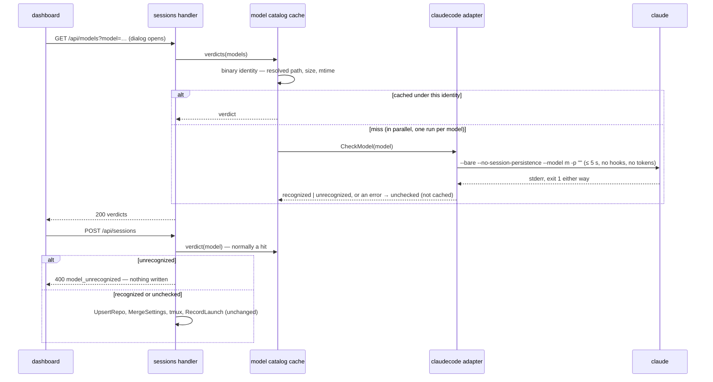

# Plan: Maintainability Regressions

**Created**: 2026-09-25
**Status**: completed
**Work Type**: full-stack
**E2E Scope**: new-specs
**Fixture plan**: launch-model-check.spec.ts startDaemon for the new tests (each sets the stub `claude`'s unrecognised-model list, a spawn option, and one kills the daemon); its existing tests keep `daemon`
**Features**: launch, ingest, connection
**Description**: Check the preset models when New Session opens, cache verdicts per Claude Code binary and block Launch on an unrecognised model (#55); write the hook wrapper scripts atomically (#54); close #58 as investigated.

## Overview

The developer filed three issues on 0.18.3 as regressions since the maintainability cleanup
(`TODO.md` § "Together — regressions since the maintainability cleanup"). Three read-only
investigations on 2026-09-25 diffed each path across the cleanup (`47325f7..af7a8dc`, i.e.
v0.18.2..v0.18.3). None of the three came from the cleanup:

- **#55, lag after Launch.** Every launch runs the model-catalog pre-check before anything else.
  It is a real `claude --bare … -p ""` run, measured on 2026-09-25 at 1.02 / 1.06 / 1.00 s on
  2.1.282. It shipped in v0.18.1, about six hours before the cleanup's base, uncached by the
  developer's choice at the time (`kb:adr/launch-refuses-model-outside-binary-catalog`: "pay
  the price of 1s otherwise cache invalidation etc becomes a whole thing"). Nothing else on the
  launch path gained a wait. This plan moves the check to the moment the dialog opens, runs the
  preset checks in parallel, and caches each verdict against the identity of the resolved
  `claude` binary file. Launch then finds its answer in the cache instead of paying a second.
  The dialog uses the verdicts to disable presets the binary does not recognise. If the model
  already selected is unrecognised, it stays selected, is marked invalid, and Launch is blocked
  until the developer picks another.
- **#54, tool hooks surfaced `hook error` / `Failed with non-blocking status code: No stderr
  output`.** It happened once, right after an update on another laptop. The rendered `hook.sh`,
  the settings entries and the ingest handler are byte-identical across the cleanup. The code
  review found two older transient windows during a daemon restart:
  - The listener is bound before startup work finishes, so a hook's `curl` can hang up to its
    `--max-time 2` against a 2 s hook timeout.
  - `hook.sh` is rewritten in place (`os.WriteFile` truncates, then writes), so a hook that
    reads the script mid-rewrite can exit with curl's non-zero status.

  The developer chose to fix only the second (option B): each wrapper script is written to a
  temp file and renamed over the old one, and not written at all when its content is
  unchanged. Serving before startup (option A) and a shorter `curl --max-time` (option C) were
  weighed and declined.
- **#58, Claude-terminal scroll choppier.** Nothing on the Claude surface's scroll path
  changed in the cleanup (see Implementation Notes → #58 investigation). The likely cause is
  Claude Code's self-update to 2.1.281 and 2.1.282 during those same days, past Muster's verified
  2.1.280. The developer closes #58 as investigated when this plan lands. No code change.

## Requirements

### Must Have

- [ ] REQ-1: `GET /api/models` returns a catalog verdict for each requested model (see
  Protocol Contract). Checks not already cached run in parallel, so four cold checks cost about
  one check's wall time, not four.
- [ ] REQ-2: A definite verdict (`recognized` or `unrecognized`) is cached against the
  **binary identity**: the `-claude-bin` value resolved on `$PATH`, with symlinks followed, plus
  that file's size and modification time. A later lookup under the same identity returns the
  cached verdict and runs no subprocess. A lookup under a different identity never returns a
  verdict cached under the old one. This is how a Claude Code update invalidates the cache,
  without Muster ever running `claude --version`.
- [ ] REQ-3: A check that errors, times out, or cannot resolve the binary's identity yields
  `unchecked` (fail-open, as today) and is never cached.
- [ ] REQ-4: `POST /api/sessions` keeps its pre-check and its `400 model_unrecognized`
  refusal, but takes the verdict from the same cache REQ-2 fills. A launch whose model was
  already checked under the current identity runs no pre-check subprocess.
- [ ] REQ-5: Concurrent requests for the same (identity, model) share one check run. For
  example, the dialog's open-time request and a Launch pressed before it answers never spawn
  two runs for one model.
- [ ] REQ-6: When the New Session dialog opens, the dashboard requests verdicts for the four
  presets, plus the custom model when `other…` is selected with a non-empty value. It
  requests again for the custom model whenever navigating to a recent restores a non-preset
  model.
- [ ] REQ-7: A preset whose verdict is `unrecognized` and that is not the selected model is
  disabled (cannot be selected) and marked as not recognised.
- [ ] REQ-8: When the selected model's verdict is `unrecognized` (a preset, or the custom
  model), the selection is kept. The field is marked invalid, and an inline message under the
  Model row states the daemon's `message` for it. The Launch button is disabled. Selecting a
  model not known to be unrecognised clears the mark and the message and re-enables Launch.
- [ ] REQ-9: A Launch refused with `400 model_unrecognized` for the custom model marks the
  custom field invalid, as in REQ-8. Editing the custom model's text clears that mark, since
  the new text has no verdict yet.
- [ ] REQ-10: `unchecked` and "no answer yet" never mark or disable anything. A verdict
  request that fails (daemon down, non-2xx) leaves every model as it would be with no
  verdicts. The dialog stays usable, and Launch reports its own error exactly as today.
- [ ] REQ-11: Each generated wrapper script (`hook.sh`, `status-line.sh`) is replaced
  atomically: its content is written to a temporary file in the same directory with mode
  0o700, then renamed over the target. A reader that opened the old file keeps reading the
  complete old script. A path lookup sees either the complete old file or the complete new
  one, never an empty or partial file.
- [ ] REQ-12: At daemon start, a wrapper script whose on-disk content already equals the
  content to be written is left untouched: no write, no rename, the same inode.

### Should Have

- [ ] REQ-13: A verdict that arrives for a model no longer relevant is ignored. That covers a
  closed dialog, and a custom value edited since the request was sent.

### Nice to Have

- (none)

## Protocol Contract

This is the delta against `docs/protocol.md`, to be merged there on approval under the
**launch** feature's anchors (a new `models.check` anchor beside `sessions.create`). There is
no WS change.

### HTTP: GET /api/models

**Auth**: UI cookie. Without it the response is `401 unauthorized`
(`{"error": {"code": "unauthorized", "message": "…"}}`, `kb:spec/connection`).

**Request:** the query parameter `model` is given 1 to 8 times. Each value is a non-empty
string, passed verbatim as `--model`, the same rule as `POST /api/sessions`' `model`.
Duplicates are collapsed.

```
GET /api/models?model=sonnet&model=opus&model=haiku&model=fable
```

**Response 200:**

```jsonc
{ "models": [                                   // one entry per distinct requested model, in first-seen request order
  { "model": "sonnet", "verdict": "recognized" },
  { "model": "fable",  "verdict": "unrecognized",
    "message": "Claude Code doesn't recognise the model \"fable\" — update Claude Code, or pick another model" },
  { "model": "opus",   "verdict": "unchecked" }
] }
// verdict: "recognized" | "unrecognized" | "unchecked"
//   recognized   — the installed binary's catalog describes it (kb:fact/model-catalog-precheck-zero-token)
//   unrecognized — its stderr carried the catalog sentence; POST /api/sessions would refuse it with model_unrecognized
//   unchecked    — the check errored, timed out or could not identify the binary; fail-open, launch would proceed
// message: string, present iff verdict is "unrecognized" — exactly the model_unrecognized message POST /api/sessions returns for that model
```

The response waits for every requested model's verdict. A cached verdict answers at once; an
uncached one runs the zero-token `--bare` check (≤ 5 s each, run in parallel, so ≤ ~5 s for
the whole request). Definite verdicts are cached against the binary identity (REQ-2):

- A Claude Code update, or any replacement of the resolved binary file, invalidates the cache
  on the next lookup.
- `unchecked` is never cached.
- The check runs in a daemon-chosen directory, not a launch directory: the catalog is built
  into the binary (see Implementation Notes → carried-over measurement).

**Errors:**
- `400 invalid_request`: no `model` parameter, more than 8 distinct values, or an empty value.
  `{"error": {"code": "invalid_request", "message": "model must be given 1 to 8 times, each non-empty"}}`

### HTTP: POST /api/sessions (pre-check wording only)

The request, the response and every error are unchanged. The pre-check paragraph's substance
changes from "runs `claude --bare …` in `directory`" to: "takes the model's verdict from the
catalog cache `kb:anchor/models.check` describes. On a miss it runs the zero-token check once
and caches a definite verdict. `unrecognized` refuses with `400 model_unrecognized`, and
nothing is written. `unchecked` lets the launch proceed."

## Schema Changes

No schema changes required. The cache is in memory: a daemon restart re-checks, which is
correct because it may be a new binary anyway.

## Diagrams

The launch feature spec's inline "One launch, end to end" sequence changes its pre-check
step. This is its delta (doc-reconcile applies it to `docs/features/launch/spec.md`):



## UI Specifications

Governing design: `docs/design/ux-flows.md` §1.2 "The form" (Model is a segmented control of
presets plus `other…` → `Custom model`); `docs/design/design-system.md` §5 "Segmented control"
and `.btn:disabled` (§5), §1 tokens. The error tone is the one `.launch-error` already uses
(`--banner-fg`, `--banner-line`), because `--rose` is reserved for the Failed state and
`--danger` for destructive actions (design-system §1/§3, `web/src/style.css` `.launch-error`
comment). The mockup `docs/design/mockups/a-instrument.html` shows the dialog and has no
invalid state; the pattern below is the new part, and the orchestrator records it in
design-system §5.

**The invalid-field pattern** (the standard form-validation idiom: an error colour on the
field, an error message next to it, `aria-invalid`, submit blocked):
- The invalid control carries `aria-invalid="true"` and `aria-describedby="model-error"`. For
  a preset that is its radio `<input>`; for the custom model it is `#custom-model-input`.
- Visually, the invalid preset's segment label (or the custom input) takes a 1px `--banner-line`
  outline and `--banner-fg` text.
- `<p id="model-error" class="field-error" hidden>` sits directly after the Model fieldset,
  with text in `--banner-fg`, mono, `--fs-xs`. It is prefixed with a `⚠` glyph inside an
  `aria-hidden` span, so the accessible text is exactly the daemon's message.
- An asterisk is **not** used: by convention it means "required", not "invalid".

**A disabled preset:** its radio is `disabled`. Its label takes `--disabled-fg` (the
`.btn:disabled` token family) with `title="Claude Code doesn't recognise this model"`.

### Views

- The New Session dialog, Model row: the invalid/disabled states above, plus `#model-error`.

### User Flows

1. The developer opens New Session. Every preset looks as today; the verdict request is in
   flight.
2. The verdicts arrive, in about 1 s after a Claude Code update, otherwise at once.
   `unrecognized` presets that are not selected become disabled.
3. If the selected model (e.g. a directory's remembered `fable`) is `unrecognized`: it stays
   selected, is outlined in the error tone, and `#model-error` shows the message. Launch is
   disabled.
4. The developer picks `sonnet`: the mark and the message clear, Launch is enabled, and
   `fable` becomes disabled.
5. Custom model: they type `zephyr` and press Launch. The daemon answers `400
   model_unrecognized`, and the custom input is marked invalid with the message in
   `#model-error`, not in `#launch-error`. Launch is disabled until they edit the text; editing
   clears the mark. *(Confirmed, review cycle 1: `#launch-error` stays empty for this refusal —
   `decisions/model-refusal-message-placement`.)*

### States

- **No data yet:** no marks and nothing disabled. The absence of a verdict reads as "not known
  to be bad", the same as `unchecked`. There is no spinner, since nothing waits on it.
- **Data:** as the flows above.
- **Daemon down:** the verdict request fails, so nothing is marked (REQ-10). The dialog's other
  daemon-down behaviour is unchanged.

### Testable UI Elements

| Element | Role | Name / Text Pattern | Notes |
|---------|------|---------------------|-------|
| Preset model option | `radio` | `sonnet` / `opus` / `haiku` / `fable` | existing native radios; `disabled` when REQ-7 applies; `aria-invalid="true"` when REQ-8 applies |
| Custom model option | `radio` | `other…` | existing |
| Custom model input | `textbox` | `Custom model` | existing label; `aria-invalid="true"` when REQ-8/9 apply |
| Model error message | — | the daemon's message, e.g. `Claude Code doesn't recognise the model "fable" — update Claude Code, or pick another model` | `#model-error`; the `⚠` glyph is `aria-hidden`, so the text excludes it; `hidden` when there is no invalid selection |
| Launch button | `button` | `Launch` | existing; `disabled` iff INV-1 |

### Invariants

- **INV-1:** the Launch button is disabled **iff** the selected model's latest verdict is
  `unrecognized`. That covers the selected preset, or `other…` with its current text. The rule
  is asserted from every source state: preset selected or custom selected; verdict none,
  `recognized`, `unchecked` or `unrecognized`; the verdict arriving before or after a selection
  change. Pre-existing disable reasons, e.g. an in-flight submit, compose with it.
- **INV-2:** `#model-error` is visible **iff** INV-1's condition holds, and its text is that
  verdict's `message`.
- **INV-3:** a cached verdict is never returned for a binary identity other than the one it
  was computed under.
- **INV-4:** a verdict of `unchecked` is never cached, never marks a field and never disables a
  preset.
- **INV-5:** at every instant, each wrapper script path names either the complete previous
  script or the complete new one.

## Affected Files

### Daemon

- `internal/claudecode/modelcheck.go`: the check itself is unchanged. It gains the
  binary-identity helper, or the implementer puts that beside it in `internal/claudecode`:
  resolve `bin` with `exec.LookPath`, `filepath.EvalSymlinks`, then `os.Stat`, returning
  (resolved path, size, mtime) or an error. The catalog sentence stays here (hard rule).
- `internal/server/launchermodels.go` (new, matching the launch spec's `launcher*.go`; a launch-feature handler type with its own `mount`, the
  usage handler exemplar shape per `docs/conventions.md` § Composition roots): the **one**
  catalog-cache owner. It holds verdicts keyed by (identity, model), drops every entry when the
  identity changes, and is bounded (≤ 64 entries per identity; clearing when full is enough).
  It collapses concurrent misses per key (REQ-5) and is mutex-guarded, with the guard named at
  its declaration. It also serves `GET /api/models` (decode, delegate, encode).
- `internal/server/launcher.go`: `checkModel` asks the cache owner instead of calling
  `CheckModel` directly (REQ-4). The nil-means-skip seam for test literals stays.
- `internal/server/server.go`: one-line construction and registration of the models feature,
  and passing its cache owner into `newSessionLauncher` (connection owns this file, which is why
  **Features** carries `connection`).
- `internal/claudecode/settings.go`: `writeEnvelopeScript` writes atomically and skips
  unchanged content (REQ-11, REQ-12). `WriteWrapperScripts`' signature is unchanged.

### Web

- `web/index.html`: `<p id="model-error" class="field-error" hidden>` after the Model fieldset.
- `web/src/protocol/models.ts` (new): the `GET /api/models` response decoder, a validator beside its siblings (`protocol/` is connection's).
- `web/src/features/launch.ts`: request verdicts on open and on a restored custom model;
  apply them; handle `model_unrecognized` for the custom field (REQ-6–10, REQ-13).
- `web/src/features/launchmodels.ts` (new, beside `launch.ts`, per § Composition roots): a **pure** function
  deriving the Model row's state from (verdicts, selected preset or custom text), returning
  which presets are disabled, whether the selection is invalid, the error message, and whether
  Launch is blocked. `launch.ts` calls it; INV-1/INV-2 are unit-tested on it.
- `web/src/render/launch.ts`: apply that state to the DOM (`disabled`, `aria-invalid`,
  `aria-describedby`, `#model-error`, Launch `disabled`).
- `web/src/style.css`: the `.field-error` rule and the invalid and disabled segment styles, using
  the existing tokens only.

### E2E (e2e-specs)

- `web/e2e/helpers/daemon.ts`: the stub `claude`'s `--bare` branch also treats as unrecognised
  every model listed (space-separated) in `MUSTER_E2E_STUB_UNRECOGNIZED_MODELS`, passed through
  a new `ScratchDaemonOptions` field, the same way `stubClaudeVersion` reaches
  `MUSTER_E2E_STUB_VERSION`.
- `web/e2e/launch-model-check.spec.ts`: gains E1–E5 beside its existing refusal tests (the same feature seam, `kb:adr/process-one-name-per-feature`).

## Edge Cases

1. The dialog opens while the daemon is down. The verdict request fails, nothing is marked, and
   Launch behaves as today. → E5
2. The dialog is closed before the verdicts arrive. The late response changes nothing on the
   next open, which issues its own request. → W3
3. The custom text is edited while its verdict is in flight. The stale verdict is ignored
   (REQ-13). → W3 (shared with edge case 2)
4. The selected preset's verdict arrives after the developer already switched to another
   preset. The arriving `unrecognized` disables the now-unselected preset and does not mark the
   new selection. → W1
5. A Launch is pressed before the open-time verdicts arrive. The daemon's launch pre-check
   joins the in-flight run or reads its result (REQ-5), so there is one subprocess per model. →
   D5
6. Claude Code auto-updates between the dialog opening and Launch. The launch lookup sees a new
   identity, misses, and runs one fresh check, so it never uses the stale verdict. → D3
7. The binary cannot be resolved (not on `$PATH`, a dangling symlink). The check still runs as
   today, but the result is treated as `unchecked` and not cached, so launch fails open. → D4
8. A check times out (a wedged binary). The model is `unchecked` and not cached, the next
   request retries, and the endpoint still answers within about 5 s. → D4 (shared with edge case 7)
9. More than 8 models, an empty value, or no `model` parameter gets `400 invalid_request`. →
   D6
10. Duplicate `model` values are collapsed to one entry in first-seen order. → D6 (shared with edge case 9)
11. A restored non-preset model (a recent's `lastModel`, e.g. `zephyr`) is requested on restore
    and marked before any Launch. → E4
12. A daemon restart with an unchanged script leaves `hook.sh`'s inode and mtime untouched. →
    D8
13. A daemon restart with a changed script (new port or token) replaces it by rename. A process
    that had the old file open reads the old content to its end. → D7
14. The temp file is never left behind after a successful write, and it is created in the data
    directory, never `/tmp`, so the rename is same-filesystem. → D7 (shared with edge case 13)
15. Hook-loss, `/clear` rebind and pane-death cases: not applicable. No hook-keyed rule changes,
    and the script's own behaviour and body are unchanged. → untested: no ingest semantics
    change; the existing ingest suite covers the unchanged body.

## Acceptance Criteria

IDs are unique across the whole section: `D*` daemon, `W*` web, `E*` e2e. One clause per
criterion.

### Daemon

- **D1**: a unit test shows two lookups of one model under one identity spawn exactly one check
  run (REQ-2).
- **D2**: a unit test shows four uncached models are checked concurrently: the fake run blocks
  until all four have started (REQ-1).
- **D3**: a unit test shows a changed identity (a different size, mtime or resolved path)
  re-runs the check and never returns the old verdict (INV-3).
- **D4**: a unit test shows a run error, a timeout or an unresolvable identity yields
  `unchecked` and a second lookup runs the check again (REQ-3, INV-4).
- **D5**: a unit test shows concurrent lookups of one (identity, model) share one run (REQ-5).
- **D6**: handler tests cover `GET /api/models`'s 200 shape (order, dedupe, `message` iff
  `unrecognized`), each `400 invalid_request` case, and `401` without the cookie.
- **D7**: a unit test shows a rewrite with new content replaces the file by rename. An fd
  opened on the old file still reads the full old content, no temp file remains, and the mode is
  0o700 (REQ-11, INV-5).
- **D8**: a unit test shows a rewrite with identical content leaves the inode and mtime
  unchanged (REQ-12).
- **D9**: a unit test shows `Launch` with a cached `unrecognized` verdict returns
  `model_unrecognized` without a check run, and with a cached `recognized` verdict proceeds
  without one (REQ-4).

### Web

- **W1**: a Vitest table on the pure Model-row derivation asserts INV-1 and INV-2 from every
  row of: selection (each preset, custom with text, custom empty) × verdict (none,
  `recognized`, `unchecked`, `unrecognized`), including the "verdict for the unselected
  preset" rows.
- **W2**: a Vitest test on the response decoder rejects a malformed body: an unknown verdict,
  `message` missing on `unrecognized`, or a non-array `models`.
- **W3**: a Vitest test shows a verdict for a stale request (the dialog closed, or the custom
  text changed) leaves the derived state unchanged (REQ-13).

### E2E

- **E1**: with `fable` stubbed unrecognised and `sonnet` selected, opening the dialog leaves
  the `fable` radio disabled and `sonnet` launchable.
- **E2**: with `fable` stubbed unrecognised and `fable` selected, the `fable` radio is still
  checked and `aria-invalid="true"`, `#model-error` shows the refusal message, and Launch is
  disabled.
- **E3**: from E2's state, selecting `sonnet` hides `#model-error` and enables Launch.
- **E4**: a custom model the stub refuses, submitted with Launch, marks `Custom model` invalid
  with the message, and editing its text re-enables Launch.
- **E5**: with the daemon killed after the page loaded, opening the dialog marks and disables
  nothing.
- **E6**: the existing refusal tests in `launch-model-check.spec.ts` pass unchanged.
  *Amended (review cycle 1, browser Major 1 / code Major 6, `decisions/model-refusal-message-placement`,
  `kb:adr/launch-model-refusal-shown-in-field-error-only`):* the two tests keep every assertion
  except where the refusal message is read, which moves from `#launch-error` to `#model-error`,
  per User Flow 5.

### Automated Checks

```checks
D0 go build ./...
D10 make lint
D11 make test
D12 make test-race
W0 make web-build
W4 make web-lint
W5 make web-test
E0 make e2e
K1 make check-kb
```

### Reviewer-Verified

- **R1**: the catalog sentence and every Claude Code argv stay inside `internal/claudecode`;
  the cache owner in `internal/server` sees only neutral verdicts.
- **R2**: there is exactly one cache owner, and both `GET /api/models` and `POST /api/sessions`
  go through it.
- **R3**: no new colour token. The invalid and disabled styles use `--banner-fg`,
  `--banner-line` and `--disabled-fg` only.
- **R4**: in a browser, an invalid preset reads as "selected and wrong" in all three themes
  (instrument, dark, light), distinct from a disabled preset.
- **R5**: no `any` in new web code.
- **R6**: `WriteWrapperScripts`' generated script body is byte-identical to before.

## Doc Delta

**launch**: becomes true:
- `docs/features/launch/spec.md` § What launch does: when the dialog opens, it asks the daemon
  whether the installed Claude Code recognises each preset. A preset it does not recognise is
  disabled. A selected model it does not recognise stays selected, is marked invalid with the
  reason, and blocks Launch until another is picked. Verdicts are cached against the resolved
  `claude` binary's path, size and modification time, so an update re-checks. Launch reads the
  same cache and refuses an unrecognised model with `model_unrecognized`. A check that cannot
  run lets the launch proceed and is not cached
  (kb:adr/launch-model-check-cached-per-binary-identity,
  kb:adr/launch-unrecognized-model-marked-blocks-launch).
- `docs/features/launch/spec.md` "One launch, end to end": the pre-check step is the Diagrams
  delta above.
- `docs/protocol.md`: the `GET /api/models` section (anchor `models.check`) and the
  `POST /api/sessions` pre-check paragraph as in the Protocol Contract. The feature spec's
  frontmatter protocol list names `models.check`.

**launch**: stops being true:
- § What launch does: "Before anything is written, the launch checks the model … with a
  zero-token `--bare` run" as the only check, run on every launch. It is replaced by the
  cached-verdict sentence above.
- `docs/protocol.md` `POST /api/sessions` pre-check: "the daemon runs `claude --bare
  --no-session-persistence --model <model> -p ""` in `directory`".

**ingest**: becomes true:
- `docs/features/ingest/spec.md` § Transport: "The wrappers live in the data directory and are
  rewritten at every daemon start" becomes "…and are replaced atomically at daemon start when
  their content changed, so a hook never runs a partly written script"
  (kb:adr/ingest-wrapper-scripts-replaced-atomically).

**ingest**: stops being true:
- nothing else.

`docs/design/design-system.md` §5 gains the invalid-field pattern: the error tone on the field,
`aria-invalid`, an inline `⚠` message, submit blocked (orchestrator, Doc upkeep).

## Out of scope

- **Serving HTTP before startup work (#54 option A)** and **a shorter `curl --max-time` (#54
  option C)**: weighed and declined by the developer on 2026-09-25. #54 is watched for
  recurrence instead.
- **#58 code change**: the investigation found none to make. Whether Claude Code 2.1.281/2.1.282
  changed scroll feel is the developer's manual A/B (the same muster build with
  `~/.local/share/claude/versions/2.1.280` vs `2.1.282`), then `/claude-code-upgrade`. Not
  filed.
- **Pre-warming the cache at daemon start**: the daemon does not own the preset list (the
  dashboard does), and the dialog-open request already hides the cold second.
- **Checking the custom model while typing**: it is checked at Launch and on restore only.
- **The #54 watch entry.** At Completion this replaces the #54 entry in `TODO.md`, copied
  verbatim, under § Issues → "On their own". On or after 2026-10-02, if no new hook-error
  issue has been logged, the developer (or a session they ask) moves it to
  `docs/history/todo-done.md`. If one has, #54 is reopened:

  - [ ] **Watch until 2026-10-02: tool hooks surfaced `hook error` after an update** ([#54](https://github.com/Zalaras/muster/issues/54)) — closed by plan `maintainability-regressions`. Remove this entry on 2026-10-02 if no hook error of the same kind has been logged since; otherwise reopen #54.

## Implementation Notes

- **Decisions (proposed ADRs, written at approval):**
  - `kb:adr/launch-model-check-cached-per-binary-identity`: supersedes
    `kb:adr/launch-refuses-model-outside-binary-catalog`. It adds the dialog-open check (that
    ADR's option B) and the cache (its option D), with invalidation by binary file identity,
    which answers that ADR's "cache invalidation becomes a whole thing". Fail-open and the
    refusal are kept.
  - `kb:adr/launch-unrecognized-model-marked-blocks-launch`: an unrecognised selection is kept,
    marked with the standard invalid-field pattern, and blocks Launch. Unrecognised unselected
    presets are disabled.
  - `kb:adr/ingest-wrapper-scripts-replaced-atomically`: write to a temp file, rename, skip when
    unchanged. Serving-before-start and a shorter curl timeout were rejected.
- **Carried-over measurement** (`kb:fact/model-catalog-precheck-zero-token`, measured on 2.1.280
  in a launch directory): re-checked against this plan's two changes.
  - *Run in a daemon-chosen directory rather than the launch directory.* Still valid, because
    the fact records the catalog as built into the binary and checked "at startup, before it
    authenticates", and `--bare` skips hooks and settings-driven startup. The directory never
    fed the verdict.
  - *Run on 2.1.282, above the verified 2.1.280.* The run was re-measured on 2.1.282 on
    2026-09-25 at 1.0 s with `claude-haiku-4-5-20251001` recognised. The sentence itself is
    re-verified by the canary at the next `/claude-code-upgrade`, not by this plan.
- **The check's argv, timeout (5 s) and WaitDelay are unchanged.** Parallel runs spawn up to
  8 `claude` processes at once, bounded by the endpoint's 8-model cap.
- **Binary identity is generic file identity.** It relies on "the file changed", not on
  Claude Code's `versions/` layout, so a Homebrew or in-place install invalidates the same way.
  `exec.LookPath` uses musterd's own `$PATH`, the same one the spawn uses.
- **Atomic write:** `os.CreateTemp` in the data directory, write, `Chmod(0o700)`, `Close`, then
  `os.Rename`. On any error, remove the temp file. The 0o700 comment's reason (the token is in
  the script) still binds the temp file. Compare the content first: when it is equal, return
  with no write.
- **#58 investigation (evidence for closing it).** Across `47325f7..af7a8dc`:
  - **xterm options** (`web/src/terminal/pane.ts`: fontSize, lineHeight and theme only; no
    scrollback or scroll options before or after): unchanged.
  - **Wheel handling**: the Claude surface installs no custom wheel or key handler (only
    `kind === "shell"` does), and `refit()` is unchanged.
  - **Drop handlers**: moved to `terminal/dropwire.ts` with no wheel handling.
  - **`style.css`**: comments only.
  - **Theme**: re-themed less often, not more.
  - **Render tick**: `setInterval(app.render, 1000)` is unchanged.
  - **PTY pump** (`internal/server/terminal.go`, `internal/termbridge`): the same 32 KiB read,
    one write per read.
  - **Attach**: gained only the `=` exact-target prefix.
  - **Scroll speed**: `CLAUDE_CODE_SCROLL_SPEED=5` is still in the launch and resume env
    (`kb:adr/surfaces-scroll-speed-via-launch-env`).
  - **Dependencies**: no changes in `web/package*.json` or `go.mod`.

  On the Claude surface the wheel is Claude Code's own (its TUI's mouse reporting), and Claude
  Code self-updated to 2.1.281 (2026-09-23 21:37) and 2.1.282 (2026-09-24 19:35) inside the
  cleanup's window.
- **#54 evidence**: the rendered `hook.sh` is byte-identical in v0.18.2 and v0.18.3, and
  `git diff v0.18.3 main` on the hook path is empty. This plan fixes the partial-script window
  only, so #54 may still recur through the listener-before-serve window (`cmd/musterd/main.go`
  binds at `prepareServing`, serves only after `srv.Start()`).
- **Doc upkeep (orchestrator)**:
  - Record the three ADRs above (proposed at approval, accepted at Completion) and supersede
    `launch-refuses-model-outside-binary-catalog`.
  - Update the `docs/design/design-system.md` §5 invalid-field pattern.
  - At Completion, tick #55 and #58 (#58 as "investigated — no Muster change, likely Claude
    Code 2.1.281/282") and move their blocks to `docs/history/todo-done.md`. #54 is **not**
    moved: its entry in `TODO.md` is replaced by the watch entry this plan's Out of scope
    approves, which keeps the `issues/54` link in `TODO.md`. The group heading goes to the done
    history with #55 and #58.
  - Record closing issues as `orch-state.py maintainability-regressions closes 54 55 58`. The
    developer decided on 2026-09-25 that #54 closes with the atomic write and is watched for
    a week.
  - Run `make gen-kb`.
- **Feature registry**: `models.check` was added to the launch spec's `protocol` list at approval.
  Every new file matches an existing launch glob: `internal/server/launchermodels.go` →
  `launcher*.go`, `web/src/features/launchmodels.ts` → `launch*.ts`, and the E2E tests live in
  `launch-model-check.spec.ts`. `check-kb` fails a glob that matches no file, so no new glob is
  added before the files exist.
- **plan-lint and `web/src/style.css`**: rule 12 flags `style.css` as owned by no feature. The
  running `plan/settings-update-failures` branch exempts it in `plan-lint.sh`; the developer
  confirmed on 2026-09-25 that this is the fix. Rebase onto `main` once that lands, and before
  `/orchestrate`'s pre-flight lint.
- **Conflict watch**: the running `plan/settings-update-failures` branch edits `web/index.html`
  (the banner), `web/src/style.css` (+10 lines), `web/src/main.ts`, `docs/protocol.md` (the
  update sections) and `internal/server/ws.go`. This plan touches different regions of the
  first four and not `ws.go`. Rebase onto `main` after that branch lands and before `/land`.
