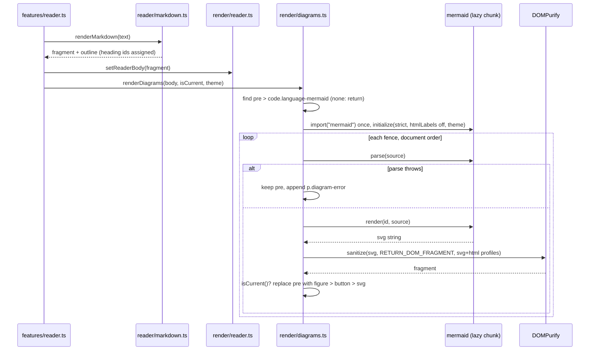

# Plan: Mermaid Support

**Created**: 2026-09-15
**Status**: completed
**Work Type**: web
**E2E Scope**: new-specs
**Fixture plan**: reader-mermaid.spec.ts daemon (E6 flips the daemon-global theme pref, and `launchSession` relies on auto-focus of the sole session, as reader.spec.ts does)
**Features**: reader
**Description**: The docs reader renders ```` ```mermaid ```` fences as diagrams with mermaid 12 (ELK bundled) compiled into musterd — no CDN — inside the existing sanitizer boundary, degrading to the fenced source with a reason when a diagram is malformed, and enlarging into a modal with zoom and pan.

## Overview

The reader (`kb:spec/reader`) renders a session's markdown in the browser: marked produces HTML,
DOMPurify sanitizes it, and the sanitized fragment is the only thing that ever enters
`article.md` (`kb:adr/reader-markdown-rendered-in-browser`). A ```` ```mermaid ```` fence today
is a plain `<pre><code class="language-mermaid">` block. The kb has just standardised on mermaid
for every system and feature diagram (`kb:adr/knowledge-diagrams-are-mermaid-records`), whose
consequences defer rendering them in the reader to this work; `TODO.md` carries the item with
three constraints this plan treats as binding: client-side, inside the sanitizer boundary with no
raw HTML or script passthrough from diagram source, and a malformed diagram degrades to the
fenced source and never breaks the page.

Rendering uses **mermaid 12.0.0**, pinned exactly like marked and DOMPurify. The developer requires ELK
layout support; mermaid 12 bundles the ELK engine and makes it the default layout for flowchart,
state, class and ER diagrams, so a diagram that names `layout: elk` — or names nothing — lays out
with ELK and nothing extra is registered (mermaid 11 would need a second pinned add-on package for ELK,
registered by hand). 12.0.0 is five days old (2026-09-10) and targets
ES2024, which the dashboard's Chromium-class browsers meet; a 12.0.x patch is a routine bump.
Nothing is fetched from a CDN: Vite bundles mermaid into hashed chunks under
`internal/webui/assets`, which `//go:embed` compiles into the musterd binary, so every byte the
reader runs ships in the binary and every request stays on the daemon's origin — the same
reasoning as `kb:adr/stack-system-font-stacks-only`. mermaid is imported **dynamically, on the
first fence a rendered document contains**, so the dashboard's entry chunk and first paint are
unchanged and a session that never opens a diagram never loads the engine.

The sanitizer boundary is kept, not moved: mermaid runs at its default `strict` security level
with HTML labels off, its SVG string passes through DOMPurify (SVG plus HTML profiles) and enters
the DOM as a fragment, and mermaid's click-binding hook is never invoked. Syntax is checked with
mermaid's parse call before render, so its red "syntax error" SVG never reaches the DOM; a failed
fence keeps its source and gains one labelled line beneath saying why (design-system §6.8: stale
or degraded is labelled, not hidden). Diagrams follow the dashboard theme — mermaid `dark` for
`instrument` and `dark`, mermaid `default` for `light` — and re-render when the theme changes.
Each diagram is wrapped in a button that enlarges it into the dashboard's settled `dialog.modal`
(design-system §5 Modal), opening fitted to the viewport with **zoom and pan**: wheel zooms
around the pointer, dragging pans, `Zoom in` / `Zoom out` / `Reset zoom` buttons and the `+`,
`-`, `0` and arrow keys do the same, and the SVG stays crisp because it is scaled by a CSS
transform. A new tab was rejected: it needs a blob URL that loses the theme, opens a tab per look,
and cannot be exercised the same way on the pop-out. No protocol, daemon or schema change: the
daemon still hands raw `text/markdown` bytes and parses nothing it serves.

## Requirements

### Must Have
- [ ] REQ-1: A fenced code block whose info string's first word is `mermaid` (case-insensitive;
  trailing words such as `title=x` ignored) renders as an SVG diagram in place of the code block,
  for every diagram type mermaid 12.0.0 supports — including the kb's eight kinds (`C4Context`,
  `C4Container`, `C4Component`, `classDiagram`, `stateDiagram-v2`, `sequenceDiagram`,
  `erDiagram`, `flowchart`).
- [ ] REQ-2: A flowchart whose frontmatter or init directive names `layout: elk` renders, and a
  flowchart naming no layout renders — ELK is available without any registration call.
- [ ] REQ-3: mermaid is pinned to exactly `12.0.0` in `web/package.json` and is bundled by Vite
  into the embedded dashboard; while a diagram document is opened, rendered and enlarged, no
  request leaves the daemon's origin.
- [ ] REQ-4: mermaid is imported dynamically — there is no static import — and its chunk is
  requested only when a rendered document contains at least one mermaid fence; a document without
  one loads nothing extra.
- [ ] REQ-5: The SVG mermaid produces enters `article.md` only as a DOMPurify fragment (SVG and
  HTML profiles, SVG filters allowed); mermaid runs with `securityLevel: "strict"`, HTML labels
  off, `startOnLoad: false`, `suppressErrorRendering: true`; its `bindFunctions` is never called.
  A diagram whose labels or `click` directives carry a `<script>`, an `onerror` attribute or a
  `javascript:` URL, or whose `%%{init}%%` directive asks for `securityLevel: "loose"`, renders
  with none of them present.
- [ ] REQ-6: A fence mermaid cannot parse or render keeps its `<pre><code>` source and gains one
  sibling line directly after it, `diagram not rendered: <first line of mermaid's message>`
  (`syntax error` when there is no message); the rest of the document, including other diagrams,
  renders normally, and mermaid's own error SVG never appears.
- [ ] REQ-7: A rendered diagram uses mermaid theme `dark` when the root's `data-theme` is
  `instrument` or `dark` (or anything unrecognised) and `default` when it is `light`, records that
  on the figure as `data-mermaid-theme`, and re-renders from the retained source — without
  re-fetching the file — when `data-theme` changes.
- [ ] REQ-8: Each rendered diagram is wrapped in a `<button>` named `Enlarge diagram`; activating
  it opens a modal `<dialog class="modal diagram-modal">` inside the same reader root showing a
  clone of the diagram fitted to the stage (zoom `1` = fit) with a toolbar of `Zoom in`,
  `Zoom out`, `Reset zoom` and `Close`; Escape, the backdrop or `Close` closes it and focus
  returns to the `Enlarge diagram` button. Identical in Focus, a tile and the pop-out.
- [ ] REQ-9: In the open modal, the wheel zooms around the pointer (factor `1.1` per 100 px of
  `deltaY`, inverted so wheel-up zooms in), pointer drag pans, `Zoom in`/`+`/`=` multiply the zoom
  by `1.25`, `Zoom out`/`-` divide it by `1.25`, `Reset zoom`/`0` return to fit with no pan, and
  the arrow keys pan by 40 px; zoom is clamped to `[0.25, 8]`; the stage exposes the current zoom
  as `data-zoom` (two decimals) and the canvas carries the `transform`.
- [ ] REQ-10: While the engine loads or a diagram renders, the fenced source stays visible — no
  spinner, no placeholder — and a result that arrives after the open was superseded
  (`fetchSeq`), the instance disposed, or a newer theme pass started is discarded.
- [ ] REQ-11: A diagram wider than the body scrolls horizontally inside its own figure, like
  `.md pre` does; `article.md` itself never gains a horizontal scrollbar, in Focus and in a
  compact tile.
- [ ] REQ-12: Heading ids and the outline are unchanged by the diagram pass — it runs after
  `renderMarkdown` has assigned ids and touches only `pre > code` mermaid blocks.

### Should Have
- [ ] REQ-13: Diagram text uses the dashboard's `--sans` stack (mermaid `fontFamily` read from
  the root's computed `--sans` at initialize time), not mermaid's default face.
- [ ] REQ-14: Diagrams in one document render sequentially in document order with unique ids
  (`muster-diagram-<instance>-<n>`), so two identical fences both render.

### Nice to Have
- [ ] REQ-15: The failure line's text is selectable so a reader can copy mermaid's message.

## Protocol Contract

No protocol changes. The reader still fetches `kb:anchor/sessions.reader` and
`kb:anchor/sessions.reader-file` exactly as today and the daemon serves raw `text/markdown`.

## Schema Changes

No schema changes required.

## Diagrams

The asynchronous post-pass this plan adds to the reader's open path. Not a delta of any kb
diagram; the reader feature spec has no inline diagram for this path today.



## UI Specifications

Design authority: `docs/design/design-system.md` §1 (tokens), §5 **Modal** (`--bg-raised` on the
`--scrim` backdrop, 1px `--line-control` border, footer rule) and §6.8 (stale/degraded is
labelled, not hidden); `docs/design/mockups/markdown-viewing/a2-nav-files-focus.html` for the
body the figure sits in. No mockup draws a diagram; the figure grounds like `.md pre` does today
(`--bg-hover`, 1px `--line`).

### Views
- Reader body (`article.md`) in Focus, in a tile and in the pop-out (`/doc.html`) — mermaid
  fences become figures; everything else is unchanged.
- Diagram modal — one `<dialog class="modal diagram-modal">` per reader root, added to
  `#reader-template` in both `web/index.html` and `web/doc.html` (the two copies stay identical).
  Sized `calc(100vw - 32px)` × `calc(100vh - 32px)`; the stage fills it above the footer toolbar.

### DOM

Rendered diagram, replacing the `<pre>` in place:

```html
<figure class="diagram" data-mermaid-theme="dark">
  <button type="button" class="diagram-enlarge" aria-label="Enlarge diagram">
    <svg …>…</svg>            <!-- DOMPurify fragment of mermaid's output -->
  </button>
</figure>
```

Failed diagram, the `<pre>` kept:

```html
<pre><code class="language-mermaid">…source…</code></pre>
<p class="diagram-error">diagram not rendered: Parse error on line 2: …</p>
```

The dialog, last child of `section.reader` in the template:

```html
<dialog class="modal diagram-modal" aria-label="Diagram">
  <div class="diagram-stage" data-zoom="1.00" tabindex="0">
    <div class="diagram-canvas"></div>       <!-- receives the svg clone; transform: translate() scale() -->
  </div>
  <div class="modal-foot diagram-toolbar">
    <button type="button" class="diagram-zoom-in" aria-label="Zoom in">+</button>
    <button type="button" class="diagram-zoom-out" aria-label="Zoom out">−</button>
    <button type="button" class="diagram-zoom-reset" aria-label="Reset zoom">fit</button>
    <button type="button" class="diagram-close">Close</button>
  </div>
</dialog>
```

The diagram source is retained in a `WeakMap<Element, string>` keyed by the figure (never an
attribute — sources can be large), for the theme re-render. Zoom state is
`{ zoom: number; x: number; y: number }`; the canvas `transform` is
`translate(${x}px, ${y}px) scale(${zoom * fit})` where `fit` is the scale that fits the SVG's
intrinsic size inside the stage on open, so `zoom` reads `1.00` at fit.

### User Flows
1. Open a markdown file containing a mermaid fence → the fenced source shows immediately with the
   rest of the document → the engine chunk loads (first time only) → each fence is replaced, in
   order, by its diagram; a malformed one keeps its source and gains the failure line.
2. Click a diagram (or Tab to it and press Enter/Space) → the modal opens with the diagram fitted
   and the stage focused → wheel/drag/keys/buttons zoom and pan → Escape, backdrop click or
   `Close` → modal closes, focus is back on the diagram button; the next open starts at fit again.
3. Change the theme in Settings → every rendered diagram in the open document re-renders in the
   mapped mermaid theme; `data-mermaid-theme` flips; nothing is re-fetched.
4. Claude rewrites the open file (`docChanged`) → the silent re-fetch re-renders the document and
   the diagram pass runs again; no loading cue (`kb:adr/reader-loading-cue-never-clears-a-rendered-body`).

### States
- No data yet: unchanged — the reader's own `loading…` placeholder; no diagram state exists before
  a body has rendered.
- Engine loading / diagram rendering: the fenced source is visible; nothing else is shown.
- Data: the figure with its SVG.
- Degraded: the source plus `diagram not rendered: <reason>`.
- Daemon down: unchanged — the reader keeps its last render, including rendered diagrams; the
  modal still opens and zooms on a rendered diagram since nothing is fetched.

### Testable UI Elements

| Element | Role | Name / Text Pattern | Notes |
|---------|------|---------------------|-------|
| Rendered diagram | — | — | `article.md figure.diagram` containing an `svg`; `data-mermaid-theme` is `dark` or `default` |
| Enlarge button | `button` | `Enlarge diagram` | `figure.diagram > button.diagram-enlarge`, wraps the `svg` |
| Failure line | — | `/^diagram not rendered: /` | `p.diagram-error`, the next sibling of the kept `pre` |
| Kept source | — | — | `pre > code.language-mermaid` remains only for a failed fence |
| Diagram dialog | `dialog` | `Diagram` | `dialog.modal.diagram-modal`; `[open]` while shown |
| Stage | — | — | `.diagram-stage`; `data-zoom` two decimals, `1.00` on open; focused on open |
| Canvas | — | — | `.diagram-canvas`, holds one `svg` clone; inline `transform` |
| Zoom in | `button` | `Zoom in` | toolbar |
| Zoom out | `button` | `Zoom out` | toolbar |
| Reset zoom | `button` | `Reset zoom` | toolbar |
| Dialog close | `button` | `Close` | toolbar |
| Theme radio (existing) | `radio` | `Light` | Settings dialog, `web/e2e/helpers/theme.ts` `themeRadio` |

### Invariants

- **INV-1 (sanitizer boundary)**: nothing enters `article.md` except a DOMPurify fragment or text
  set via `textContent` — asserted from every path that writes the body: initial open, silent
  re-fetch (`docChanged`, focus, snapshot), theme re-render, and the failure path.
- **INV-2 (origin)**: no request leaves the daemon's origin from the reader, in Focus, a tile and
  the pop-out, before, during and after the engine loads and while the modal is used.
- **INV-3 (one dialog per root)**: each reader root holds exactly one `dialog.diagram-modal`; with
  two tiles on docs, enlarging in one never opens the other's dialog.
- **INV-4 (late results)**: an asynchronous result never touches a body it was not started for —
  from a superseded open, a disposed instance, and a theme pass superseded by a newer one.
- **INV-5 (zoom clamp)**: `data-zoom` is within `[0.25, 8.00]` after any sequence of wheel, key
  and button inputs, from fit, from the minimum and from the maximum.

### Carried-over measurements

None — no Claude Code fact is applied here; the only measured values are the reader's own
(`kb:adr/reader-markdown-rendered-in-browser`: 24 kB gzip, 50 ms), which this plan does not reuse.

## Affected Files

### Web
- `web/package.json`, `web/package-lock.json` — `"mermaid": "12.0.0"` (exact).
- `web/src/reader/mermaid.ts` — **new**, pure, Vitest-tested: `isMermaidLanguageClass(className:
  string): boolean` (a `language-mermaid` class token, case-insensitive on `mermaid`, other tokens
  ignored; `language-mermaidjs` and `lang-mermaid` are false), `mermaidThemeFor(theme: string |
  null): "dark" | "default"` (`light` → `default`, everything else → `dark`),
  `diagramErrorText(err: unknown): string` (`diagram not rendered: ` plus the first non-empty line
  of an `Error`'s message trimmed and capped at 200 characters; `syntax error` for anything else),
  `diagramId(instance: number, n: number): string`.
- `web/src/reader/zoom.ts` — **new**, pure, Vitest-tested: `ZoomState`, `ZOOM_MIN`/`ZOOM_MAX`,
  `fitScale(svgW, svgH, stageW, stageH): number`, `clampZoom(z): number`,
  `zoomAround(state, factor, px, py): ZoomState` (keeps the stage point `(px, py)` fixed),
  `wheelFactor(deltaY): number` (`1.1 ** (-deltaY / 100)`), `panBy(state, dx, dy): ZoomState`,
  `resetZoom(): ZoomState`, `transformOf(state, fit): string`.
- `web/src/render/mermaid.ts` — **new**, DOM, not Vitest-testable (needs `window`, like
  `reader/markdown.ts`): the engine module — `loadEngine()` (memoised `import("mermaid")` +
  `initialize`), `renderDiagramSvg(id, source, theme): Promise<DocumentFragment>` (parse → render →
  DOMPurify with `RETURN_DOM_FRAGMENT` and `USE_PROFILES: { html: true, svg: true, svgFilters:
  true }`; throws with mermaid's message on failure). The only module that names mermaid.
- `web/src/render/diagrams.ts` — **new**, DOM: `renderDiagrams(body, opts: { instance, isCurrent:
  () => boolean, theme })` finds `pre > code` blocks passing `isMermaidLanguageClass`, renders them
  sequentially, swaps in `figure.diagram > button.diagram-enlarge > svg` or appends
  `p.diagram-error`, retains sources in a `WeakMap`; `rerenderDiagrams(body, theme, isCurrent)` for
  the theme pass.
- `web/src/render/diagramdialog.ts` — **new**, DOM: `wireDiagramDialog(refs)` — delegated click on
  `.diagram-enlarge` opens the root's dialog with a clone at fit, focuses the stage; wheel, pointer
  drag (`setPointerCapture`), keys and toolbar buttons drive `reader/zoom.ts` and write `data-zoom`
  and the canvas `transform`; `Close`/Escape/backdrop close and restore focus.
- `web/src/render/reader.ts` — `ReaderRefs` gains `diagramDialog`, `diagramStage`,
  `diagramCanvas`, `diagramZoomIn`, `diagramZoomOut`, `diagramZoomReset`, `diagramClose` from the
  template; `buildReader` calls `wireDiagramDialog`.
- `web/src/features/reader.ts` — after `setReaderBody(... fragment)` in `openFile`, start the
  diagram pass with `isCurrent = () => !this.disposed && seq === this.fetchSeq`; a
  `MutationObserver` on `document.documentElement` for `data-theme` (attached in the constructor,
  disconnected in `dispose`) awaits any in-flight pass then calls `rerenderDiagrams`.
- `web/index.html`, `web/doc.html` — `#reader-template` gains the identical `<dialog>` markup above.
- `web/src/style.css` — `.md figure.diagram` (`--bg-hover`, 1px `--line`, `overflow-x: auto`,
  `max-width: 100%`, `margin: 0 0 10px`), `.diagram-enlarge` (unstyled button, `cursor: zoom-in`,
  `display: block`), `.diagram-error` (`--fg-muted`, `0.85em`, `user-select: text`),
  `dialog.diagram-modal` (`width: calc(100vw - 32px)`, `height: calc(100vh - 32px)`, grid rows
  `1fr auto`), `.diagram-stage` (`overflow: hidden`, `cursor: grab`, `touch-action: none`,
  `--well` ground), `.diagram-canvas` (`transform-origin: 0 0`, `will-change: transform`),
  `.diagram-toolbar` (existing `.modal-foot` rule plus the four buttons), `.reader.compact` variant
  keeps the figure inside the tile.
- `web/src/reader/CLAUDE.md` — hand-written part: `mermaid.ts` and `zoom.ts` join the pure
  exemplars; `render/mermaid.ts` joins `markdown.ts` as the modules Vitest cannot import.
- `web/src/render/CLAUDE.md` — hand-written part, if it enumerates modules: `diagrams.ts`,
  `diagramdialog.ts`, `mermaid.ts`.
- `web/src/reader/mermaid.test.ts`, `web/src/reader/zoom.test.ts` — **web-tests**: W7–W9, W21.
- `web/e2e/reader-mermaid.spec.ts` — **e2e-specs**, new spec (fixture `daemon`).
- `web/e2e/helpers/reader.ts` — **e2e-specs**: `diagramFigure`, `enlargeButton`, `diagramDialog`,
  `diagramStage`, `diagramError`, `writeMermaidFixture(dir)`; an `OriginRequestTracker` recording
  every request URL.

### Daemon
- None. No Go file changes.

## Edge Cases

1. Info string `Mermaid` or `MERMAID` — marked emits `language-Mermaid`; matched case-insensitively → W8
2. Info string `mermaid title=x` — marked classes the first word only, so `language-mermaid`; renders → E12 (shared with edge case 1)
3. Empty mermaid fence — parse throws; source kept with the failure line → E3 (shared with edge case 4)
4. One malformed fence among valid ones — only it degrades; the others render → E3
5. The user opens another file while the engine is still loading or rendering — the late SVG is discarded, the new body untouched → W12
6. `docChanged` re-fetch of the open file — silent re-render runs the pass again; new label text appears → E7
7. Theme change with diagrams rendered — re-rendered from retained source in the mapped theme, no fetch → E6
8. Theme change on the pop-out — `/doc.html` reads the theme hint at load and has no live theme sync, so the observer never fires there → untested: no code path reaches it; the observer is inert on that page
9. Dead session with the docs surface open — the pass is state-agnostic and runs on any rendered fragment → untested: no session-state branch exists in the pass; E22 of reader.spec.ts already covers the dead-session render path
10. Diagram wider than the body — figure scrolls horizontally; `article.md` does not → E11
11. Escape, backdrop click and `Close` each dismiss the dialog with focus back on the button → E8
12. The same diagram document in two tiles — each root has its own dialog; enlarging in one opens only that one → E9
13. Labels carrying `<script>`, `onerror`, a `javascript:` `click` — none present after render → E4
14. `%%{init: {"securityLevel":"loose","flowchart":{"htmlLabels":true}}}%%` in the source — mermaid's `secure` list refuses `securityLevel`; anything HTML labels smuggle is still stripped by DOMPurify → E4 (shared with edge case 13)
15. The engine chunk fails to load — the failure line reads `diagram not rendered: engine unavailable` on every fence → untested: the chunk is embedded in the binary; a failed import cannot be driven without killing the daemon, which fails the file fetch first
16. Two identical fences in one file — distinct ids, both render → E12 (shared with edge case 1)
17. A fence nested in a blockquote or list item — `pre > code` is found at any depth → E12 (shared with edge case 1)
18. Compact tile — the figure stays inside the tile's body; no horizontal scroll on `article.md` → E11 (shared with edge case 10)
19. Theme changes while a pass is in flight — the theme handler awaits the current pass, then re-renders; the in-flight pass's result is not applied twice → W19
20. A file with no mermaid fence — no import, no request for the engine chunk → E5
21. The dialog is open when the body re-renders — the dialog holds a clone, so replacing the body never empties it; it closes normally → W20
22. mermaid's SVG carries a `<style>` element and `#id` references its CSS depends on — DOMPurify must keep both or the diagram renders unstyled; the implementer measures and adds `ADD_TAGS: ["style"]` only if the default profile strips it → E2 (a styled diagram has a non-default `fill`) and W10
23. A flowchart with `layout: elk` frontmatter and one with no layout — both render; no registration call exists → E15
24. Zoom in repeatedly past `8` or out past `0.25` — `data-zoom` clamps and stays there → E13
25. Wheel zoom with the pointer off-centre — the SVG point under the pointer stays under it (`zoomAround`) → W21
26. Drag beyond the stage — pan is unbounded on purpose; `Reset zoom` brings it back → E14
27. Ctrl/trackpad pinch arrives as a `wheel` event with `ctrlKey` — same handler, page zoom prevented with `preventDefault` → W22
28. Window resized while the dialog is open — `fit` is not recomputed until `Reset zoom` or the next open → W22 (shared with edge case 27)
29. Reopening the modal after zooming and closing — state resets to fit on every open → E13 (shared with edge case 24)
30. Keyboard on the stage — `+`/`=`, `-`, `0`, arrows act; Tab reaches the toolbar; Escape is the dialog's own → E13 (shared with edge case 24)

## Acceptance Criteria

IDs are unique across the whole section — `W*` web, `E*` e2e. One clause per criterion.

### Web
- **W1**: `make web-build` passes.
- **W2**: `make web-test` passes.
- **W3**: `make web-lint` passes.
- **W4**: `web/package.json` pins `mermaid` to exactly `12.0.0`.
- **W5**: no module under `web/src` statically imports mermaid (type-only imports allowed).
- **W6**: no module the reader owns assigns HTML strings into the DOM.
  *Amended 2026-09-15 (orchestrator, pre-review): the check's command grepped the bare token
  `innerHTML`, which matches prose as well as code. Measured: the only two hits in scope are
  comments in `web/src/reader/markdown.ts` and `web/src/reader/CLAUDE.md` that **state this very
  rule**, both pre-existing from `a7ba245` on `main`, and no module under `web/src` performs any
  HTML-string assignment at all. The plan's "no pre-existing hit (dry-run 2026-09-15)" note was a
  false green: three of the command's path arguments did not exist at plan time, `rg` exits 2 on a
  missing path, and `! rg …` negates that error into a pass — the dry-run never searched. The
  command now matches assignment — plain and compound-append alike, closing the one spot where
  the first amendment was narrower than the bare token (review cycle 1, Minor 2) — and
  additionally covers the outer-HTML property and the adjacent-HTML insertion method (both spelled out in the checks block, never in
  this prose — plan text carrying a banned literal is itself a defect,
  kb:lesson/banned-string-split-to-dodge-gate), so it is strictly stronger than the original while
  no longer failing on documentation of the rule. W6's text above is unchanged; only its proxy
  command moved.*
- **W7**: `mermaidThemeFor` returns `default` for `light` and `dark` for `instrument`, `dark`,
  `""`, `null` and an unrecognised name — every cell in a Vitest table.
- **W8**: `isMermaidLanguageClass` is true for `language-mermaid`, `language-Mermaid`,
  `language-MERMAID`, `language-mermaid other`, `x language-mermaid`, and false for
  `language-mermaidjs`, `lang-mermaid`, `mermaid`, `` — every cell in a Vitest table.
- **W9**: `diagramErrorText` returns `diagram not rendered: ` plus the first non-empty line of an
  `Error`'s message trimmed to 200 characters, and `diagram not rendered: syntax error` for a
  non-`Error` or an empty message.
- **W10**: `render/mermaid.ts` initialises mermaid with `startOnLoad: false`, `securityLevel:
  "strict"`, HTML labels off (top-level and `flowchart`), `suppressErrorRendering: true`, and
  sanitizes with `RETURN_DOM_FRAGMENT` and the `html`, `svg`, `svgFilters` profiles.
- **W11**: `bindFunctions` from mermaid's render result is never invoked anywhere under `web/src`.
- **W12**: every asynchronous step in the diagram pass re-checks `isCurrent()` before touching the
  DOM, so a superseded open or disposed instance never receives a late SVG.
- **W13**: the diagram pass reads and replaces only `pre > code` mermaid blocks; heading elements
  and their ids are never read or written by it.
- **W14**: diagrams render sequentially in document order with ids from `diagramId`, unique per
  reader instance and per pass.
- **W15**: `web/src/reader/CLAUDE.md`'s hand-written part names `mermaid.ts` and `zoom.ts` as pure
  and `render/mermaid.ts` as not Vitest-importable.
- **W16**: `plans/mermaid-support/web-implementation.md` reports `ls -l bin/musterd` before and
  after, and the sizes of the `index` entry chunk before and after, from real builds.
- **W17**: the `<dialog>` markup in `web/index.html`'s and `web/doc.html`'s `#reader-template` is
  byte-identical.
- **W18**: the failure line's text always comes from `diagramErrorText`; mermaid's error SVG is
  never inserted.
- **W19**: the theme `MutationObserver` handler awaits any in-flight pass before re-rendering and
  is disconnected in `dispose`.
- **W20**: the dialog shows a clone of the figure's `svg`, never the live node.
- **W21**: `zoom.ts` in Vitest: `clampZoom` pins `0.1` to `0.25` and `20` to `8`; `wheelFactor`
  is `>1` for negative `deltaY` and `<1` for positive; `zoomAround` leaves the stage point
  `(px, py)` mapped to the same canvas point before and after (checked at three points and two
  factors); `panBy` adds to `x`/`y`; `fitScale` fits both axes (a wide and a tall SVG);
  `resetZoom` is `{ zoom: 1, x: 0, y: 0 }`.
- **W22**: the stage's `wheel` listener is non-passive and calls `preventDefault`; `fit` is
  computed on open and on `Reset zoom` only.
- **W23**: no layout-loader registration call and no ELK add-on package reference exists under
  `web/src` — ELK comes from mermaid 12 itself.

### E2E
- **E1**: `make e2e` passes (the full suite, including the new spec).
- **E2**: a file with a valid `flowchart` fence shows `figure.diagram svg` with a non-default
  `fill` on some node, and no `pre code.language-mermaid` remains.
- **E3**: a file with one malformed and one valid fence keeps the malformed one's `pre code`
  with `p.diagram-error` matching `/^diagram not rendered: /` as its next sibling, and renders the
  valid one.
- **E4**: a file whose diagram carries a `<script>` label, an `onerror` attribute, a `javascript:`
  `click` and a `securityLevel: "loose"` init directive renders with no `script`, no `[onerror]`
  and no `[href^="javascript:"]` in the body, and `window.__readerXss` stays undefined.
- **E5**: opening a plain file then a diagram file, every request the page makes has the daemon's
  origin, and at least one new same-origin script request appears only after the diagram file is
  opened.
- **E6**: with a diagram rendered under the default theme (`data-mermaid-theme="dark"`), choosing
  `Light` in Settings makes the figure read `data-mermaid-theme="default"` with no further request
  to `/reader/file`, **and the diagram survives the flip** — `figure.diagram svg` still carries a
  `viewBox` and its rendered nodes, asserted in the order that breaks it: enlarge the diagram,
  close the modal, then change the theme.
  *Amended 2026-09-15 (orchestrator, review cycle 1, Major 2): the criterion pinned an attribute
  and a negative and never that a diagram was still there, so a spec transcribing it faithfully
  was blind to cycle 1's Critical 1 — the attribute is written one line after the fragment is
  swapped in, so it flips just as reliably when the fragment is degenerate. REQ-7 says the diagram
  "re-renders"; the survival clause is what makes the criterion say so. Non-protocol, demonstrated
  by measurement in review.md § Critical 1 (four isolating runs), and restores consistency with
  REQ-7.*
- **E7**: rewriting the open diagram file with a changed node label and posting a routed Write
  hook makes the new label text appear inside `figure.diagram svg`.
- **E8**: in Focus, clicking `Enlarge diagram` opens `dialog.diagram-modal[open]` whose canvas
  holds an `svg` and whose stage reads `data-zoom="1.00"` and has focus; Escape closes it and focus
  is on the `Enlarge diagram` button; the same for the backdrop and for `Close`.
- **E9**: with two tiles on docs showing the same diagram file, `Enlarge diagram` in one tile
  opens that tile's dialog only, and Escape restores focus to that tile's button.
- **E10**: on the pop-out, `Enlarge diagram` opens the dialog, Escape closes it and restores
  focus, and every request the page made has the daemon's origin.
- **E11**: with a diagram wider than the body, `figure.diagram` has `scrollWidth > clientWidth`
  while `article.md` has `scrollWidth <= clientWidth`, in Focus and in a compact tile.
- **E12**: a file with one fence of each of the eight kb kinds plus a `Mermaid`-cased fence, a
  `mermaid title=x` fence, a fence inside a blockquote and two identical fences renders a
  `figure.diagram svg` for every one and leaves no `pre code[class*="mermaid" i]`.
- **E13**: in the open modal, `Zoom in` reads `data-zoom="1.25"`, `Zoom out` returns `1.00`,
  pressing `-` reads `0.80`, `Reset zoom` returns `1.00`, twelve `+` presses read `8.00`, twelve
  more still read `8.00`, sixteen `-` presses read `0.25`, and after Escape and re-enlarge the
  stage reads `1.00` again.
  *Amended 2026-09-15 (orchestrator, pre-review): the press count was `fourteen`, which REQ-9's
  own factor makes unsatisfiable — from the clamped `8.00`, dividing by `1.25` fourteen times
  lands on `0.35`, and `0.25` is first reached on the sixteenth press. The amendment restores
  consistency with REQ-9 and INV-5, which already pin the factor and the clamp; no behaviour
  changed. Raised by e2e-specs at authoring (`plans/mermaid-support/test-specs.md` § Notes,
  "E13's arithmetic").*
- **E14**: in the open modal, a wheel-up over the stage raises `data-zoom` above `1.00`, a
  pointer drag of 100 px right and 50 px down changes the canvas `transform`'s translate by
  `(100, 50)`, and `Reset zoom` restores `translate(0px, 0px)` and `1.00`.
- **E15**: a file with a flowchart whose frontmatter is `config: layout: elk` and a flowchart
  with no layout renders `figure.diagram svg` for both.

### Automated Checks

Every line below is `<ID> <single-line shell command>`, run from the project root. A check passes
iff its command exits 0.

```checks
W1 make web-build
W2 make web-test
W3 make web-lint
W4 rg -q '"mermaid": "12\.0\.0"' web/package.json
W5 ! rg -n '^import [^t].*from "mermaid"' web/src
W6 ! rg -n 'innerHTML\s*\+?=|outerHTML\s*\+?=|insertAdjacentHTML' -- web/src/reader web/src/features/reader.ts web/src/render/reader.ts web/src/render/diagrams.ts web/src/render/diagramdialog.ts web/src/render/mermaid.ts
W11 ! rg -n "bindFunctions\(" web/src
W23 ! rg -n "registerLayoutLoaders|layout-elk" web/src web/package.json
E1 make e2e
```

W5's grep excludes `import type …` lines (they erase under `verbatimModuleSyntax`); the dynamic
`import("mermaid")` in `render/mermaid.ts` does not match it. W6 matches an HTML-string *assignment* and the two related insertion vectors, not the bare
token, so a comment or CLAUDE.md line documenting the rule does not fail it; see the W6 note.
W6, W11 and W23 include no test
files — `web/src/**/*.test.ts` never renders into a DOM, and E2E specs live under `web/e2e`,
outside the grep. No pattern has a pre-existing hit in the tree (dry-run 2026-09-15).

### Reviewer-Verified

- **W7**, **W8**, **W9**, **W21**: read `web/src/reader/mermaid.test.ts` and `zoom.test.ts` for
  the full tables.
- **W10**, **W12**, **W13**, **W14**, **W18**, **W19**, **W20**, **W22**: read
  `render/mermaid.ts`, `render/diagrams.ts`, `render/diagramdialog.ts` and `features/reader.ts`.
- **W15**, **W17**: read the two CLAUDE.md files and diff the two template blocks.
- **W16**: read `web-implementation.md`; the numbers must come from `ls -l` and the Vite build
  output, not from the diff.
- **E2–E15**: exercised by `web/e2e/reader-mermaid.spec.ts`; the reviewer confirms each test's
  assertions match the criterion's text.

## Doc Delta

**reader** — becomes true (`docs/features/reader/spec.md`, § The reader):
- "Rendering is in the browser with marked, DOMPurify and mermaid, pinned exactly; mermaid is
  imported only when a document contains a ```` ```mermaid ```` fence and is bundled into the
  binary, never fetched. A fence becomes a diagram whose SVG crosses DOMPurify like the markdown
  does; one mermaid cannot parse keeps its fenced source with a labelled reason beneath. Diagrams
  follow the dashboard theme and re-render when it changes, and each enlarges into a modal with
  zoom and pan."
- `refs` gains `plan:mermaid-support`; `web` gains `web/src/render/diagrams.ts`,
  `web/src/render/diagramdialog.ts` and `web/src/render/mermaid.ts` (the existing globs already
  cover the new `web/src/reader/*` files).

**reader** — stops being true:
- The sentence beginning "Rendering is in the browser with marked and DOMPurify, pinned exactly"
  comes out, replaced by the sentence above (its fragment clause survives inside it).

`docs/protocol.md`: no change. `TODO.md`'s "Render mermaid diagrams in the docs reader" block
moves to `docs/history/todo-done.md` at completion (orchestrator).

## Implementation Notes

**Decisions this plan makes** (each a `status: proposed` ADR at approval, `refs: [plan:mermaid-support]`):
1. `kb:adr/reader-diagrams-mermaid-12-bundled-lazily` — mermaid 12.0.0 pinned exactly, bundled by
   Vite into the embedded dashboard and imported dynamically on the first fence; chosen over
   11.17.2 because ELK is required and 12 bundles it as the default; CDN loading and daemon-side
   rendering (mermaid-cli needs a headless Chromium) rejected.
2. `kb:adr/reader-diagram-svg-crosses-dompurify` — strict security level, HTML labels off, SVG
   through DOMPurify's `html`+`svg`+`svgFilters` profiles as a fragment, `bindFunctions` never
   called; trusting mermaid's own sanitizer alone was rejected because the boundary must stay in
   one place (`kb:adr/reader-markdown-rendered-in-browser`).
3. `kb:adr/reader-diagram-failure-keeps-source-with-reason` — parse before render; a failed fence
   keeps its source and gains one labelled line; mermaid's error SVG (and `suppressErrorRendering`
   off) rejected.
4. `kb:adr/reader-diagram-theme-maps-to-builtin-themes` — `dark`/`default` mapped from
   `data-theme`, re-render on change via a `MutationObserver`; mermaid `base` fed from CSS tokens
   and mermaid 12's redux/neo defaults deferred.
5. `kb:adr/reader-diagram-enlarge-is-a-zoomable-modal` — one `dialog.modal` per reader root with a
   scaled clone, wheel/drag/key/button zoom and pan on a CSS transform; a new tab (blob URL, no
   theme, one tab per look) and a fit-only modal rejected.

**mermaid API (12.x)** — verify against the installed `node_modules/mermaid/dist/mermaid.d.ts`
before relying on any of it; the 12.0.0 release notes list only the ELK default, the redux/neo
defaults, the removed `defaultRenderer` option and removed layout internals as breaking:
- `mermaid.initialize({ startOnLoad: false, securityLevel: "strict", htmlLabels: false,
  flowchart: { htmlLabels: false }, suppressErrorRendering: true, theme, fontFamily })`. Call
  once per theme change (initialize is idempotent); `theme` and `fontFamily` are the only values
  that vary. Do not set `layout` — ELK is 12's default and a diagram may override it in its own
  frontmatter. Confirm `theme: "dark"` and `theme: "default"` are still accepted names in 12.
- `await mermaid.parse(source)` throws on a syntax error with a message such as
  `Parse error on line 2: …`; that message feeds `diagramErrorText`. Do not pass
  `suppressErrors: true` — it returns `false` and loses the message.
- `const { svg } = await mermaid.render(id, source)` — no container argument; mermaid appends
  and removes its own temporary element on `document.body`. Ignore `bindFunctions` (W11).
- The `secure` config list already covers `securityLevel`, `startOnLoad`, `secure`, `maxTextSize`,
  `suppressErrorRendering`, `maxEdges`; `htmlLabels` is **not** in it, which is why DOMPurify
  stays the boundary (edge case 14).
- mermaid depends on its own copies of `marked` (^16) and `dompurify` (^3.4); the bundle will
  carry two `marked` versions. Accepted; note it in ADR 1's consequences.

**DOMPurify on SVG** — mermaid's SVG contains a `<style>` element whose rules select by the
diagram's `#id` and classes, `<marker>` definitions, `<foreignObject>` only when HTML labels are
on. DOMPurify's default profile keeps `style` elements and `id` attributes (with DOM-clobbering
protection); measure that the rendered diagram is styled (E2's `fill` check) and only then decide
whether `ADD_TAGS` is needed. Never widen with `ADD_ATTR: ["on*"]` or `ALLOW_UNKNOWN_PROTOCOLS`.

**Dynamic import** — `const mod = await import("mermaid"); const mermaid = mod.default;`.
Vite emits the engine (and ELK) as separate hashed chunks under `internal/webui/assets/assets/`;
Vite's 500 kB chunk-size warning will fire and is informational — do not raise
`build.chunkSizeWarningLimit` to silence it, and do not add `manualChunks`. The `.gitkeep`
plugin in `web/vite.config.ts` is unaffected. If `tsc --noEmit` rejects mermaid 12's `.d.ts` on
an ES2024 lib feature, raise `lib` in `web/tsconfig.json` to `ES2024` — `skipLibCheck` is already
on, so this is unlikely.

**Theme detection** — a `MutationObserver` on `document.documentElement` with
`attributeFilter: ["data-theme"]` is the only mechanism that works on both pages without new
wiring; `features/theme.ts` sets `dataset.theme` and is not otherwise touched. Read
`mermaidThemeFor(document.documentElement.dataset["theme"] ?? null)` at each pass.

**Zoom and pan** — all arithmetic is in `reader/zoom.ts` (pure, W21); `render/diagramdialog.ts`
only reads events and writes `data-zoom` and `style.transform`. Fit: read the clone's intrinsic
size from its `viewBox` (fall back to `width`/`height` attributes, then `getBBox()`), the stage's
`clientWidth`/`clientHeight`, and `fitScale = min(stageW / svgW, stageH / svgH)`; centre the fitted
canvas by setting the initial translate so the diagram is centred at `zoom = 1`. Pointer drag
uses `pointerdown` + `setPointerCapture` + `pointermove` deltas + `pointerup`/`pointercancel`;
`touch-action: none` on the stage so the browser never scrolls instead. Keys are handled on the
stage's `keydown` (`+`, `=`, `-`, `0`, `ArrowLeft/Right/Up/Down`), not on `document`, so the
reader's own shortcuts are untouched (`features/actions.ts` already no-ops session shortcuts
while a modal `<dialog>` is open).

**Focus** — the `Enlarge diagram` button is a real `<button>`, so a `<figure>` wrapping it stays
non-interactive; `dialog.showModal()` moves focus into the dialog and the opener explicitly
focuses the stage (`tabindex="0"`), and `close` restores focus to the element recorded on open —
the button, found again via its figure in case the body re-rendered (edge case 21: fall back to
`article.md` if the figure is gone).

**Fixture markdown for E2E** — `writeMermaidFixture(dir)` writes: `flow.md` (one `flowchart TD`),
`broken.md` (one `flowchart` with `A -->` and one valid), `unsafe.md` (labels with `<script>`,
``, a `click A "javascript:window.__readerXss=true"` and the loose init directive),
`kinds.md` (the eight kinds — copy the kb's smallest fence of each from `docs/diagrams/*.md` and
the reader spec — plus the case, attribute, blockquote and duplicate variants), `elk.md` (a
flowchart with `---\nconfig:\n  layout: elk\n---` frontmatter and one without), `wide.md` (a
`flowchart LR` with 40 chained nodes), `plain.md` (no fence).

**Doc upkeep** (orchestrator, Doc-Upkeep Backstop / Completion): flip the five ADRs to `accepted`
and extend their `files`/`tests` frontmatter to the new modules and `web/e2e/reader-mermaid.spec.ts`
(`check-kb` refuses a path that does not exist yet, so at approval they name existing files only);
`TODO.md` block → `docs/history/todo-done.md`; reader spec via `/doc-reconcile` per the Doc Delta;
`make gen-kb && make check-kb`.
