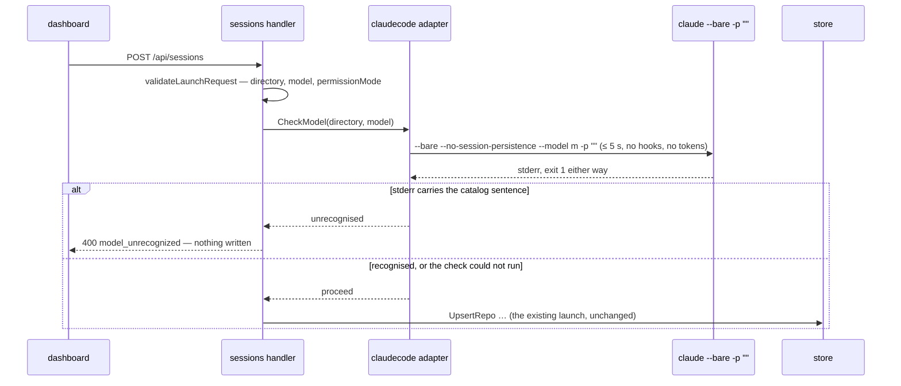

# Plan: New Session Improvement

**Created**: 2026-09-23
**Status**: completed
**Work Type**: full-stack
**E2E Scope**: new-specs
**Fixture plan**: launch-model-check.spec.ts daemon (asserts rail count and recents after a refused launch — daemon-global); launch-opens-session.spec.ts daemon (asserts which session is focused and rail order — daemon-global); launch-defaults.spec.ts daemon (asserts the no-history default and the recents race — recents are daemon-global); permission-mode.spec.ts and launch.spec.ts unchanged fixtures (existing assertions edited in place)
**Features**: launch, focus, tiles, surfaces, connection, actions, rail, rename
*Amended 2026-09-23 (decisions/features-scope, kb:adr/process-features-scope-answered-by-widening-header): widened from `launch, focus, tiles` — `features-scope.sh` found changed files owned by surfaces, connection, actions, rail and rename.*
**Description**: The new-session flow — refuse a model the installed Claude Code does not know, make manual mean manual, fall back to auto, fix the dialog's open-time race, and open the launched session (#28, #29, #41).

## Overview

Three issues from the backlog group "the new-session flow", plus one bug the planning probe
found.

**#29 — block an unavailable model.** The reporter's Claude Code did not know the `fable`
alias. That session launched normally and failed only when used. The 2026-09-23 probe measured
a zero-token check (kb:fact/model-catalog-precheck-zero-token): `claude --bare
--no-session-persistence --model <m> -p "" </dev/null` checks the model against the binary's
own model catalog. For a model the catalog does not describe, it prints `"<m>" isn't described
by this version's model catalog; …` on stderr. It takes about 1 s, fires no hooks, reads no
keychain and makes no API call. Without a check, the session starts normally and its first turn
fails with `StopFailure.error = "model_not_found"` (kb:fact/unknown-model-fails-first-turn). The
daemon therefore runs the check on every launch (the developer chose "pay the 1 s, no cache").
It runs after request validation and before anything is written, and refuses an unrecognised
model with a new `400 model_unrecognized`. The check fails open: only the measured sentence
blocks a launch. A check that errors, times out, or runs on a binary without a catalog lets the
launch proceed.

**Manual means manual (found by the probe).** "manual" is the wire's `default`, and today it
emits no `--permission-mode` flag. With no flag, Claude Code starts in its *configured* default,
which is auto on the developer's machine
(kb:fact/permission-mode-no-flag-follows-configured-default). `--permission-mode default` forces
manual. Every offered mode is now sent explicitly, on launch and on resume.

**#28 — the dialog's defaults.** Clicking a Recent keeps restoring that directory's last model
and mode (the developer, 2026-09-23: "that recent behaviour is fine"). Two things change. When
there is nothing to restore, Start in falls back to **auto** instead of manual. And the
open-time race is fixed. The dialog's initial restore (navigate to the first recent, then apply
its model and mode) resolves asynchronously, so today it can:
- overwrite a model or mode the user already picked;
- when superseded by a Recent the user clicked meanwhile, report failure and fall back to the
  browse root, throwing the user's navigation away.

**#41 — open the launched session.** In Focus, `onLaunched` renders but never calls
`app.focus(id)`, so the user stays on the running session. A launch now focuses the launched
session in Focus. In both views it puts keyboard focus in that session's terminal, so the user
can start typing (or answer the trust prompt) at once.

## Requirements

### Must Have
- [ ] REQ-1 (#29): `POST /api/sessions` runs the model-catalog check after
  `validateLaunchRequest` succeeds and before `UpsertRepo`, so it precedes every write. The
  argv is exactly `<claudeBin> --bare --no-session-persistence --model <model> -p ''` as
  seven separate argv elements, the last one empty. Stdin is empty, the working directory is the request's `directory`, and the run
  is bounded at 5 s. When the run's stderr contains `isn't described by this version's model
  catalog`, the launch is refused with `400 model_unrecognized`. The message is `Claude Code
  doesn't recognise the model "<model>" — update Claude Code, or pick another model`. A refused
  launch writes nothing: no repo row, no `settings.local.json` write, no session row, no tmux
  session and no `sessionUpsert`.
- [ ] REQ-2 (#29): the check fails open. A run that cannot start, times out, or ends without the
  sentence on stderr lets the launch proceed exactly as today. That covers an older binary that
  rejects `--bare`, or one with no catalog. A failure to *run* the check is logged at warn level
  with the directory and model, never the stderr body. The exit code is not a signal: it is 1
  for known and unknown models alike.
- [ ] REQ-3 (#29): the dialog shows the refusal's `message` in `#launch-error` (existing path)
  and stays open. The title, model and mode the user entered are left untouched.
- [ ] REQ-4: `BuildArgv` emits `--permission-mode <mode>` for every accepted mode (`default`,
  `plan`, `acceptEdits`, `auto`), so "manual" launches and resumes as `--permission-mode
  default`.
- [ ] REQ-5 (#28): when there is nothing to restore, Start in checks **auto**. That covers a
  fresh dialog with no recents, a first recent whose `lastPermissionMode` is `null`, and a
  stored value with no radio (`permissionModeToCheck`'s fallback becomes `auto`). The static
  `checked` in `web/index.html` moves from manual to auto, so the form never flashes manual
  before its first reset.
- [ ] REQ-6 (#28): the initial restore never clobbers the user.
  - (a) A model (radio or custom text) or mode the user changed since the dialog opened is not
    overwritten when the first recent's values arrive. Untouched fields are still restored.
  - (b) If the initial navigation was superseded by a navigation the user started (a Recent
    click, a crumb, a child), the initial restore does nothing further. There is no model/mode
    restore and no browse-root fallback.
  - (c) A genuinely failed initial navigation (first recent's directory gone) still falls back
    to the browse root, as today.

  Clicking a Recent keeps restoring that directory's model and mode, unchanged.
- [ ] REQ-7 (#41): after a successful launch in Focus, the launched session is the focused
  session: the rail's current marker is on its card and the mainhead shows its title. Keyboard
  focus is in its terminal.
  *Amended 2026-09-23 (decisions/launched-card-scroll, kb:adr/rail-launch-leaves-rail-scroll-untouched): the rail's scroll is left untouched, so in an overflowing rail the marker may be on an off-screen card, as it already is for the number chords.*
- [ ] REQ-8 (#41): after a successful launch in Tiles, the launched session is promoted into
  the grid (unchanged) and keyboard focus is in its tile's terminal.

### Should Have
- [ ] REQ-9: the canary guards the two new dependencies on Claude Code's interface.
  - The static tier asserts the catalog sentence `isn't described by this version's model
    catalog` and the flags `--bare` and `--no-session-persistence` as byte strings in the
    installed bundle.
  - A zero-token test runs the production check against the installed binary:
    `muster-canary-unrecognized-model` must come back unrecognised and
    `claude-haiku-4-5-20251001` recognised.
  - The unauthenticated permission-mode sweep gains an explicit `default` row asserting
    `permission_mode: "default"`.

## Protocol Contract

Delta against `docs/protocol.md` § `kb:anchor/sessions.create` (merged there on approval;
`docs/features/launch/contract.md` regenerates). No WS change, no new endpoint.

### HTTP: POST /api/sessions — changed
**Auth**: UI cookie, unchanged (`kb:spec/connection`).
**Request:** unchanged shape. Two comment changes:
```jsonc
{
  "model": "opus",          // required; passed to `--model` verbatim — any non-empty string the installed Claude Code's model catalog does not refuse (pre-check below)
  "permissionMode": "default" // required: "default" | "plan" | "acceptEdits" | "auto"; every value is sent as an explicit `--permission-mode` flag ("default" is manual — with no flag Claude Code would start in its configured default, kb:fact/permission-mode-no-flag-follows-configured-default)
}
```
**Response 201:** unchanged.
**Errors (added):**
- 400 `model_unrecognized`: the installed Claude Code's model catalog does not describe
  `model` (kb:fact/model-catalog-precheck-zero-token). Nothing was written. Checked after every
  `invalid_request` rule, so a request invalid in both ways reports `invalid_request`.
```json
{ "error": { "code": "model_unrecognized", "message": "Claude Code doesn't recognise the model \"zephyr\" — update Claude Code, or pick another model" } }
```

Side-effect note added to the anchor's prose: before any side effect, the launch runs `claude
--bare --no-session-persistence --model <model> -p ""` in the directory (≤ 5 s, zero tokens, no
hooks). A check that cannot run or does not print the catalog warning lets the launch proceed.

## Schema Changes

No schema changes required.

## Diagrams

The launch spec's inline "One launch, end to end" sequence diagram gains the pre-check. This is
a delta of the inline fence in `docs/features/launch/spec.md` (not a kb diagram record): one
`S->>A` step and an `alt` for the refusal, inserted before `UpsertRepo`. Everything below the
insertion is unchanged.



## UI Specifications

Design authority: `docs/design/ux-flows.md` §1 (launch) and "Shape — Focus" / "Shape — Tiles";
`docs/design/design-system.md` "The two views"; the dialog's markup follows
`plans/new-session-dialog/mockup.html`. There is no new surface. The refusal renders in the
existing `#launch-error` `role="alert"` paragraph.

### Views
- **Launch dialog** — unchanged markup except that `auto` carries the static `checked`. The
  behaviour changes are REQ-5 and REQ-6.
- **Focus** — after a launch the new session is focused and its terminal has keyboard focus.
- **Tiles** — after a launch the new tile's terminal has keyboard focus.

### User Flows
1. **No history.** Open the dialog on a fresh daemon. Start in shows `auto`, Model shows
   `sonnet`.
2. **Refused model.** Pick `other…`, type a model the installed Claude Code does not know, then
   Launch. After about 1 s the alert reads `Claude Code doesn't recognise the model "<m>" —
   update Claude Code, or pick another model`. The dialog stays open with every field as typed.
   Pick `sonnet` and Launch again: the dialog closes and the session opens.
3. **Opens the launched session (Focus).** With session A focused, launch B. The dialog closes,
   B's card carries the current marker, the mainhead shows B's title, and typed keys go to B's
   terminal.
4. **Opens the launched session (Tiles).** Launch from Tiles. B is promoted into the grid and
   typed keys go to B's tile terminal.
5. **Open-time race.** Open the dialog and, before the listing loads, pick `opus`. When the
   first recent loads, `opus` stays checked. Its directory is listed, and its mode is restored
   only if the user had not touched the mode. If the user instead clicks a second Recent before
   the listing loads, the second Recent's directory is what ends up listed.

### States
- No data yet: before `GET /api/repos` resolves, the Recent sidebar is empty and the form shows
  its reset values (`sonnet`, `auto`). This is the existing "no data yet" state with the new
  default.
- Daemon down: Launch fails through the existing network-error message in `#launch-error`. The
  pre-check never runs. No change.

### Testable UI Elements

All exist today. The names were transcribed from `web/index.html` lines 125–175.

| Element | Role | Name / Text Pattern | Notes |
|---------|------|---------------------|-------|
| Launch dialog | `dialog` | `New session` | `aria-labelledby` → `#launch-dialog-title`; its text also holds the `⌥⌘N` kbd span (aria-hidden) |
| Start in: auto | `radio` | `auto` | now the static `checked` default |
| Start in: manual | `radio` | `manual` | wire `default` |
| Model: other | `radio` | `other…` | ellipsis is U+2026 |
| Model: sonnet / opus | `radio` | `sonnet` / `opus` | — |
| Custom model input | `textbox` | `Custom model` | label `for="custom-model-input"`; hidden until `other…` |
| Launch error | `alert` | `/Claude Code doesn't recognise the model "[^"]+" — update Claude Code, or pick another model/` | existing `#launch-error`, `role="alert"` |
| Launch button | `button` | `Launch` | — |
| Rail card current marker | — | `aria-current` on the card | kb:adr/rail-current-marker-means-shown-in-focus; locator strategy is e2e-specs' call |

### Invariants

- **INV-1 (refusal writes nothing).** When the response is `400 model_unrecognized`, the store,
  the directory's `.claude/settings.local.json`, the tmux socket and the WS stream are exactly
  as before the request. This is asserted from two source states: a never-launched directory
  (no repo row, no settings file) and a directory with a prior launch (repo row and settings
  file present, byte-identical afterwards). → D7, E3
- **INV-2 (only the sentence blocks).** A launch is refused iff the check's stderr contains the
  catalog sentence. Every other check outcome proceeds: run error, timeout, empty stderr, other
  stderr, any exit code. → D4, D6
- **INV-3 (every mode is explicit).** For every accepted mode on both launch and resume argv,
  `--permission-mode <mode>` is present exactly once. → D10
- **INV-4 (the launched session is opened).** After a successful launch, the launched session is
  focused (Focus) or live (Tiles), and keyboard focus is in its terminal. This is asserted from
  these source states:
  - Focus with no sessions;
  - Focus with another session focused;
  - Focus in attention sort with another session needing input (the default-focus render phase
    must not steal it back);
  - Tiles with a free slot, and Tiles with a full grid.

  Bystander: the previously focused session remains in the rail, and its row and state are
  untouched. → E5, E6, E7, E8
- **INV-5 (the restore never clobbers).** For every combination of "user touched model", "user
  touched mode" and "user navigated", crossed with "initial navigation ok / failed /
  superseded", the fields and listing the dialog ends in are the table in W5/W6. → W5, W6, E9,
  E10

Paths walked against the invariants: `Launch` and `Resume` both call `BuildArgv`, so INV-3
reaches Resume, and REQ-4 covers it. `Resume` does **not** run the model check: it relaunches a
model the session already ran. The E2E `launchSession` helper posts directly, so it never
drives the dialog race. The focus render phase (phase 6) only defaults `focusedId` when it is
null or vanished, so after `app.focus(B)` it leaves B. That is the attention-sort row of INV-4.

### Carried-over measurements

- kb:fact/model-catalog-precheck-zero-token was measured from an interactive shell in a trusted
  probe repo. The daemon runs the check from musterd's environment in the launch directory,
  which may be untrusted.
  - Re-checked: `--bare` skips keychain and hooks, and `-p` does not raise the trust prompt
    (kb:fact/trust-prompt-preselects-exit: "headless `-p` runs do not record trust"). The empty
    prompt errors before any session work. So neither trust nor the daemon's environment
    changes the outcome.
  - Still unmeasured: behaviour on versions below 2.1.274. REQ-2's fail-open is what makes that
    safe.
  - REQ-9's canary test re-measures this on every bump, from the canary's own scratch
    directory.
- `--permission-mode default` was measured accepted on 2.1.259
  (kb:fact/permission-mode-flag-on-wire) and on 2.1.280
  (kb:fact/permission-mode-no-flag-follows-configured-default). The verified floor is 2.1.246,
  so 2.1.246–2.1.258 is unmeasured for the explicit spelling. BuildArgv's current comment
  calls the unflagged form "the safer spelling" for that reason. That reason is now outweighed
  by a measured wrong mode on the ceiling. REQ-9's explicit-`default` sweep row is the guard
  from here on.

## Affected Files

### Daemon (daemon-impl)
- `internal/claudecode/modelcheck.go` (new) — `CheckModel(ctx, run, bin, dir, model)`. It
  returns a neutral verdict (`recognised` / `unrecognised`) or an error. It builds the REQ-1
  argv and runs it through an injectable run func that returns stderr: a run-func seam per
  `docs/conventions.md` § Testing, with the production func setting `WaitDelay`. It also holds a
  pure `stderrSaysUnrecognised([]byte) bool` keyed on the measured sentence. Every Claude Code
  string lives here.
- `internal/claudecode/launch.go` — `BuildArgv` emits `--permission-mode` for all four modes.
  Its doc comment is rewritten against the new fact.
- `internal/server/sessions.go` — `sessionLauncher` gains a `checkModel` func field. A nil func
  means no check, which keeps existing literal-constructed launchers in tests compiling and
  passing. `Launch` calls it between `validateLaunchRequest` and `UpsertRepo`. There is a new
  `modelUnrecognized(model)` `*launchError` (400). A check error is logged at warn and the
  launch proceeds.
- `internal/server/server.go` — one-line wiring: `checkModel` bound to `claudecode.CheckModel`
  with the production run func and `claudeBin`, under a 5 s timeout.
- `internal/claudecode/CLAUDE.md` — hand-written part only, if it lists the package's files or
  subprocesses.

### Daemon tests (daemon-tests)
- `internal/claudecode/modelcheck_test.go` (new) — the D4/D5/D6 tables.
- `internal/claudecode/launch_test.go` — `TestBuildArgv` rows: `default` now emits the flag.
- `internal/server/sessions_test.go` — D7/D8/D9 via a fake `checkModel` at the verdict seam
  (never the stderr sentence).
- `test/canary/static_test.go`, `test/canary/canary_test.go`, `test/canary/harness_test.go` —
  REQ-9: static needles, the zero-token `CheckModel` test, and the explicit-`default` sweep row.

### Web (web-impl)
- `web/src/api.ts` — `permissionModeToCheck`'s fallback becomes `"auto"`.
- `web/src/features/launch.ts`
  - `resetForm` sets `auto`.
  - Touched-tracking for model and mode, set on user `change`/`input`, cleared on reset.
  - `navigate` reports `ok | failed | superseded` instead of a boolean.
  - `initOpen` acts on the two pure decisions below.
  - `onLaunched` focuses and moves keyboard focus (REQ-7/8).
  - `initLaunch`'s deps gain `surfaces: { focusSelected(id: number): void }` (structural, as
    `tiles` is today).
- `web/src/features/launch-restore.ts` (new, pure) — two functions the unit agent tests:
  - `initialRestore(touched, repo)`: the model and/or mode to apply;
  - `openFallback(outcome)`: `"restore" | "browse-root" | "none"`.

  `web/src/sessions/` also fits if web-impl prefers it (pure logic, `docs/conventions.md` §
  Composition roots). Either way it must be pure and exported.
- `web/src/main.ts` — one-line registration change: `initLaunch(app, { tiles, surfaces })`.
- `web/index.html` — the static `checked` moves from the manual radio to the auto radio.

### Web tests (web-tests)
- `web/src/api.test.ts` — the W4 rows: the fallback is now `auto`.
- A test file beside the new pure module — the W5/W6 tables.

### E2E (e2e-specs)
- `web/e2e/helpers/daemon.ts` — `STUB_CLAUDE_SCRIPT` answers the pre-check. When `$1` is
  `--bare`, it reads the value after `--model`. If that value starts with
  `muster-e2e-unrecognized`, it writes `"<model>" isn't described by this version's model
  catalog; update Claude Code, or map it with behavesAs on a modelPicker row.` to stderr. It
  always writes `Error: Input must be provided either through stdin or as a prompt argument
  when using --print` to stderr and exits 1, mirroring the real binary. Without this branch
  every E2E launch would hang in the stub's read loop until the 5 s timeout.
- New: `web/e2e/launch-model-check.spec.ts`, `web/e2e/launch-opens-session.spec.ts`,
  `web/e2e/launch-defaults.spec.ts`.
- `web/e2e/launch.spec.ts:336` — the fresh-dialog `manual` assertion becomes `auto`.

### Doc upkeep (orchestrator — never an impl track)
- `docs/protocol.md` § `sessions.create` — the Protocol Contract delta (merged at approval).
- `docs/features/launch/spec.md`, `docs/features/focus/spec.md`,
  `docs/features/tiles/spec.md` — per the Doc Delta, via doc-reconcile. That includes the
  inline diagram delta.
- ADRs flipped from `proposed` to `accepted` at Completion.

## Edge Cases

1. The check hangs (a wedged binary). The 5 s context fires, and `WaitDelay` bounds a descendant
   holding the pipe. The launch proceeds and a warn line is logged. → D6
2. The check cannot start (`-claude-bin` missing or not executable). The launch proceeds;
   tmux's spawn then fails with the existing `launch_failed`. → D6 (shared with edge case 1)
3. An older Claude Code that rejects `--bare` prints an unknown-option error with no catalog
   sentence, so the launch proceeds. → D4
4. The unauthenticated tag line `[claude-code:unrecognized_model] {…}` appears without the
   sentence. It does not block, because only the sentence counts. → D4 (shared with edge case 3)
5. A model the catalog knows but the account cannot run passes the check and fails its first
   turn with `model_not_found` (kb:fact/unknown-model-fails-first-turn). → untested: out of
   scope, the account-side gate is invisible before a real request (see Out of scope)
6. An invalid request that also has an unknown model (a relative directory, say) reports
   `invalid_request`, and the check never spawns. → D9
7. A refused launch into a never-launched directory leaves no repo row, no settings file, no
   Recent entry and no card. → D7
8. A refused launch into a previously launched directory leaves its repo row
   (`lastModel`/`lastLaunchedAt`) and `settings.local.json` byte-identical.
   → D7 (shared with edge case 7)
9. The user retries after a refusal with a recognised model. The launch succeeds from the same
   dialog. → E4
10. The WS `sessionUpsert` for the launch arrives before the 201. `onLaunched` focuses the id
    whether or not the store already holds the row. → untested: arrival order is not drivable
    from E2E; review reads that `onLaunched` never branches on store membership
11. In Focus with attention sort, another session needs input. The launched session stays
    focused across later renders; phase 6 does not reassign a present `focusedId`. → E8
12. The launched session's surface is dead by the time focus lands. The surface's `focus()` is
    the documented no-op for a dead surface (kb:adr/focus-rail-click-focuses-terminal). →
    untested: the E2E stub never exits on its own
13. In Tiles with a full grid, the launch demotes the lowest-priority tile (unchanged) and the
    new tile's terminal gets focus. → E7
14. The user picks a model before the initial restore lands. The model is kept, and the mode is
    still restored if untouched. → W5
15. The user clicks a second Recent while the initial browse is in flight. The second Recent's
    directory stays listed with its values, and there is no browse-root fallback. → W6
16. The first recent's directory was deleted. The initial navigation fails and falls back to the
    browse root (existing behaviour, kept). → W6 (shared with edge case 15)
17. A remembered `acceptEdits` on a Recent is restored as accept edits. That is unchanged, and
    only the *fallback* is auto. → E11
18. Auto is the fallback while haiku is selected. The seed is auto, and the first hook corrects
    it to default through the existing honesty path (kb:fact/permission-mode-auto-model-gated).
    → untested: the model gate belongs to Claude Code; the latch correction is existing behaviour
    kb:adr/launch-form-seeds-model-and-permission-mode already covers
19. Resuming a session whose latched mode is `default` gives an argv carrying
    `--permission-mode default`. → D10
20. A model string beginning with `-` would be misparsed by `claude` as a flag. That is true of
    the launch argv today and equally of the check. → untested: pre-existing, unchanged by this
    plan
21. Hook loss or duplication, `/clear` rebinding, and daemon restart mid-session do not apply.
    No rule here is keyed on `session_id` or on hook arrival; the check runs once, before a
    session exists. → untested: no hook-driven path changes

## Acceptance Criteria

IDs are unique across the whole section — `D*` daemon, `W*` web, `E*` e2e. One clause per
criterion.

### Daemon
- **D1**: `make test` passes.
- **D2**: `go build ./...` succeeds.
- **D3**: `make lint` passes.
- **D4**: `stderrSaysUnrecognised` returns true for the measured full line and false for each of
  these rows: empty stderr, the `Input must be provided` line alone, the tag line alone, and an
  unknown-option error.
- **D5**: `CheckModel` invokes its run func with exactly the seven REQ-1 argv elements (binary,
  `--bare`, `--no-session-persistence`, `--model`, the model, `-p`, the empty string), with
  empty stdin, in `dir`.
- **D6**: a run func that returns an error or blocks past the context deadline yields an error
  from `CheckModel`, and `Launch` proceeds to a 201.
- **D7**: a launch whose check says unrecognised returns 400 `model_unrecognized` with the
  REQ-1 message and leaves the store, the fake tmux, the settings file and the broadcast log
  unchanged. This is asserted from both source states of INV-1.
- **D8**: a launch whose check says recognised returns 201 with the same row the pre-plan
  launch produced.
- **D9**: a request failing `validateLaunchRequest` never invokes the check func.
- **D10**: `BuildArgv` emits `--permission-mode <m>` exactly once for each of `default`, `plan`,
  `acceptEdits` and `auto`, with and without `ResumeSessionID`.
- **D11**: no Claude Code catalog string or pre-check flag appears outside
  `internal/claudecode`. Test files are inside the net: server tests fake the check at the
  verdict seam and never need the sentence. `test/canary` sits outside `internal/`/`cmd/` and
  legitimately holds the static needles.
- **D12**: the offline canary (compile, classify, static tier with the new needles) passes.
- **D13**: the forced canary's zero-token `CheckModel` test and its explicit-`default` sweep row
  pass against the installed binary.

### Web
- **W1**: `make web-build` succeeds.
- **W2**: `make web-test` passes.
- **W3**: `make web-lint` passes.
- **W4**: `permissionModeToCheck` returns `"auto"` for `null`, `""`, `"bypassPermissions"` and
  `"nonsense"`, and returns each of the four accepted values unchanged.
- **W5**: `initialRestore` restores exactly the untouched fields, for all four combinations of
  model-touched and mode-touched.
- **W6**: `openFallback` maps `ok` → `restore`, `failed` → `browse-root` and `superseded` →
  `none`.
  *Amended 2026-09-23 (review cycle 1, maintainability Minor 1; kb:adr/launch-open-outcome-decided-in-controller): `openFallback` was a 1:1 relabel of `NavigateOutcome` and was removed. `initOpen` switches on the outcome itself, so REQ-6(b)/(c)'s mapping has no pure seam left. It is asserted end to end: `ok` by E11, `superseded` by E10, and `failed` by the new E12.*
- **W7**: no `any` types in new web code.

### E2E
- **E1**: on a fresh daemon with no launch history, the opened dialog has the `auto` radio
  checked.
- **E2**: the fresh dialog has the `sonnet` model radio checked.
- **E3**: launching with the custom model `muster-e2e-unrecognized-model` into a never-launched
  directory shows the `model_unrecognized` alert text. The dialog stays open, the rail's card
  count is unchanged, and the Recent sidebar has no entry for that directory.
- **E4**: after E3's refusal, the title input still holds its value, and switching to `sonnet`
  and pressing Launch closes the dialog and adds a card.
- **E5**: in Focus with session A focused, launching B puts the current marker on B's card and
  B's title in the mainhead.
- **E6**: after E5's launch, text typed without clicking reaches B's terminal (the stub echoes
  `stub-echo:<line>`).
- **E7**: in Tiles with a full grid, launching B gives B a live tile, and text typed without
  clicking reaches B's tile terminal.
- **E8**: in Focus with attention sort and another session in needs-input, the launched
  session is still focused after a `settleFor()` hold.
- **E9**: with the first `GET /api/browse` held back (`page.route`), choosing `opus` before
  releasing it leaves `opus` checked after the listing lands.
- **E10**: with the first `GET /api/browse` held back, clicking the second Recent before
  releasing it leaves that second Recent's directory listed. The footer shows its path and it
  is `aria-pressed`, not the first recent's and not the browse root.
- **E11**: the existing permission-mode spec's four stored-mode rows still pre-select their
  radios on reopen.
- **E12**: with the most recent Recent's directory deleted before the dialog opens, the opened
  dialog lists the browse root (REQ-6c). *Added 2026-09-23 with W6's amendment: web-tests (cycle 1) measured zero automated coverage of this path.*

### Automated Checks

```checks
D1 make test
D2 go build ./...
D3 make lint
D11 ! rg -n -e '"--no-session-persistence"' -e '"--bare"' -e "model catalog" internal/ cmd/ --glob '!internal/claudecode/**'
D12 MUSTER_CANARY_OFFLINE=1 make canary
W1 make web-build
W2 make web-test
W3 make web-lint
E1 make e2e
K1 make check-kb
```

### Reviewer-Verified

- **D4–D10**: read against the unit tests named in Affected Files (their pass is D1).
- **D13**: the orchestrator runs `MUSTER_CANARY_FORCE=1 make canary` once from the main
  session, after the fix waves, with the developer approving
  (kb:adr/process-real-verification-post-run-by-pipeline). The installed version equals the
  ceiling, so an unforced run would skip the harness. The forced run costs the canary's four
  haiku turns, and its log is pasted into the review.
- **W4–W6**: read against the Vitest files (their pass is W2).
- **W7**: no `any` in new web code.
- **E2–E11**: covered by E1's `make e2e` run. Review-browser measures E5–E8's focus claims in
  the live DOM (`document.activeElement` inside the launched session's terminal container).

## Doc Delta

**launch** (`docs/features/launch/spec.md`) — becomes true:
- § The form: "Model and Start in default to the directory's last-used values; with none, Start
  in is auto. A value picked before those values arrive is kept."
- § The form: "Every Start-in mode, manual included, is sent as an explicit `--permission-mode`
  flag, because with none Claude Code starts in its own configured default
  (kb:fact/permission-mode-no-flag-follows-configured-default)."
- § What launch does, as its new first sentence: "Before anything is written, the launch checks
  the model against the installed Claude Code's model catalog with a zero-token `--bare` run
  (kb:fact/model-catalog-precheck-zero-token). An unrecognised model is refused with
  `model_unrecognized`; a check that cannot run lets the launch proceed
  (kb:adr/launch-refuses-model-outside-binary-catalog)."
- § What launch does: "A launch opens the launched session: Focus focuses it, and both views
  put keyboard focus in its terminal (kb:adr/launch-opens-launched-session)."
- § One launch, end to end: the inline sequence diagram carries the pre-check step and refusal
  `alt` from this plan's Diagrams section.
- Frontmatter `refs` gain the three new facts and the three new ADRs, and lose
  `kb:adr/launch-model-presets-passed-verbatim` and
  `kb:adr/launch-permission-modes-offered-four-tabbed` (superseded).

**launch** — stops being true:
- "(kb:adr/launch-model-presets-passed-verbatim, kb:fact/fable-model-alias)" becomes
  "(kb:fact/fable-model-alias)". The sentence still says the value is passed verbatim, which
  stays true.
- "(kb:adr/launch-permission-modes-offered-four-tabbed, kb:fact/permission-mode-flag-on-wire)"
  cites the superseding ADR instead.
- § One launch, end to end, the lead's second clause: "and the card is broadcast from the
  inserted row, before any hook has arrived". It duplicates § What launch does, and deleting it
  offsets the added words. The spec is at 718 of 800 words; net growth must stay ≤ 80.

**focus** (`docs/features/focus/spec.md`) — becomes true:
- "A launch focuses the launched session and puts keyboard focus in its terminal
  (kb:adr/launch-opens-launched-session)."

**focus** — stops being true: nothing.

**tiles** (`docs/features/tiles/spec.md`) — becomes true:
- The sentence "A session launched from Tiles is promoted into the grid, demoting the
  lowest-priority tile when full" gains ", and keyboard focus moves to its terminal", plus the
  citation kb:adr/launch-opens-launched-session.

**tiles** — stops being true: nothing.

**protocol** (`docs/protocol.md` § sessions.create): the Protocol Contract delta above, merged
at approval.

## Out of scope

- **A model the account cannot run.** The catalog check covers what the binary knows. A
  catalogued model the account may not use still fails its first turn with `model_not_found`.
  Proposed backlog entry, copied verbatim into `TODO.md` only if the developer approves this
  wording:
  - [ ] **Name a launched session's `model_not_found`** — a model the installed Claude Code
    knows but the account cannot run passes the launch pre-check and fails its first turn with
    `StopFailure.error = "model_not_found"` (kb:fact/unknown-model-fails-first-turn); the card
    shows only the generic failure. Candidate: say "model unavailable" on the card and offer
    Resume with another model.
- **Reading Claude Code's configured default mode** (#28's addendum). It lives in the
  user-level settings Muster must never read (CLAUDE.md hard rule). Auto is the fallback
  instead.
- **Pre-checking on Resume.** Resume relaunches the model the session already ran.
- **Caching the check.** The developer, 2026-09-23: "pay the price of 1s otherwise cache
  invalidation etc becomes a whole thing".

## Implementation Notes

- **Facts handled:**
  - kb:fact/model-catalog-precheck-zero-token — the argv, the sentence, exit code 1 either way,
    and about 1 s;
  - kb:fact/unknown-model-fails-first-turn — why a check is worth 1 s;
  - kb:fact/permission-mode-no-flag-follows-configured-default — REQ-4;
  - kb:fact/permission-mode-flag-on-wire — the explicit `default` spelling;
  - kb:fact/permission-mode-auto-model-gated — the auto fallback on haiku.
- **Decisions (ADRs written `proposed` at approval, `refs: [plan:new-session-improvement]`):**
  - `kb:adr/launch-refuses-model-outside-binary-catalog` — supersedes
    `kb:adr/launch-model-presets-passed-verbatim`. Presets are still passed verbatim; the daemon
    now refuses a model the installed binary's catalog does not describe, checked fail-open
    with a zero-token `--bare` run on every launch, uncached.
  - `kb:adr/launch-start-in-explicit-flag-auto-fallback` — supersedes
    `kb:adr/launch-permission-modes-offered-four-tabbed`. The same four modes under the same
    labels. Every mode, manual included, is sent as an explicit flag, and a missing or unknown
    stored mode falls back to auto.
  - `kb:adr/launch-opens-launched-session` — a successful launch focuses the launched session
    in Focus and moves keyboard focus into its terminal in both views. It extends
    kb:adr/tiles-launched-session-promoted-into-grid (whose "Focus behaviour is unchanged" this
    now changes) and sits beside kb:adr/focus-rail-click-focuses-terminal. A launch is a
    deliberate "go there" even when submitted from the keyboard.
- **Boundary:** the sentence, the flags and the argv live only in `internal/claudecode`. The
  launcher sees a neutral verdict. The warn log names the directory and model and never the
  stderr body.
- **Keyboard focus timing:** `dialog.close()` restores focus to the opener synchronously, so
  `onLaunched` must call `surfaces.focusSelected(id)` *after* `close()` and after the render or
  promote that opens the surface. Otherwise the terminal's textarea does not exist yet.
- **`navigate()`'s return type** changes from `boolean` to the three-way outcome. The Recent
  click handler keeps its "restore only on ok" behaviour.
- **Watch Biome's cognitive-complexity ceiling (15)** in `initOpen`. The pure module exists
  partly so that function does not have to branch on everything itself.
