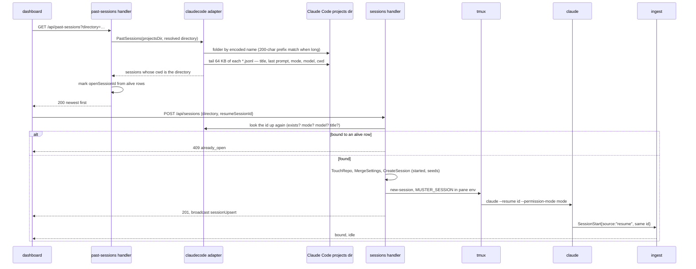

# Plan: Resume and Dangerously Allow

**Created**: 2026-09-27
**Status**: approved
**Work Type**: full-stack
**E2E Scope**: new-specs
**Fixture plan**: past-sessions.spec.ts daemon (a resume opens the launched session — auto-focus and rail counts are daemon-global); bypass.spec.ts daemon (a launch opens the launched session, and the chip is asserted on the rail's only card and its only tile)
**Features**: launch, lifecycle, actions, rail, focus, tiles, connection, rename
**Description**: Resume a Claude Code session Muster did not start (#62), and offer the bypass-permissions Start-in mode (#61), both from the launch dialog.

## Overview

Two `TODO.md` entries, one surface: **Resume old Claude session**
([#62](https://github.com/Zalaras/muster/issues/62)) and **Bypass permissions**
([#61](https://github.com/Zalaras/muster/issues/61)).

The New session dialog gains a **New | Resume** switch in its head (mockup A,
`plans/resume-and-dangerously-allow/mockups/opt-a-tabs.html`). **New** is today's dialog plus a
fifth Start-in segment, `bypass`, in the danger family: checking it shows a warning line and turns
the primary button into a danger-filled `Launch without checks`. **Resume** keeps the directory
picker and replaces the whole form — Title, Model, Start in — with the listed directory's Claude
Code sessions, newest first, read from Claude Code's transcripts by a new daemon endpoint. Picking
one and pressing Resume creates a new Muster session running `claude --resume <id>` in its original
permission mode. A session whose last mode was bypass carries the danger chip, and selecting it
makes the button `Resume without checks`.

After the dialog closes, one guardrail stays: a danger `bypass` chip on the rail card and in the
Focus mainhead and the tile header whenever a session's last-known mode is `bypassPermissions`. Claude Code's own
bypass warning, which blocks startup like the trust prompt, is surfaced and never answered.

This supersedes `kb:adr/launch-bypass-and-dontask-unoffered` (rejected): the developer judged the
guardrails below enough without the permissions editor. dont-ask stays unoffered.

## Requirements

### Must Have
- [ ] REQ-1: `POST /api/sessions` accepts `permissionMode: "bypassPermissions"` and launches with
  `--permission-mode bypassPermissions`; the existing Resume action passes a latched
  `bypassPermissions` like any other mode.
- [ ] REQ-2: Start in offers a fifth segment `bypass` (value `bypassPermissions`); while it is
  checked the warning line `#bypass-warning` shows and the primary button is danger-filled and
  reads `Launch without checks`; any other mode shows `Launch`, amber.
- [ ] REQ-3: A directory's remembered `lastPermissionMode` of `bypassPermissions` is never restored:
  the dialog checks auto instead, on open and on a Recent click.
- [ ] REQ-4: A rail card, the Focus mainhead and a tile header show a danger chip reading `bypass` iff the session's
  `permissionMode.value` is `bypassPermissions`, alive or not.
- [ ] REQ-5: A session in `started` with no `claudeSessionId` whose `permissionMode` is a
  `bypassPermissions` seed carries the note `likely waiting on Claude Code's bypass warning`
  (with `firstLaunchHere`: `first launch here — likely waiting on Claude Code's trust prompt, then
  its bypass warning`). Muster never answers either prompt.
- [ ] REQ-6: `GET /api/past-sessions?directory=<abs>` lists that directory's Claude Code sessions
  from its transcripts, newest first, with title, last prompt, last-active time, last permission
  mode and the id of an alive Muster session already bound to it.
- [ ] REQ-7: The dialog head carries a `New` / `Resume` tab pair; ⌥⌘N and the New session button
  always open on New.
- [ ] REQ-8: The Resume tab shows the picker and the listed directory's past sessions in place of
  the form; the list refetches when the listed directory changes.
- [ ] REQ-9: A past session already open in an alive Muster session is shown disabled with the text
  `open in Muster`. Sessions running outside Muster are not detected
  (`kb:fact/no-running-session-signal`).
- [ ] REQ-10: `POST /api/sessions` with `resumeSessionId` creates a new Muster session running
  `claude --resume <id> --permission-mode <mode>` — the transcript's last mode, or `default` when it
  records none — with no `--model` and no `--name`.
- [ ] REQ-11: Selecting a past session whose `permissionMode` is `bypassPermissions` makes the
  button danger-filled `Resume without checks`; any other selection shows `Resume`, amber.
- [ ] REQ-12: No path leaves two alive Muster sessions bound to one Claude session id: a
  `resumeSessionId` already bound to an alive session is refused `409 already_open`, and the
  Resume action on a dead session whose Claude session id another alive session holds is refused
  `409 not_resumable`.
- [ ] REQ-13: A resumed-from-list session opens like any launch (`kb:adr/launch-opens-launched-session`,
  `kb:adr/tiles-launched-session-promoted-into-grid`).

### Should Have
- [ ] REQ-14: A filter box narrows the past-session list by case-insensitive substring over title
  and last prompt.
- [ ] REQ-15: A resume from the list records the directory in Recent (MRU order and launch count)
  without overwriting its remembered model and Start-in mode.

### Nice to Have
- Nothing.

## Protocol Contract

Delta against `docs/protocol.md`. Merged there on approval under `sessions.create`, `ws.session`
and a new anchor `pastsessions.list`, listed in the `launch` spec's protocol list so it lands in
`docs/features/launch/contract.md`.

### HTTP: POST /api/sessions (changed)
**Auth**: UI cookie (401 `unauthorized` without it), unchanged.
**Request — launch (unchanged apart from the mode set):**
```json
{ "directory": "string — required, absolute",
  "title": "string — optional",
  "model": "string — required",
  "permissionMode": "string — required: \"default\" | \"plan\" | \"acceptEdits\" | \"auto\" | \"bypassPermissions\"" }
```
`bypassPermissions` is sent as `--permission-mode bypassPermissions`; `dontAsk` stays refused.
The error message becomes `permissionMode must be one of default, plan, acceptEdits, auto, bypassPermissions`.

**Request — resume from the list (new):**
```json
{ "directory": "string — required, absolute; the directory the list was read for",
  "resumeSessionId": "string — required; a claudeSessionId from GET /api/past-sessions for this directory" }
```
`title`, `model` and `permissionMode` must be absent. No model pre-check runs.

**Response 201:** the Session object (`kb:anchor/ws.session`), `state: "started"`, broadcast as
`sessionUpsert` before any hook, as a launch is. For a resume from the list: `title` is the past
session's title (null if it has none), `model` is `{ "id": <the transcript's last assistant model>,
"displayName": null }` or null when none is recorded, `permissionMode` is
`{ "value": <mode passed>, "source": "seed" }`, `claudeSessionId` null until its
`SessionStart{source:"resume"}` binds it (`kb:adr/ingest-envelope-authoritative-binding`),
`firstLaunchHere` true iff the directory had no repo row.

**Errors (added):**
- 400 `invalid_request`: `resumeSessionId` present with `title`, `model` or `permissionMode`.
  `{"error": {"code": "invalid_request", "message": "resumeSessionId cannot be combined with title, model or permissionMode"}}`
- 400 `invalid_request`: `resumeSessionId` empty.
  `{"error": {"code": "invalid_request", "message": "resumeSessionId must not be empty"}}`
- 404 `unknown_claude_session`: no transcript for that id among the directory's past sessions.
  `{"error": {"code": "unknown_claude_session", "message": "no Claude Code session with that id in this directory"}}`
- 409 `already_open`: an alive Muster session is bound to it; `id` is that session.
  `{"error": {"code": "already_open", "message": "that Claude Code session is already open in Muster", "id": 7}}`

Existing errors (`directory` rules, `launch_failed`) apply to both forms, checked in the order
directory → combination → existence → already_open.

### HTTP: GET /api/past-sessions (new, anchor `pastsessions.list`)
**Auth**: UI cookie (401 `unauthorized` without it).
**Request:** query parameter `directory`, an absolute directory path.
**Response 200:**
```json
{ "sessions": [
  { "claudeSessionId": "string — the transcript's session id",
    "title": "string | null — the last custom-title, else the last ai-title; null when neither",
    "lastPrompt": "string | null — the last last-prompt line, first line only, truncated to 200 chars",
    "lastActiveAt": "ISO8601 — the transcript file's modification time",
    "permissionMode": "string | null — the last permission-mode line, verbatim (open string); null when none",
    "openSessionId": "number | null — the id of an alive Muster session bound to this claudeSessionId" } ],
  "truncated": "boolean — true iff more than 200 sessions matched and only the newest 200 are listed" }
```
Ordered `lastActiveAt` descending. Only sessions whose recorded `cwd` equals the directory (after
symlink resolution) are listed. A directory Claude Code has never run in yields `{"sessions": [], "truncated": false}`.
Read-only: the daemon never writes under Claude Code's projects directory.

**Errors:**
- 400 `invalid_request`: `directory` missing or not absolute.
  `{"error": {"code": "invalid_request", "message": "directory must be an absolute path"}}`
- 404 `not_found`: the directory does not exist or is not a directory.
  `{"error": {"code": "not_found", "message": "directory does not exist or is not a directory"}}`

### WS: daemon→UI `sessionUpsert` (Session object, changed)
No shape change. `permissionMode.value`'s observed values gain `"bypassPermissions"`
(`kb:fact/bypass-permission-mode-on-wire`). `model.displayName` may be null on a resumed-from-list
session until the status line confirms the model.

## Schema Changes

No schema changes required. REQ-15 needs a store call that touches a repo row's
`last_launched_at` and `launch_count` without writing `last_model` / `last_permission_mode` (or
creates the row with both null) — a query, not a migration.

## Diagrams

Resume from the list, end to end. Inline in the new `past-sessions` spec that doc-reconcile writes.



## UI Specifications

Binding: `docs/design/design-system.md` §1 (danger tokens), §3 (state colour is meaning — the chip
uses `--danger`, never `--rose`), §5 Modal, Segmented control, Buttons (`.btn.key-danger` is the one
filled button while bypass is selected — still exactly one filled primary), §6 honesty rules;
`docs/design/ux-flows.md` §1.1–1.4. Mockup authority: `mockups/opt-a-tabs.html`.

### Views
- **Launch dialog, New tab** — today's dialog, the fifth `bypass` segment, `#bypass-warning` under
  Start in while bypass is checked, the primary button's two faces.
- **Launch dialog, Resume tab** — the picker unchanged (the picker height drops to 220px), then
  `#past-sessions` (head: `Claude sessions in <dir name> · <count>`, filter input, list), then the
  footer. `#launch-form .fields` is hidden.
- **Rail card**, **Focus mainhead** and **tile header** — the `bypass` chip after the title.

### DOM (feature level)
- In `#launch-dialog h2`, after the title text: `<span role="tablist" aria-label="Session kind">`
  with `<button role="tab" id="launch-tab-new" aria-selected>New</button>` and
  `<button role="tab" id="launch-tab-resume">Resume</button>`.
- Between `.picker` and `#launch-form .fields`: `<section id="past-sessions" hidden
  aria-label="Past sessions">` holding a head `<div>`, `<input id="past-filter" type="search"
  aria-label="Filter sessions">`, and `<div id="past-list">` of row `<button>`s. Each row:
  `<span class="t">` title (or `(untitled)`), optional `<span class="chip-danger">bypass</span>`,
  `<span class="age">` from `formatAge` (`web/src/sessions/format.ts`), `<span class="lp">` last
  prompt; `aria-pressed="true"` on the selection; a row with `openSessionId` is `disabled` and its
  `.lp` reads `open in Muster`.
- A fifth `<label class="bypass"><input type="radio" name="permission-mode"
  value="bypassPermissions" />bypass</label>` in the Start-in track, and `<p id="bypass-warning"
  class="bypass-warn" hidden>` after the fieldset.
- `#launch-button` keeps its id across all four faces; its class is `btn key` or `btn key-danger`.
- The chip: `<span class="chip-danger">bypass</span>` (CSS uppercases it; `textContent` is
  `bypass`), in the card's title row, in `.mainhead` after the title and in the tile's `.thead` after `.nm`.

### User Flows
1. Bypass launch: open the dialog → pick a directory → check `bypass` → the warning shows, the
   button reads `Launch without checks`, danger → press it → the session appears with the chip and
   the bypass-warning note → Claude Code's warning shows in its terminal; the user answers it there.
2. Resume from the list: open the dialog → press the `Resume` tab → pick a directory → the list
   loads, the first enabled row selected → optionally type in the filter → pick a row → the footer
   reads `Resume <title> in <path>` → press `Resume` → the dialog closes and the new session opens.
3. Switching back to `New` restores the form exactly as it was left.
4. Navigating to another directory while on Resume refetches; a selection is cleared on refetch
   and the first enabled row is selected.

### States
- **No data yet (Resume tab):** `#past-list` shows `Loading sessions…`; the button is disabled.
- **Empty:** `No Claude Code sessions in this directory`; button disabled.
- **Filter excludes everything:** `No sessions match`; button disabled.
- **All rows disabled:** no selection; button disabled.
- **`truncated`:** a last line `Showing the newest 200`.
- **Daemon down / fetch failed:** `Couldn't read sessions — try again`; button disabled; the
  existing `#launch-error` path reports a failed POST as today.
- **Model unknown on a resumed card:** the card's model reads as any null model does today
  (`unknown`, never blank — `kb:adr/usage-unknown-renders-word-not-track`).

### Testable UI Elements

| Element | Role | Name / Text Pattern | Notes |
|---------|------|---------------------|-------|
| New tab | `tab` | `New` | `role="tab"` mandated; `aria-selected` marks the active one |
| Resume tab | `tab` | `Resume` | same |
| Tab pair | `tablist` | `Session kind` | `aria-label` mandated |
| Bypass segment | `radio` | `bypass` | native radio in the Start-in radiogroup |
| Bypass warning | — | `Bypass permissions — every tool call runs without asking: edits, shell commands, network. Nothing stops a bad command.` | `#bypass-warning`; `<b>` wraps the first two words, so `textContent` is exactly this |
| Primary button | `button` | `Launch` \| `Launch without checks` \| `Resume` \| `Resume without checks` | `#launch-button`; class `key-danger` iff a "without checks" face |
| Past-session region | — | `Past sessions` | `<section aria-label>`; `region` role not asserted |
| Filter | `searchbox` | `Filter sessions` | `<input type="search">` |
| Past-session row | `button` | `/^<title>/` — title first, then the chip text if any, age, last prompt, no separators | `textContent` concatenates spans with no spaces |
| Open-in-Muster row | `button` (disabled) | contains `open in Muster` | `disabled` attribute |
| List head | — | `Claude sessions in <dir name> · <n>` | |
| Loading / empty / no match / error lines | — | `Loading sessions…` / `No Claude Code sessions in this directory` / `No sessions match` / `Couldn't read sessions — try again` | inside `#past-list` |
| Truncation line | — | `Showing the newest 200` | |
| Footer target (Resume) | — | `Resume <title> in <path>` | `#launch-target` |
| Bypass chip | — | `bypass` | `.chip-danger` in a rail card, in `.mainhead` and in a tile's `.thead` |
| Bypass-warning note | — | `likely waiting on Claude Code's bypass warning` | card note; with firstLaunchHere: `first launch here — likely waiting on Claude Code's trust prompt, then its bypass warning` |

### Invariants
- **INV-1 (chip):** a rail card, the Focus mainhead and a tile header show the `bypass` chip iff
  `permissionMode.value === "bypassPermissions"`. Asserted from every state (`started`, `idle`,
  `working`, `needs_input`, `planning`, `failed`), alive and dead, and after the latch changes from
  bypass to another mode and back, in every hosting surface (rail card, mainhead, tile header).
- **INV-2 (primary face):** `#launch-button` is `key-danger` iff (New tab ∧ bypass checked) ∨
  (Resume tab ∧ the selected row's `permissionMode === "bypassPermissions"`); its label follows
  REQ-2/REQ-11. Asserted from every reachable dialog configuration: each tab × each Start-in value ×
  each row kind, and across tab switches in both directions.
- **INV-3 (restore):** no restore path (dialog open, Recent click) ever checks `bypass`.
- **INV-4 (one alive row per Claude session):** no Muster path — launch-from-list, the Resume
  action — leaves two alive sessions bound to one `claudeSessionId`. Asserted with other sessions
  present, including a dead session bound to the same id and an alive one bound to a different id.

### Carried-over measurements
- `kb:fact/transcript-dir-encoding`, `kb:fact/transcript-session-lines`,
  `kb:fact/resume-restores-model-and-mode-except-plan`, `kb:fact/bypass-acceptance-blocks-startup`,
  `kb:fact/bypass-permission-mode-on-wire` were measured on 2.1.283 interactively (the last one
  headless) in a probe repo, with Muster's hooks absent. Re-checked against this plan's
  configuration: Muster launches the same binary through tmux with project-scoped hooks; none of the
  measured values depends on hook configuration, and the argv differs from the probe's only by
  `--permission-mode`, which the resume fact already covers. Still valid. The bypass
  wire value was seen headless only; REQ-4 keys on whatever the latch holds, so an interactive
  divergence would show as a missing chip, caught by the real verification below.
- `kb:fact/permission-mode-no-flag-follows-configured-default` is why REQ-10 always sends a flag,
  `default` when the transcript records none — the transcript's mode is unknown, and `default` never
  escalates.

## Affected Files

### Daemon
- `internal/claudecode/launch.go` — `PermissionBypass = "bypassPermissions"` joins
  `PermissionModes`; `BuildArgv` omits `--model` when `Model` is empty; a resume keeps
  `--permission-mode`.
- `internal/claudecode/launchtranscripts.go` (new) — the only owner of the projects-dir layout:
  `ProjectsDir()` default, folder-name encoding, `PastSessions(root, dir string) ([]PastSession,
  error)` with the 64 KB tail read, the cwd filter and the 200-char prefix match, returning
  neutral fields (id, title, last prompt, mtime, permission mode, model).
- `internal/session/session.go` — the `PermissionMode` constant set follows `claudecode`.
- `internal/session/manager.go` — a lookup of the alive session bound to a Claude session id.
- `internal/server/launcherpastlist.go` (new) — the `past-sessions` feature: `GET /api/past-sessions`.
- `internal/server/launcherpast.go` (new) — the `resumeSessionId` branch of `POST /api/sessions`:
  validation, existence, `already_open`, seeds, argv, spawn through the existing
  `spawnAndRecordLaunch`.
- `internal/server/launcher.go` — `validateLaunchRequest` routes the two request forms; `Resume`
  refuses when another alive session holds the Claude session id.
- `internal/server/sessions.go` — `createSessionRequest` gains `ResumeSessionID`.
- `internal/server/launcherrors.go` — `unknown_claude_session`, `already_open` (with `id`).
- `internal/server/server.go` — one-line `register(s, newPastSessionsFeature(...))`.
- `internal/store/repo.go` — `TouchRepo` for REQ-15.
- `cmd/musterd/main.go` — `-claude-projects-dir` flag (default: Claude Code's projects directory
  under the user's home; E2E passes a scratch dir), wired into `LaunchConfig`.

### Web
- `web/index.html` — the tab pair, `#past-sessions`, the fifth radio, `#bypass-warning`.
- `web/src/style.css` — `.head-tabs`, `#past-sessions` rows, `.seg-track label.bypass`,
  `.bypass-warn`, `.chip-danger`, with `[hidden]` companions.
- `web/src/protocol/session.ts` — `PERMISSION_MODES` gains `bypassPermissions`.
- `web/src/sessions/permission.ts` — `permissionModeToCheck` maps `bypassPermissions` to `auto`;
  new pure `launchPrimaryFace(tab, mode, selectedRowMode) → { label, danger }`.
- `web/src/features/launchpastlist.ts` (new) — pure `filterPastSessions(list, query)` and
  `defaultSelection(list)`.
- `web/src/sessions/card.ts` — the bypass-warning note in `firstLaunchNote`; `bypassChip(session)`
  on the view model.
- `web/src/api/launch.ts` — `fetchPastSessions`, `parsePastSessions`, the `resumeSessionId`
  request form, the `already_open` / `unknown_claude_session` errors.
- `web/src/features/launchresume.ts` (new) — the Resume tab controller: tabs, fetch on directory
  change, selection, filter, submit.
- `web/src/features/launch.ts` — the fifth mode, the primary face on mode change, handing the
  Resume tab to `launchresume.ts`.
- `web/src/render/launchpast.ts` (new) — list, rows, states.
- `web/src/render/sessions.ts` — the chip in the card's title row.
- `web/src/render/mainhead.ts` — the chip after the mainhead title.
- `web/src/render/tiles.ts` — the chip after `.thead .nm`, updated in place with the header chrome.

### E2E harness (e2e-specs)
- `web/e2e/helpers/daemon.ts` — pass `-claude-projects-dir <scratch>` to every scratch daemon, and
  a `writeTranscript(...)` method that writes a fixture transcript (encoded folder, lines per
  `kb:fact/transcript-session-lines`) into it.

New files are named under the `launch` spec's existing globs (`internal/claudecode/launch*.go`,
`internal/server/launcher*.go`, `web/src/features/launch*.ts`, `web/src/render/launch*.ts`), so
every one has an owner while `make check-kb` still refuses a glob that matches no file.

## Edge Cases

1. Two directories share a transcript folder (`a.b`, `a-b`): each lists only its own sessions by
   `cwd`. → D3
2. A directory path over 200 encoded chars: its folder is found by prefix and filtered by `cwd`. → D4
3. A transcript with no title line: listed with `title: null`, rendered `(untitled)`. → D5, W6
4. A stub transcript with no `cwd`-bearing line: not listed. → D6
5. `memory/` and `<id>/subagents/` in the folder are not listed. → D6 (shared with edge case 4)
6. A transcript over 64 KB whose tail holds no `cwd`: the first 64 KB is read for it. → D7
7. A transcript deleted between list and POST: `404 unknown_claude_session`; the dialog shows the
   message in `#launch-error` and refetches. → D10, E8
8. A transcript deleted after spawn (`No conversation found`, exit 1): the pane dies, the card
   ends like any dead launch. → untested: needs a race between POST and spawn; the pane-death path
   is liveness's, already covered
9. The past session is open in an alive Muster row: row disabled; a POST anyway gets
   `409 already_open`. → D11, E5
10. The Resume action on a dead row whose Claude id another alive row holds: `409 not_resumable`,
    message naming the other session. → D12
11. `/clear` in a resumed-from-list session mints a new id: the ordinary clear rebind; the old id
    becomes listable and resumable. → untested: `kb:fact/clear-mints-new-session-id` path is
    unchanged and covered by lifecycle tests
12. The resume's `SessionStart` arrives after a straggler `Stop` for the same id from the original
    run outside Muster: impossible to envelope — only Muster's pane carries `MUSTER_SESSION`, so an
    outside process's hooks never reach this row. → untested: no route exists
13. The `SessionStart{source:"resume"}` is lost: the row stays `started` with the bypass or no-signal
    note until the first enveloped event binds it (`kb:adr/ingest-envelope-authoritative-binding`). → D13
14. Daemon restart between spawn and bind: reconcile keeps the live row as for any launch. →
    untested: reconcile path unchanged
15. The user picks "No, exit" at Claude Code's bypass warning: the pane dies, the card ends with no
    Claude id, Remove is its only action. → untested: needs the real warning; the dead-unbound path is
    existing actions behaviour
16. A resumed-from-list session with no recorded mode: sent `--permission-mode default`, seeded
    `default`. → D9
17. Latch moves from bypass to another mode (a hook with a different `permission_mode`): the chip
    goes. → W3, E3
18. A remembered bypass on Recent click and on open: auto is checked. → W2, E4
19. Tab switch while a list fetch is in flight: a late response for another directory is dropped. → W8
20. Daemon down while on Resume: error line, button disabled. → E9
21. Claude Code's projects directory unreadable or absent: `200` with an empty list, logged. → D8
22. Launch clicked twice during the POST (existing TODO entry): unchanged by this plan. → untested:
    out of scope, filed separately

## Acceptance Criteria

### Daemon
- **D1**: `BuildArgv` with mode `bypassPermissions` emits `--permission-mode bypassPermissions`.
- **D2**: `BuildArgv` with an empty model emits no `--model`.
- **D3**: `PastSessions` for `a.b` excludes sessions whose `cwd` is `a-b` in the shared folder.
- **D4**: `PastSessions` finds a >200-char directory's folder by prefix and filters it by `cwd`.
- **D5**: title precedence is last `custom-title`, else last `ai-title`, else null.
- **D6**: stubs without `cwd`, `memory/` and subagent trees are not listed.
- **D7**: a large transcript whose tail lacks `cwd` is resolved from its head.
- **D8**: an absent or unreadable projects dir yields an empty list, not an error.
- **D9**: a resume-from-list POST spawns `--resume <id> --permission-mode <mode or default>` with no
  `--model` and no `--name`, and seeds title, model and mode from the listing.
- **D10**: an unknown `resumeSessionId` returns `404 unknown_claude_session` and writes nothing.
- **D11**: a `resumeSessionId` bound to an alive session returns `409 already_open` with its `id`.
- **D12**: the Resume action refuses a dead session whose Claude id an alive session holds.
- **D13**: a resumed-from-list row binds on its first enveloped event carrying the resumed id.
- **D14**: `resumeSessionId` with `model`, `title` or `permissionMode` returns `400 invalid_request`.
- **D15**: a resume from the list advances the repo's MRU and count and leaves its remembered model
  and mode unchanged.
- **D16**: `GET /api/past-sessions` orders by `lastActiveAt` descending and sets `openSessionId`.
- **D17**: no Claude-Code transcript-format string appears outside `internal/claudecode`.

### Web
- **W1**: `launchPrimaryFace` returns each of the four faces per INV-2's table.
- **W2**: `permissionModeToCheck("bypassPermissions")` returns `auto`.
- **W3**: `bypassChip` is true iff `permissionMode.value === "bypassPermissions"`, for every state.
- **W4**: the card note matches REQ-5 for bypass seeds, with and without `firstLaunchHere`.
- **W5**: `filterPastSessions` matches case-insensitively on title and last prompt.
- **W6**: `parsePastSessions` accepts null title, prompt and mode, and rejects a malformed body.
- **W7**: `defaultSelection` picks the first row with no `openSessionId`, or none.
- **W8**: a past-sessions response for a directory no longer listed is dropped.

### E2E
- **E1**: a bypass launch shows the warning and `Launch without checks`, then POSTs
  `permissionMode: "bypassPermissions"`, and the pane's start command carries the flag.
- **E2**: the launched bypass session's rail card and mainhead show the chip.
- **E3**: a hook reporting `permission_mode: "default"` removes the chip from the rail card and the mainhead.
- **E12**: in Tiles, the bypass session's tile header shows the chip, and a hook reporting `permission_mode: "default"` removes it.
- **E4**: a directory remembered with `bypassPermissions` opens and restores on auto.
- **E5**: the Resume tab lists fixture sessions newest first with the open one disabled.
- **E6**: resuming a fixture session opens a new session whose pane start command carries
  `--resume <id> --permission-mode plan` and no `--model`.
- **E7**: selecting a bypass fixture row shows `Resume without checks`.
- **E8**: resuming a fixture deleted after listing shows the `404` message in `#launch-error`.
- **E9**: with the daemon down, the Resume tab shows `Couldn't read sessions — try again`.
- **E10**: the filter narrows the list and shows `No sessions match` when nothing does.
- **E11**: switching Resume → New restores the form's prior values.

### Automated Checks

```checks
D0 make build
D17 ! rg -n '"custom-title"|"ai-title"|"last-prompt"|\.claude/projects' cmd/ internal/ --glob '!internal/claudecode/**' --glob '!**/*_test.go'
D18 make test
D19 make lint
W0 make web-build
W10 make web-lint
W11 make web-test
E0 make e2e
K1 make check-kb
```

Test-file scope for D17: `_test.go` files are outside the net — server tests need fixture
transcripts, and they get them from a helper exported by `internal/claudecode/claudecodetest`, not
by spelling the strings (kb:lesson/banned-string-split-to-dodge-gate). `web/e2e/` is outside the
grep's paths; its fixture writer is `ScratchDaemon.writeTranscript` in `web/e2e/helpers/daemon.ts`.

### Reviewer-Verified
- **W9**: no `any` types in new web code.
- **R1**: the chip and the danger button use the `--danger` family, never `--rose` (design-system §3).
- **R2**: exactly one filled button in the dialog in every configuration (design-system §3).
- **R3 (real verification, orchestrator, main session — kb:adr/process-real-verification-post-run-by-pipeline)**:
  on haiku in a scratch repo, resume a real plan-mode session from the Resume tab; its footer reads
  plan mode and the card binds to the same `claudeSessionId`. Then launch a real bypass session: the
  card shows the chip and the bypass-warning note while Claude Code's warning is on screen; answer
  "No, exit" and confirm the card ends.

## Doc Delta

**launch** — becomes true:
- The dialog's head carries New and Resume tabs; the Resume tab is described in `docs/features/past-sessions/spec.md`.
- Start in offers five modes; `bypass` sends `bypassPermissions`, shows a warning line, and turns
  Launch into a danger `Launch without checks` (kb:adr/launch-bypass-offered-with-danger-guardrails).
- A remembered bypass is never restored; the dialog checks auto (kb:adr/launch-bypass-never-restored-as-default).
- A bypass launch that has not bound says it is likely waiting on Claude Code's bypass warning,
  which Muster never answers (kb:fact/bypass-acceptance-blocks-startup).

**launch** — stops being true:
- "bypass and don't-ask are not offered (kb:adr/launch-bypass-and-dontask-unoffered)" — becomes
  "don't-ask is not offered".
- The mermaid "One launch, end to end" diagram moves to `docs/diagrams/` if the body exceeds 800
  words after the additions.

**past-sessions** (new spec, created by doc-reconcile now that its files exist: `go`/`web` globs
naming `internal/claudecode/launchtranscripts*.go`, `internal/server/launcherpast*.go`,
`web/src/features/launchresume*.ts`, `web/src/features/launchpastlist*.ts`,
`web/src/render/launchpast*.ts`; `e2e: [web/e2e/past-sessions.spec.ts]`; `protocol:
[pastsessions.list]`, removed from launch's list) — becomes true: the whole spec — the list, its source and limits, the
running-session guard, resume in the original mode, and the diagram above.

**actions** — becomes true:
- Resume is also refused when another alive session holds the same Claude session id.

**rail**, **focus**, **tiles** — becomes true:
- A card / the mainhead / a tile header shows a danger `bypass` chip while the session's last-known mode is bypass.

**lifecycle** — becomes true:
- `permissionMode` observed values include `bypassPermissions`.

`docs/protocol.md`: the Protocol Contract above.

## Out of scope

- **dont-ask stays unoffered** — kb:adr/launch-bypass-and-dontask-unoffered's reasoning holds for
  it and the developer did not ask for it.
- **Guard tests for the 2026-09-27 facts** — proposed as a backlog line, not filed:
  "**Canary coverage for the resume/bypass facts** — the six 2026-09-27 transcript, resume and
  bypass fact records have no guard test."
- Nothing else.

## Implementation Notes

- **Prerequisite, before `/orchestrate`:** `make canary` green on 2.1.283 via
  `/claude-code-upgrade`, so the six facts pass `make check-kb`.
- Every `kb:fact` above is handled in `internal/claudecode`; nothing outside it names a transcript
  line type or the projects path (D17).
- The projects dir default is computed from `os.UserHomeDir()`; never from `CLAUDE_CONFIG_DIR`.
  Reading transcripts is not reading settings — the hard rule on `~/.claude/settings.json` is
  untouched; the daemon never writes under the projects dir.
- Never read the `~/.claude/sessions/*.key` files (`kb:fact/no-running-session-signal`).
- Transcripts hold prompt text: never log `title` or `lastPrompt`.
- Decisions this plan makes (proposed ADRs, written at approval):
  `kb:adr/launch-bypass-offered-with-danger-guardrails` (reverses
  `kb:adr/launch-bypass-and-dontask-unoffered`; the supersede lands at Completion), `kb:adr/launch-bypass-never-restored-as-default`,
  `kb:adr/launch-bypass-warning-surfaced-never-answered`,
  `kb:adr/launch-resume-listed-from-transcripts-by-cwd`,
  `kb:adr/launch-resume-in-original-mode-else-default`,
  `kb:adr/launch-resume-one-alive-row-per-claude-session`,
  `kb:adr/launch-resume-running-guard-muster-only`.
- **Doc upkeep (orchestrator):** the Doc Delta is doc-reconcile's, including creating the
  `past-sessions` spec; `web/e2e/bypass.spec.ts` joins the launch spec's `e2e` list then; the two
  `TODO.md` entries (#61, #62) are ticked at Completion.
- **At Completion (orchestrator):** `kb:adr/launch-bypass-offered-with-danger-guardrails` gains
  `supersedes: [launch-bypass-and-dontask-unoffered]` in the same commit that flips it to accepted
  and the old record to superseded — `check-kb` allows a proposed record to supersede only an
  accepted one, and that record is rejected.

## Decisions (interview record) (the developer, 2026-09-27)

1. **Bypass is offered now, superseding `kb:adr/launch-bypass-and-dontask-unoffered`.** The
   guardrails that stand in for the permissions UI:
   - a fifth Start-in segment, `bypass`, in the `--danger` family, with an inline warning line
     under Start in while it is checked (mockup A);
   - while bypass is checked, the Launch button becomes danger-filled (`.btn.key-danger`) and
     reads `Launch without checks`, taken from mockup C; unchecking restores `Launch`;
   - a danger `bypass` chip on the rail card and the mainhead while the session's latched mode is
     `bypassPermissions`;
   - bypass is never restored as a directory's remembered Start-in default: a directory whose
     last launch was bypass opens on auto;
   - the Resume action on a bypass session resumes it in bypass, as it keeps any latched mode;
   - dont-ask stays unoffered.
2. **Layout is option A** (`mockups/opt-a-tabs.html`): a New | Resume switch in the dialog head.
   Resume keeps the directory picker and replaces the whole form — Title, Model and Start in —
   with the listed directory's Claude Code sessions, newest first, with a filter. A resumed
   session carries on as it was; nothing but the session is chosen.
3. **No special cases for Muster-started sessions.** The list shows every Claude Code session for
   the directory the same way, whoever started it — no "in muster" tag, no tie-in to #47.
4. **A running session is shown disabled**, since resuming it would put two processes on one
   conversation. Wanted: any running session, wherever it runs. Fallback, if the probe finds no
   reliable signal for sessions outside Muster: only sessions alive in a Muster pane (known from
   Muster's own rows — bound Claude session id plus `alive`). Nothing may parse terminal output.

## Measured (interface-probe, 2026-09-27, Claude Code 2.1.283)

Recorded as fact records; all six carry `verified: 2.1.283..2.1.283`, which `make check-kb` refuses
until `make canary` goes green on 2.1.283 and raises the ceiling from 2.1.280 (`/claude-code-upgrade`).

| # | Question | Answer | Record |
|---|---|---|---|
| 1 | Folder naming | resolved path, every char outside `[A-Za-z0-9-]` → `-`; >200 chars → 200 + `-` + unknown 6-char hash; `a.b` and `a-b` share a folder, each line's `cwd` separates them | `kb:fact/transcript-dir-encoding` |
| 2 | Title / last prompt | last `custom-title.customTitle`, else last `ai-title.aiTitle`; `last-prompt.lastPrompt`; always within the last 35 KB (166 files, up to 24 MB) | `kb:fact/transcript-session-lines` |
| 3 | What is a session | `*.jsonl` directly in the folder; `memory/` and `<id>/subagents/` are not; 2–6 KB stubs have no title; `-p` sessions persist, resumable, untitled | `kb:fact/transcript-dir-encoding`, `kb:fact/transcript-session-lines` |
| 4 | Resume with no flags | model from the transcript; mode from the transcript **except plan**, which comes back as the configured default; title kept; unknown id → `No conversation found…`, exit 1 | `kb:fact/resume-restores-model-and-mode-except-plan` |
| 5 | Bypass on the wire | `permission_mode: "bypassPermissions"` on `UserPromptSubmit`, `Stop` (headless only) | `kb:fact/bypass-permission-mode-on-wire` |
| 6 | Bypass warning | interactive launch shows a warning, "No, exit" preselected; no hook, no status line until answered; `-p` skips it; whether acceptance is remembered is **unmeasured** (never accepted — it writes user-level state) | `kb:fact/bypass-acceptance-blocks-startup` |
| 7 | Running outside Muster | no stable signal | `kb:fact/no-running-session-signal` |

### What the answers do to the design

- **Running sessions (decision 4):** the fallback applies — only sessions alive in a Muster row are
  disabled in the list.
- **Bypass warning:** it is the trust prompt's twin, so it is handled the same way
  (`kb:adr/launch-trust-prompt-never-auto-answered`): never answered by Muster, surfaced from
  absence of signal. A bypass session with no `SessionStart` yet says it is likely waiting on
  Claude Code's bypass warning.
- **Resume from the list (the developer, 2026-09-27):** a session comes back in its original
  mode. Muster reads the transcript's last `permission-mode` line and passes it as an explicit
  `--permission-mode`, so plan survives; with no such line it passes no flag and Claude Code decides
  (`kb:fact/resume-restores-model-and-mode-except-plan`). No `--model`: the transcript's model is
  already what comes back.
- **Bypass on a listed session (the developer, 2026-09-27):** a row whose last mode is
  `bypassPermissions` carries the danger `bypass` chip, and while it is selected the footer
  button is danger-filled and reads `Resume without checks`.
