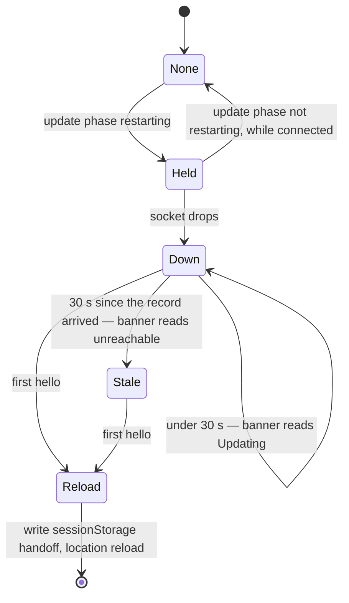

# Plan: Settings Update Failures

**Created**: 2026-09-25
**Status**: completed
**Work Type**: full-stack
**E2E Scope**: new-specs
**Fixture plan**: update.spec.ts startDaemon (a staged versioned binary, its directory's state and the release base URL are computed per test)
**Features**: update, connection, surfaces
**Features amended**: `surfaces` added mid-run (review cycle 2 wave 2), because the hub-logger constructor fix repaired one call site in the surfaces-owned `internal/server/shellactivity_test.go`; no surfaces behaviour or doc claim changes. See `decisions/features-scope-shellactivity-test` and kb:adr/process-features-widened-for-a-refactor-call-site.
**Description**: Say why an update can't go ahead, recheck the install on every check, shorten check/apply failures to one sentence, and show an update restart in the banner then reload onto the new dashboard.

## Overview

Three things the Settings Updates panel and the dashboard tell the developer when an update is
blocked, failing, or under way. Closes `TODO.md` § Issues → "Together — the Settings Updates
panel": **#53** ("Check update shows the new update but cannot update") and "Shorten the Settings
update-check error", plus a third item the developer added in planning: an Update-and-restart
shows nothing but the daemon-down alarm while it runs.

**#53.** On the developer's laptop the panel showed 0.18.1 available with both apply buttons
disabled and the unmanaged remedy. After musterd was restarted, the same binary
(`/usr/local/bin/musterd`, checked with `lsof` 2026-09-25) could update. Classification runs once at
startup and is fixed for the daemon's life (`kb:adr/update-install-kinds-decide-who-may-apply`),
so whatever failed the write probe or the git-tree walk at that startup disabled Update until
the next start. The cause at that moment can't be recovered: the startup log records the kind but
not the path or the reason. The plan fixes both halves. The installer/unmanaged half of the
classification is re-derived at the start of every release check, and every unmanaged remedy
names the running binary's path and the concrete reason.

**Failure text.** A failed check prints Go's whole transport chain (`update check failed:
requesting http://…/latest: Head "http://…/latest": dial tcp …: connection refused`), which puts
the URL on screen twice. A failed download does the same through `apply.error`. Both become one
sentence naming what failed and the innermost cause, and the full chain goes to the daemon log at
warn. The web side renders the daemon's text as it does today.

**Update-and-restart indication.** Today the `restarting` phase flashes in the status line, the
socket drops, the Settings dialog closes itself, and what's left is "musterd unreachable" until
the daemon returns. Now each window that saw `restarting` shows the banner as "Updating musterd to
v… — restarting", with the pane-noise explanation honesty rule 7 needs. It falls back to the
unreachable text after 30 s. On the first reconnect the window reloads, because the new binary
embeds a new dashboard. The fresh page shows "Updated to v…" in the banner for 3 s, only if the
daemon it reached reports that version.

## Requirements

### Must Have

- [ ] REQ-1: An `unmanaged` install whose binary directory fails the write probe carries the
  remedy `can't update <path>: <dir> is not writable (<cause>) — install with: curl -fsSL
  https://raw.githubusercontent.com/Zalaras/muster/main/scripts/install.sh | sh`. `<path>` is
  the resolved executable path, `<dir>` its directory, and `<cause>` the innermost error text of
  the failed probe (e.g. `permission denied`, `operation not permitted`, `read-only file system`).
- [ ] REQ-2: An `unmanaged` install found inside a git tree carries the remedy `can't update
  <path>: it is inside the git checkout <root> — install with: curl -fsSL
  https://raw.githubusercontent.com/Zalaras/muster/main/scripts/install.sh | sh`. `<root>` is
  the directory holding the `.git` entry the walk found.
- [ ] REQ-3: The Homebrew remedy is unchanged: `installed by Homebrew — run brew upgrade musterd`.
- [ ] REQ-4: At the start of every release check, whether automatic (tick, pref-on) or
  user-initiated (`kb:anchor/update.check`), the daemon re-runs the write probe and the git-tree
  walk for an install that is not `dev` or `homebrew`. It stores the resulting `installer` or
  `unmanaged` kind and remedy. This happens before, and regardless of, the network request's
  outcome.
- [ ] REQ-5: A reclassification that changes `install` or `remedy` broadcasts `update` once. One
  that changes neither broadcasts nothing beyond what the check itself sends.
- [ ] REQ-6: `dev` and `homebrew` are never re-derived. They stay as classified at startup.
- [ ] REQ-7: `kb:anchor/update.apply`'s `update_unsupported` refusal and the "may apply" decision
  read the current classification, never the startup one.
- [ ] REQ-8: A failed release check's 502 `check_failed` message is one of these:
  - `update check failed: couldn't reach the release host (<cause>)` for a transport failure,
    where `<cause>` is `timed out` for a timeout, `host not found` for a DNS failure, and
    otherwise the innermost error's text (e.g. `connection refused`).
  - `update check failed: the release host answered <status>, not a redirect` for a non-3xx
    status.
  - `update check failed: the latest release tag "<tag>" is not a release version` for an
    unparseable tag.
  - `update check failed: <message>` for anything else (e.g. no `Location` header).
- [ ] REQ-9: A failed apply's `apply.error` reads as follows. For a download failure:
  `couldn't download <file> (<cause>); nothing was installed`, with `<cause>` as in REQ-8 or
  `status <code>`. For a missing signature (HTTP 404 on `checksums.txt.minisig`): `couldn't
  download checksums.txt.minisig (status 404) — this release has no signature, refusing to
  apply`. Every other failure (verification refusals, install errors) keeps its current sentence.
- [ ] REQ-10: Neither a `check_failed` message nor `apply.error` contains a URL.
- [ ] REQ-11: The full wrapped error of a failed user-initiated check, and of a failed apply, is
  logged at warn level with the error chain. A failed automatic check stays at debug
  (`kb:adr/update-check-runs-in-daemon-daily`'s silence).
- [ ] REQ-12: The startup log line `musterd starting` carries the resolved executable path as
  field `exe`. The remedy log line that follows it carries the REQ-1/REQ-2 text.
- [ ] REQ-13: A window that receives an `update` message with `apply.phase` `restarting` holds a
  restart record: the version being applied, and when it arrived. The record is in memory only.
- [ ] REQ-14: While a restart record is held and the socket is down, the banner reads `Updating
  musterd to v<version> — restarting; hook output in open panes is Muster's absence, not session
  failure.`
- [ ] REQ-15: While a restart record is held and the socket has been down for 30 s since the
  record arrived, the banner reads the ordinary unreachable text. The record stays held.
- [ ] REQ-16: A window holding a restart record reloads itself on its first `hello` after the
  socket dropped, whatever that hello's `protocolVersion`, so a protocol bump reloads rather than
  showing the mismatch screen. Before reloading it writes the applied version to `sessionStorage`.
- [ ] REQ-17: On load, a page reads the `sessionStorage` handoff and removes it. If the first
  snapshot's `update.running` equals the handed-off version, the banner reads `Updated to
  v<version>.` for 3 s, then hides. Otherwise nothing is shown.
- [ ] REQ-18: A window that receives an `update` message with a phase other than `restarting`
  while connected drops any restart record it holds.

### Should Have

- [ ] REQ-19: The `Updated to v…` banner uses a neutral style (`--bg-raised` ground, `--fg-muted`
  text, `--line-control` border), not the `--banner-*` daemon-down tokens: it's information, not
  an alarm. That's the reasoning `docs/design/design-system.md` §5 applies to the update dot. The
  restarting banner keeps the `--banner-*` tokens, since the daemon is down.

### Nice to Have

Nothing.

## Protocol Contract

Delta against `docs/protocol.md`. No shape changes, so no protocol version bump
(`kb:adr/connection-protocol-bumps-only-on-shape-change`). Field semantics and message wording
change as follows.

### WS: daemon→UI `update` — `install` and `remedy` semantics

```jsonc
"install": "installer",  // "installer" | "dev" | "homebrew" | "unmanaged" — classified at startup from the resolved executable path; "dev" and "homebrew" are fixed for the daemon's life, while "installer" and "unmanaged" are re-derived at the start of every release check (automatic or kb:anchor/update.check) and may swap, a change being broadcast like any other field
"remedy": null,          // string iff install is "homebrew" | "unmanaged"; for "unmanaged" it names the running binary's resolved path and the reason it can't be updated (an unwritable directory with the probe's error, or the enclosing git checkout); null otherwise
"apply": { "phase": "idle", "version": null,
           "error": null }  // string|null — one sentence naming what failed and why, never a URL or a transport chain; non-null iff phase is "failed"
```

Every other field and the sending rule are unchanged.

### HTTP: POST /api/update/check — reclassification and the 502 message

**Auth**: UI cookie (401 `unauthorized`), unchanged.

Added before the release request: the install classification is re-derived as in the `update`
delta above, and a change is broadcast even if the check then fails.

**Errors** (502 wording replaced; 404 and 409 unchanged):
- 502 `check_failed` — the release host could not be reached, answered without a redirect, or
  its latest tag is not a release version. The message is one sentence, never a URL:
  `{ "error": { "code": "check_failed", "message": "update check failed: couldn't reach the release host (connection refused)" } }`

### HTTP: POST /api/update/apply — the refusal reads the current classification

**Auth**: UI cookie (401 `unauthorized`), unchanged.

- 409 `update_unsupported` — the install is `homebrew`/`unmanaged` **as last classified**;
  `message` is the current `update.remedy`:
  `{ "error": { "code": "update_unsupported", "message": "can't update /usr/local/bin/musterd: /usr/local/bin is not writable (permission denied) — install with: curl -fsSL https://raw.githubusercontent.com/Zalaras/muster/main/scripts/install.sh | sh" } }`

## Schema Changes

No schema changes required.

## Diagrams

The per-window restart record (REQ-13–18). Feature-scoped, so it lives in the plan. The
orchestrator may carry it inline into `docs/features/update/spec.md` if the word cap allows. It
is not a kb diagram delta.



## UI Specifications

Governed by `docs/design/design-system.md` §1 (`--banner-*` tokens), §5 (Settings dialog and the
Updates fieldset, the neutral-cue rule for the update dot), §6 honesty rule 7 (daemon-down is
surfaced loudly and explains pane noise), and `docs/design/ux-flows.md` "Degraded and honest
states". Reference for the Updates fieldset: the Settings modal in
`docs/design/mockups/a-instrument.html`. The banner has no mockup beyond `web/index.html`'s
current markup.

### Views
- **Updates fieldset** (`#settings-update`): unchanged structure. `#update-status` renders the
  daemon's remedy and error text as today, now shorter.
- **Banner** (`#banner`, `role="alert"`, full width under the masthead): one element, three texts:
  - daemon down (unchanged): `musterd unreachable — hook output in open panes is Muster's
    absence, not session failure.`
  - update restart in progress (REQ-14), on `--banner-*` tokens.
  - update confirmation (REQ-17), on the neutral style (REQ-19), for 3 s.

  `connection.ts` stays the banner's only writer. The update feature supplies the restart record
  and the confirmation; how they reach the banner render is web-impl's design.

### User Flows
1. Settings → Update and restart → confirm. The status line shows `Restarting musterd…` for a
   moment, then the socket drops and the dialog closes (unchanged).
2. The banner shows `Updating musterd to v0.18.1 — restarting; hook output in open panes is
   Muster's absence, not session failure.`
3. The daemon returns and the first hello arrives. The page reloads.
4. The fresh page connects. The banner shows `Updated to v0.18.1.` for 3 s, then hides.
5. If the daemon hasn't returned 30 s after step 1, the banner switches to the unreachable text.
   Step 3 still happens whenever it does return.

### States
- **No data yet**: before the first snapshot there is no `update` object. No restart record can
  exist, and a `sessionStorage` handoff waits for the first snapshot before deciding.
- **Daemon down**: the ordinary unreachable banner, unless a restart record is held (REQ-14/15).
- **Data**: as today, plus the confirmation.

### Testable UI Elements

| Element | Role | Name / Text Pattern | Notes |
|---------|------|---------------------|-------|
| Banner, restarting | `alert` | text `Updating musterd to v<version> — restarting; hook output in open panes is Muster's absence, not session failure.` | `#banner`; `role="alert"` is existing static markup |
| Banner, confirmation | `alert` | text `Updated to v<version>.` | same `#banner` element; hidden after 3 s |
| Banner, daemon down | `alert` | text `musterd unreachable — hook output in open panes is Muster's absence, not session failure.` | unchanged |
| Updates status line | `status` | the REQ-1/2/3 remedy, REQ-8 check message, or `Update failed: ` + REQ-9 text | `#update-status`, existing `role="status"` |
| Update button | `button` | `Update` (exact) | existing |
| Update and restart button | `button` | `Update and restart` | existing |
| Check now button | `button` | `Check now` | existing |

### Invariants

- **INV-1**: `remedy` is non-null iff `install` is `homebrew` or `unmanaged`, after every
  reclassification. Source states: startup kind `installer` or `unmanaged`; apply `idle`,
  `downloading`/`verifying`/`installing`, `done` with `installed` set, and `failed`; pref on and
  pref off; a check that succeeds and one that fails.
- **INV-2**: Neither a 502 `check_failed` message nor `apply.error` contains `://`, for every
  failure class REQ-8 and REQ-9 name.
- **INV-3**: The banner reads `Updated to v<X>.` only on a page whose first snapshot has
  `update.running === X` and whose `sessionStorage` handoff named X. Return paths: same version,
  a different version, no handoff, a handoff with a throwing `sessionStorage`, and a second page
  load with the handoff already consumed.
- **INV-4**: A window reloads itself only on the first hello after a drop while it holds a restart
  record. A drop and reconnect without a record never reloads.

State-changing paths walked against INV-1: `checkAvailability` (both callers) is changed by
REQ-4. `RequestApply` reads the kind and is covered by REQ-7. `Current`/`buildUpdateInfo` reads
it. `SetCheckEnabled` and `Start` read only `dev`, which never changes (REQ-6). `checkSwap`
doesn't touch the classification. `musterd -update` classifies once in its own short-lived
process, so there is nothing to recheck.

### Carried-over measurements

None. No `kb:fact` value is applied here.

## Affected Files

### Daemon
- `internal/selfupdate/install.go` — `Classify` composes the REQ-1/REQ-2 remedies from the path,
  the probe's error and the git root. It exposes the installer/unmanaged re-derivation as a
  function `internal/server` can call through a seam, without re-deciding `dev`/`homebrew`.
  `InstallerRemedy` gives way to the composed text; its two callers are in `install_test.go`.
- `internal/selfupdate/release.go`, `internal/selfupdate/apply.go` (and a new
  `internal/selfupdate/failure*.go` if the implementer wants one) — the REQ-8/REQ-9 one-sentence
  descriptions, keeping the wrapped error for the log. Release-host knowledge stays in this
  package (`kb:adr/update-release-knowledge-in-selfupdate-package`).
- `internal/server/updatemanager.go` — the REQ-4 recheck at the start of `checkAvailability`, with
  `install` moving under `mu` (its "immutable after construction" note goes). REQ-7, REQ-11, and
  storing the short `apply.error`.
- `internal/server/update.go` — the 502 message from the short description. `update_unsupported`
  reads the current remedy.
- `internal/server/server.go` — at most one `Config` field line, if the reclassify seam is
  passed in.
- `cmd/musterd/main.go` — builds the production reclassifier from the same inputs
  `resolveInstall` uses. `logStartup` adds `exe`.

### Web
- `web/src/features/updaterestart.ts` (new, update feature) — the restart record, the 30 s rule,
  the reload with its `sessionStorage` handoff (through the existing JSON storage helpers,
  imported unchanged — see Implementation Notes), and the confirmation timer. The banner decision is a **pure exported function**,
  e.g. `(record, connection, now, confirmation) → banner view`, so web-tests can table-test it.
- `web/src/features/connection.ts`, `web/src/render/banner.ts` — the banner renders one of three
  texts and the neutral modifier. It is still written only by `connection.ts`.
- `web/src/ws.ts`, `web/src/wsapp.ts`, `web/src/app.ts` — surface the hello's arrival, including
  a protocol-mismatch hello, to the update feature so REQ-16 can reload before the mismatch
  screen.
- `web/src/main.ts` — one registration line for the new controller.
- `web/index.html` — the banner's static text, if rendering moves it into `render/banner.ts`.
- `web/src/style.css` — the REQ-19 neutral banner modifier (the contrast gate's file).

### Tests (owned by the test agents, listed for routing only)
- daemon-tests: `internal/selfupdate/install_test.go`, `internal/selfupdate/*failure*_test.go`
  or `release_test.go`/`apply_test.go`, `internal/server/update*_test.go`,
  `cmd/musterd/main_test.go`.
- web-tests: `web/src/features/updaterestart.test.ts`.
- e2e-specs: `web/e2e/update.spec.ts`, `web/e2e/helpers/update.ts` (a banner locator if wanted).

## Edge Cases

1. Unmanaged at startup (git tree), the `.git` removed, then Check now: the kind becomes
   `installer`, the remedy clears, and the buttons enable → E1.
2. Unmanaged at startup (unwritable dir), the dir made writable, then Check now: same outcome →
   E2.
3. Installer at startup and the directory later made unwritable: the next check flips it to
   `unmanaged` with the REQ-1 remedy → D4.
4. A recheck while an apply is in flight doesn't cancel the apply. The apply already passed the
   gate, and a failing install step reports its own error → D6.
5. A manual check against a stopped host still reclassifies and broadcasts the change, then
   returns 502 → D5.
6. Pref off: no automatic check runs, so no recheck. A manual check still rechecks → D5 (shared with edge case 5).
7. `homebrew` and `dev` are never re-derived, even when their directory's writability changes →
   D7.
8. Reclassification that produces the same kind and remedy sends no extra broadcast → D5 (shared with edge case 5).
9. A transport failure's innermost error is a DNS failure, a timeout, or connection refused →
   D8.
10. Release host answers 200 or 404 instead of a redirect → D8 (shared with edge case 9).
11. Redirect to an unparseable tag → D8 (shared with edge case 9).
12. Download fails mid-apply with the host stopped → D9 (unit), E4 (end to end).
13. `checksums.txt.minisig` returns 404 → D9 (shared with edge case 12). The existing E7 still reads `^Update failed: `.
14. A restart broadcast lost before the drop: no record, so the ordinary unreachable banner, and
    no reload on reconnect → W3.
15. The daemon doesn't come back within 30 s: the banner falls back to unreachable, and a later
    return still reloads → W2.
16. The daemon returns at a different version (re-exec ran something else): the page reloads,
    and no confirmation shows → W5.
17. The returning daemon speaks a different protocol version: the reload happens on that hello,
    before the mismatch screen → W6.
18. `sessionStorage` throws: the reload still happens, and no confirmation shows → W5 (shared with edge case 16).
19. The handoff is read once. A later reload of the same tab shows nothing → W5 (shared with edge case 16).
20. A `restarting` record then a non-restarting phase while connected: the record drops, and a
    later unrelated drop shows the ordinary banner → W4.
21. Several windows open: each holds its own record and reloads on its own reconnect →
    untested: per-window logic W1–W6 cover. A two-page restart E2E adds a daemon restart for no
    new code path.
22. Settings dialog open when the socket drops: it closes, as today → untested: unchanged
    behaviour, `settings.ts` is untouched.
23. A page reloaded by hand mid-restart has no record, so it shows the ordinary unreachable
    banner → W3 (shared with edge case 14).

## Acceptance Criteria

IDs are unique across the whole section — `D*` daemon, `W*` web, `E*` e2e.

### Daemon
- **D1**: `Classify` returns the REQ-1 remedy, with the probe's innermost error text, for an
  unwritable directory.
- **D2**: `Classify` returns the REQ-2 remedy, naming the `.git`-holding root, for a binary inside
  a git tree.
- **D3**: The Homebrew remedy is unchanged (REQ-3).
- **D4**: A check flips `installer` to `unmanaged` when the directory has become unwritable, and
  back when it is writable again.
- **D5**: `checkAvailability` rechecks on both the manual and automatic paths, before the network
  call. It broadcasts once on a change and never on a no-change, and it rechecks on a failed
  check.
- **D6**: A recheck during an in-flight apply leaves the apply running.
- **D7**: `homebrew` and `dev` installs are never re-derived.
- **D8**: The 502 `check_failed` message matches REQ-8 exactly for each named failure class.
- **D9**: `apply.error` matches REQ-9 exactly for each download failure class and the minisig
  404.
- **D10**: INV-1 holds after a recheck from every source state it names.
- **D11**: INV-2 holds across D8's and D9's failure classes.
- **D12**: `update_unsupported` returns the current remedy after a recheck changed it (REQ-7).
- **D13**: `musterd starting` carries `exe` (REQ-12).

### Web
- **W1**: The banner derivation returns the REQ-14 text for a held record with the socket down
  under 30 s.
- **W2**: It returns the unreachable text at 30 s and after, with the record still held.
- **W3**: With no record, a drop gives the unreachable text and a reconnect doesn't reload.
- **W4**: A non-restarting phase while connected drops the record.
- **W5**: The confirmation shows for 3 s only when the handoff version equals the first
  snapshot's `update.running`. It never shows for a mismatch, an absent handoff, a throwing
  storage, or a consumed handoff.
- **W6**: The first hello after a drop with a record held, including a protocol-mismatch hello,
  triggers the reload with the handoff written first.
- **W7**: A second hello before the page unloads does not write the handoff again or reload
  twice.

### E2E
- **E1**: A binary staged in a scratch git tree shows the REQ-2 remedy naming its path. After the
  `.git` is removed, Check now enables Update and clears the status line.
- **E2**: A binary staged in a directory made read-only (`chmod 0555`) shows the REQ-1 remedy with
  `not writable (permission denied)`. After `chmod 0755`, Check now enables Update.
- **E3**: Check now against a stopped release host shows exactly `update check failed: couldn't
  reach the release host (connection refused)`.
- **E4**: Update after the release host stops shows `Update failed: couldn't download
  musterd_<version>_darwin_<arch>.tar.gz (connection refused); nothing was installed`, and the
  on-disk binary is byte-identical.
- **E5**: Update and restart reloads the page. A `window` marker set before the click is gone
  afterwards, and the banner shows `Updated to v<new>.` then hides.
- **E6**: After E5's flow the Running readout shows the new version.

### Automated Checks

```checks
D20 make test
D21 make lint
D22 make test-race
D23 ! rg -n "not installed by the muster installer" internal cmd web/src web/e2e
W20 make web-build
W21 make web-test
W22 make web-lint
W23 make contrast
E20 make e2e
K1 make check-kb
```

D23's grep includes test and spec files on purpose. The literal is the old remedy text, which
REQ-1/REQ-2 replace everywhere. Its holders are `internal/selfupdate/install.go` (daemon-impl) and
any test asserting it (daemon-tests, e2e-specs), and all three owners are named under Affected
Files. No test needs the old string to exercise a wire shape.

### Reviewer-Verified

- **W8**: no `any` types in new web code.
- **W9**: `#banner` has one writer, `features/connection.ts`.
- **W10**: the restarting banner keeps the `--banner-*` tokens and the confirmation uses the
  REQ-19 neutral style. Needs a browser in each theme.
- **W11**: the restarting banner (REQ-14) is actually seen during a real Update and restart. It's
  a sub-second display that E2E can't assert as settled, so review-browser watches it.
- **D14**: `install` is read under `mu` everywhere in `updatemanager.go`, and `make test-race`
  covers a recheck racing `Current` and `RequestApply`.
- **D15**: no Go file outside `internal/selfupdate` composes release-host failure text or knows
  installer remedy wording.

## Doc Delta

**update** — becomes true:
- `docs/features/update/spec.md` § Install kinds says: at startup the binary classifies its
  install from the resolved executable path as installer, dev, homebrew or unmanaged. Installer
  and unmanaged are re-derived at the start of every release check, so a blocker that clears
  enables Update without a restart. An unmanaged remedy names the binary's path and the reason:
  an unwritable directory with the error, or the enclosing git checkout.
- § Applying says any failure leaves the old binary untouched and reports one sentence naming
  what failed and why. The full error goes to the daemon log.
- § Restarting says every window that saw the restart shows the banner as updating while the
  daemon is down (falling back to unreachable after 30 s), reloads on its first reconnect, and
  confirms `Updated to v…` for 3 s when the daemon it reached runs that version.
- `docs/protocol.md` carries the `update` `install`/`remedy`/`apply.error` semantics and the
  `update.check`/`update.apply` wording above.

**update** — stops being true:
- "At startup the binary classifies its install from the resolved executable path as installer,
  dev, homebrew or unmanaged." (replaced by the sentence above)
- "any failure leaves the old binary untouched and reports an error with a remedy sentence"
  (replaced)
- `docs/protocol.md`'s `install` comment "constant for the daemon's life", and the 502 example
  `requesting https://example.test/releases/latest: connection refused`.

**connection** — becomes true:
- `docs/features/connection/spec.md` adds, after the daemon-down banner sentence: except after an
  update restart, when the banner reads as updating (kb:spec/update).

**connection** — stops being true:
- nothing.

## Out of scope

- Nothing.

## Implementation Notes

- **Decisions this plan makes**, written as `status: proposed` ADRs at approval:
  - `kb:adr/update-install-rechecked-on-every-check`: installer/unmanaged are re-derived at the
    start of every check. Supersedes `kb:adr/update-install-kinds-decide-who-may-apply`, carrying
    its kinds, precedence and apply serialisation forward unchanged.
  - `kb:adr/update-remedy-names-path-and-cause`: the unmanaged remedy names the resolved path and
    the concrete reason, never a claim about who installed the binary.
  - `kb:adr/update-failure-one-sentence-chain-in-log`: check and apply failures reach the wire as
    one sentence without a URL, and the full chain is logged at warn (user-initiated check,
    apply).
  - `kb:adr/update-restart-reloads-dashboard`: after an update restart each window reloads on
    its first reconnect and confirms the version from a `sessionStorage` handoff. The banner
    reads as updating while the daemon is down.
- `kb:adr/update-restart-is-in-place-reexec-not-shutdown`'s consequence "reconnects through the
  ordinary banner path" is left as written (accepted ADRs are not edited). The new restart ADR
  refs it.
- The reclassify seam follows `docs/conventions.md` § Testing's constructor-default run seam
  (`kb:adr/process-adapter-run-seam-constructor-default`). Same-package tests overwrite it
  rather than chmod-ing real directories. E1/E2 do the real-filesystem version.
- Innermost cause: unwrap to the deepest error (`*os.PathError`/`*net.OpError`/`*url.Error` →
  `syscall.Errno` text). `net.Error.Timeout()` and `context.DeadlineExceeded` read `timed out`,
  and `*net.DNSError` reads `host not found`.
- The `sessionStorage` handoff reuses `readJson` and its write twin from the dashboard's one
  storage seam (owned by the reader and theme features), passing `sessionStorage` as the
  `StorageLike`. That module is imported, not edited.
- `internal/selfupdate/CLAUDE.md`'s gotcha "Sentinel error text is user-facing" still holds.
  daemon-impl updates its hand-written part if the recheck changes what the package owns.
- E2E: `web/e2e/update.spec.ts` E11 (`/fail/i`), E13 (`/install\.sh|curl/i`) and E7
  (`/^Update failed: /`) keep passing under the new wording. E2's `chmod` must be restored in
  `finally` so cleanup can delete the directory.
- **Doc upkeep (orchestrator)**: `docs/design/design-system.md` §6 rule 7 gains the restart
  wording and the §1 table notes the REQ-19 neutral banner modifier. `TODO.md`'s two entries move
  to `docs/history/todo-done.md` at completion. The landing commit carries `closes #53`.
